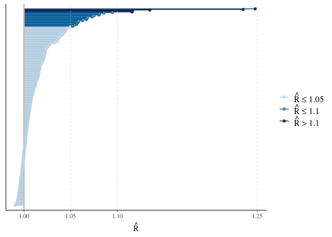
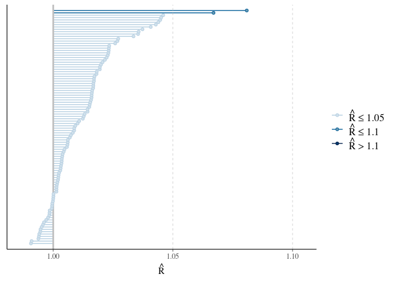
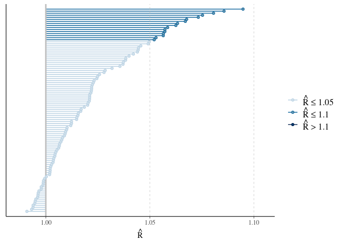
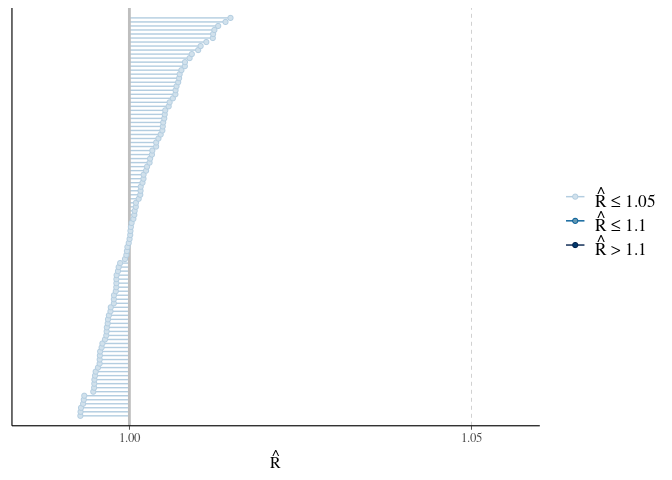

```r
## Load libraries ----
library(tidyverse)
library(magrittr)
library(bayesplot)
```


```r
## Read data ----
stanfit_object <- read_rds("./models/model_run_20221207_223858/stanfit_object.rds")

class(stanfit_object)
```

```
## [1] "stanfit"
## attr(,"package")
## [1] "rstan"
```


```r
list_of_draws <- rstan::extract(stanfit_object)
print(names(list_of_draws))
```

```
##  [1] "alpha"   "nu"      "sigma_u" "sigma_v" "sigma_s" "delta"   "psi"    
##  [8] "phi"     "tau_u"   "tau_v"   "lp__"
```


```r
rhat_of_draws <- rhat(stanfit_object)
mcmc_rhat(rhat_of_draws)
```

<!-- -->


```r
names(rhat_of_draws)
```

```
##   [1] "alpha[1]"   "alpha[2]"   "nu[1]"      "sigma_u[1]" "sigma_u[2]"
##   [6] "sigma_u[3]" "sigma_v[1]" "sigma_v[2]" "sigma_v[3]" "sigma_s"   
##  [11] "delta"      "psi[1,1]"   "psi[1,2]"   "psi[1,3]"   "psi[1,4]"  
##  [16] "psi[1,5]"   "psi[1,6]"   "psi[1,7]"   "psi[1,8]"   "psi[1,9]"  
##  [21] "psi[1,10]"  "psi[1,11]"  "psi[1,12]"  "psi[1,13]"  "psi[1,14]" 
##  [26] "psi[1,15]"  "psi[1,16]"  "psi[1,17]"  "psi[1,18]"  "psi[1,19]" 
##  [31] "psi[1,20]"  "psi[1,21]"  "psi[1,22]"  "psi[1,23]"  "psi[1,24]" 
##  [36] "psi[1,25]"  "psi[1,26]"  "psi[1,27]"  "psi[1,28]"  "psi[1,29]" 
##  [41] "psi[1,30]"  "psi[1,31]"  "psi[1,32]"  "psi[1,33]"  "psi[1,34]" 
##  [46] "psi[1,35]"  "psi[1,36]"  "psi[1,37]"  "psi[1,38]"  "psi[1,39]" 
##  [51] "psi[1,40]"  "psi[1,41]"  "psi[1,42]"  "psi[1,43]"  "psi[1,44]" 
##  [56] "psi[1,45]"  "psi[1,46]"  "psi[1,47]"  "psi[1,48]"  "psi[1,49]" 
##  [61] "psi[1,50]"  "psi[1,51]"  "psi[1,52]"  "psi[1,53]"  "psi[1,54]" 
##  [66] "psi[1,55]"  "psi[1,56]"  "psi[1,57]"  "psi[1,58]"  "psi[1,59]" 
##  [71] "psi[1,60]"  "psi[1,61]"  "psi[1,62]"  "psi[1,63]"  "psi[1,64]" 
##  [76] "psi[1,65]"  "psi[1,66]"  "psi[1,67]"  "psi[1,68]"  "psi[1,69]" 
##  [81] "psi[1,70]"  "psi[1,71]"  "psi[1,72]"  "psi[1,73]"  "psi[1,74]" 
##  [86] "psi[1,75]"  "psi[1,76]"  "psi[1,77]"  "psi[1,78]"  "psi[1,79]" 
##  [91] "psi[1,80]"  "psi[1,81]"  "psi[1,82]"  "psi[1,83]"  "psi[1,84]" 
##  [96] "psi[1,85]"  "psi[1,86]"  "psi[1,87]"  "psi[1,88]"  "psi[1,89]" 
## [101] "psi[1,90]"  "psi[1,91]"  "psi[1,92]"  "psi[1,93]"  "psi[1,94]" 
## [106] "psi[1,95]"  "psi[1,96]"  "psi[1,97]"  "psi[1,98]"  "psi[1,99]" 
## [111] "psi[1,100]" "psi[2,1]"   "psi[2,2]"   "psi[2,3]"   "psi[2,4]"  
## [116] "psi[2,5]"   "psi[2,6]"   "psi[2,7]"   "psi[2,8]"   "psi[2,9]"  
## [121] "psi[2,10]"  "psi[2,11]"  "psi[2,12]"  "psi[2,13]"  "psi[2,14]" 
## [126] "psi[2,15]"  "psi[2,16]"  "psi[2,17]"  "psi[2,18]"  "psi[2,19]" 
## [131] "psi[2,20]"  "psi[2,21]"  "psi[2,22]"  "psi[2,23]"  "psi[2,24]" 
## [136] "psi[2,25]"  "psi[2,26]"  "psi[2,27]"  "psi[2,28]"  "psi[2,29]" 
## [141] "psi[2,30]"  "psi[2,31]"  "psi[2,32]"  "psi[2,33]"  "psi[2,34]" 
## [146] "psi[2,35]"  "psi[2,36]"  "psi[2,37]"  "psi[2,38]"  "psi[2,39]" 
## [151] "psi[2,40]"  "psi[2,41]"  "psi[2,42]"  "psi[2,43]"  "psi[2,44]" 
## [156] "psi[2,45]"  "psi[2,46]"  "psi[2,47]"  "psi[2,48]"  "psi[2,49]" 
## [161] "psi[2,50]"  "psi[2,51]"  "psi[2,52]"  "psi[2,53]"  "psi[2,54]" 
## [166] "psi[2,55]"  "psi[2,56]"  "psi[2,57]"  "psi[2,58]"  "psi[2,59]" 
## [171] "psi[2,60]"  "psi[2,61]"  "psi[2,62]"  "psi[2,63]"  "psi[2,64]" 
## [176] "psi[2,65]"  "psi[2,66]"  "psi[2,67]"  "psi[2,68]"  "psi[2,69]" 
## [181] "psi[2,70]"  "psi[2,71]"  "psi[2,72]"  "psi[2,73]"  "psi[2,74]" 
## [186] "psi[2,75]"  "psi[2,76]"  "psi[2,77]"  "psi[2,78]"  "psi[2,79]" 
## [191] "psi[2,80]"  "psi[2,81]"  "psi[2,82]"  "psi[2,83]"  "psi[2,84]" 
## [196] "psi[2,85]"  "psi[2,86]"  "psi[2,87]"  "psi[2,88]"  "psi[2,89]" 
## [201] "psi[2,90]"  "psi[2,91]"  "psi[2,92]"  "psi[2,93]"  "psi[2,94]" 
## [206] "psi[2,95]"  "psi[2,96]"  "psi[2,97]"  "psi[2,98]"  "psi[2,99]" 
## [211] "psi[2,100]" "phi[1]"     "phi[2]"     "phi[3]"     "phi[4]"    
## [216] "phi[5]"     "phi[6]"     "phi[7]"     "phi[8]"     "phi[9]"    
## [221] "phi[10]"    "phi[11]"    "phi[12]"    "phi[13]"    "phi[14]"   
## [226] "phi[15]"    "phi[16]"    "phi[17]"    "phi[18]"    "phi[19]"   
## [231] "phi[20]"    "phi[21]"    "phi[22]"    "phi[23]"    "phi[24]"   
## [236] "phi[25]"    "phi[26]"    "phi[27]"    "phi[28]"    "phi[29]"   
## [241] "phi[30]"    "phi[31]"    "phi[32]"    "phi[33]"    "phi[34]"   
## [246] "phi[35]"    "phi[36]"    "phi[37]"    "phi[38]"    "phi[39]"   
## [251] "phi[40]"    "phi[41]"    "phi[42]"    "phi[43]"    "phi[44]"   
## [256] "phi[45]"    "phi[46]"    "phi[47]"    "phi[48]"    "phi[49]"   
## [261] "phi[50]"    "phi[51]"    "phi[52]"    "phi[53]"    "phi[54]"   
## [266] "phi[55]"    "phi[56]"    "phi[57]"    "phi[58]"    "phi[59]"   
## [271] "phi[60]"    "phi[61]"    "phi[62]"    "phi[63]"    "phi[64]"   
## [276] "phi[65]"    "phi[66]"    "phi[67]"    "phi[68]"    "phi[69]"   
## [281] "phi[70]"    "phi[71]"    "phi[72]"    "phi[73]"    "phi[74]"   
## [286] "phi[75]"    "phi[76]"    "phi[77]"    "phi[78]"    "phi[79]"   
## [291] "phi[80]"    "phi[81]"    "phi[82]"    "phi[83]"    "phi[84]"   
## [296] "phi[85]"    "phi[86]"    "phi[87]"    "phi[88]"    "phi[89]"   
## [301] "phi[90]"    "phi[91]"    "phi[92]"    "phi[93]"    "phi[94]"   
## [306] "phi[95]"    "phi[96]"    "phi[97]"    "phi[98]"    "phi[99]"   
## [311] "phi[100]"   "tau_u[1]"   "tau_u[2]"   "tau_u[3]"   "tau_v[1]"  
## [316] "tau_v[2]"   "tau_v[3]"   "lp__"
```


```r
rhat_of_draws[c('alpha[1]', # white surface intercept
                'alpha[2]', # black surface intercept
                'delta', # shared surface scaling factor
                'nu[1]', # state random effect
                'lp__') # Stan's lp__ variable
              ] 
```

```
## alpha[1] alpha[2]    delta    nu[1]     lp__ 
## 1.116025 1.115839 1.033044 1.116007 1.247641
```


```r
rhat_of_draws[c('sigma_u[1]', # SD of CAR part
                'sigma_u[2]', # SD of CAR part
                'sigma_u[3]', # SD of CAR part
                'sigma_v[1]', # SD of iid spatial part
                'sigma_v[2]', # SD of iid spatial part
                'sigma_v[3]', # SD of iid spatial part
                'sigma_s', # SD of state random effect
                'tau_u[1]', # precision of CAR part
                'tau_u[2]', # precision of CAR part
                'tau_u[3]', # precision of CAR part
                'tau_v[1]', # precision of iid spatial part
                'tau_v[2]', # precision of iid spatial part
                'tau_v[3]' # precision of iid spatial part
                )
              ]
```

```
## sigma_u[1] sigma_u[2] sigma_u[3] sigma_v[1] sigma_v[2] sigma_v[3] 
##  1.2348573  1.0729678  0.9988496  1.0120802  1.0355089  1.1348638 
##    sigma_s   tau_u[1]   tau_u[2]   tau_u[3]   tau_v[1]   tau_v[2] 
##  1.0132134  1.0803350  1.0414958  0.9991347  1.0679743  1.0581181 
##   tau_v[3] 
##  1.0541054
```


```r
# phi
mcmc_rhat(rhat_of_draws[grep('phi', names(rhat_of_draws))])
```

<!-- -->


```r
# psi
mcmc_rhat(rhat_of_draws[grep('psi\\[1', names(rhat_of_draws))])
```

<!-- -->


```r
# psi
mcmc_rhat(rhat_of_draws[grep('psi\\[2', names(rhat_of_draws))])
```

<!-- -->


