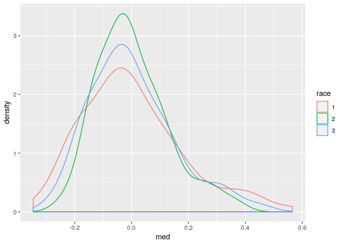
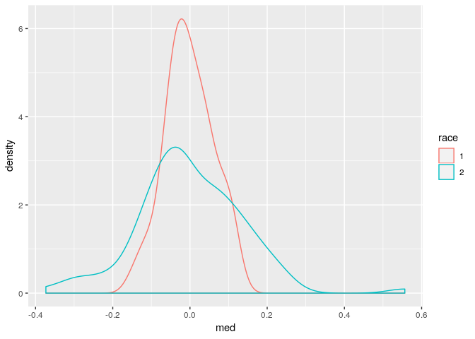
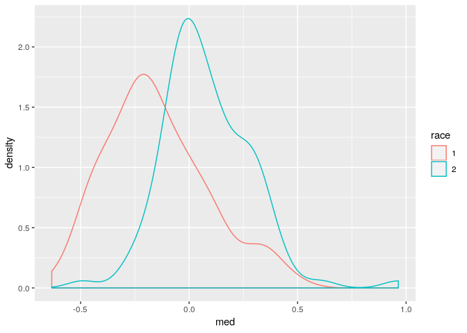

```r
## Load libraries ----
library(tidyverse)
library(magrittr)
```


```r
## Read data ----
stanfit_summary <- read_rds("./models/model_run_20221126_060055/stanfit_summary.rds")
stanfit_object <- read_rds("./models/model_run_20221126_060055/stanfit_object.rds")
county_fips_df <- read_rds("../data/intermediate/county_fips_df.rds")
```


```r
## Functions ----
extract_samples <- function(stanfit) {
    ## Extract samples from a stanfit object and return a list of variables
    ## NOTE: Random effects will be matrices of dimensions iterations x areas
    ##       while the fixed effects will just be columns of length iterations
    
    ## Extract the samples of fixed effects from stan_fit object
    fixed_pars <- stanfit@model_pars[grepl(stanfit@model_pars,
                                           pattern = "alpha|beta|delta|sigma")]
    x <- as.matrix(stanfit, pars = fixed_pars)
    
    ## Get a list of the names and make them prettier
    var_names <-
        gsub(x = colnames(x),
             pattern = "\\[|\\]",
             replacement = "")
    
    ## Turn the named matrix into a list of vectors
    x <- split(x, c(col(x)))
    
    ## Put back in the variable names
    names(x) <- var_names
    
    ## Now extract the random effects and attach the random effects
    random_pars <- stanfit@model_pars[grepl(stanfit@model_pars,
                                            pattern = "nu|psi|phi")]
    r_effs <- as.matrix(stanfit, pars = random_pars)
    x$psi1 <- r_effs[, grep(x = colnames(r_effs),
                            pattern = 'psi[1',
                            fixed = TRUE)]
    x$psi2 <- r_effs[, grep(x = colnames(r_effs),
                            pattern = 'psi[2',
                            fixed = TRUE)]
    x$phi  <- r_effs[, grep(x = colnames(r_effs),
                            pattern = 'phi',
                            fixed = TRUE)]
    x$nu   <- r_effs[, grep(x = colnames(r_effs),
                            pattern = 'nu',
                            fixed = TRUE)]
    
    return(x)
}
```


```r
## summary stats of fixed effects ----
stanfit_summary[c('alpha[1]', 'alpha[2]', 'nu[1]', 'delta'), ]
```

```
##                mean    se_mean        sd       2.5%       25%         50%
## alpha[1] -0.3991725 0.80010417 4.9566025  -9.954995 -2.540020 -0.31768541
## alpha[2] -0.1697555 0.80209882 4.9584817  -9.739083 -2.321946 -0.09438681
## nu[1]     0.2517444 0.80054225 4.9578435 -10.858557 -1.923128  0.16976802
## delta     1.1738139 0.02713623 0.1953239   0.776431  1.050513  1.15800984
##               75%     97.5%    n_eff     Rhat
## alpha[1] 1.773224 10.703950 38.37736 1.078704
## alpha[2] 2.032094 10.944760 38.21569 1.078705
## nu[1]    2.403524  9.816159 38.35457 1.078918
## delta    1.293712  1.491315 51.80981 1.079372
```


```r
# intercept of surface for white pop
stanfit_summary['alpha[1]', 'mean'] + stanfit_summary['nu[1]', 'mean']
```

```
## [1] -0.147428
```


```r
# intercept of shared surface for black pop
stanfit_summary['alpha[2]', 'mean'] + stanfit_summary['nu[1]', 'mean']
```

```
## [1] 0.08198889
```


```r
## organize samples from stanfit_object ----
stanfit_samples <- extract_samples(stanfit_object)

## obtain posterior predictive values ----
## Make a version of nu that is expanded such that every state column
## repeats as many times as their are counties. Then we can just add
## the expanded matrix when calculating posterior quantities.
nu_counts <- county_fips_df %>%
    dplyr::group_by(s_idx) %>%
    dplyr::summarize(count = dplyr::n()) %>%
    dplyr::mutate(c_sum = cumsum(count))

## Initialize a holder
nu_expanded <- matrix(NA,
                      nrow = nrow(stanfit_samples$psi1),
                      ncol = max(nu_counts$c_sum))

for (s in 1:nrow(nu_counts)) {
    start_ix <- ifelse(length(nu_counts$c_sum[s - 1]) > 0,
                       nu_counts$c_sum[s - 1], 0) + 1
    end_ix <- nu_counts$c_sum[s]
    
    nu_expanded[, start_ix:end_ix] <- stanfit_samples$nu #! ----> temporary
}

# white log ratios
posterior_white <- stanfit_samples$alpha1 + stanfit_samples$psi1 + 
  (stanfit_samples$phi * stanfit_samples$delta) + 
  nu_expanded

# black log ratios
posterior_black <- stanfit_samples$alpha2 + stanfit_samples$psi2 +
            (stanfit_samples$phi / stanfit_samples$delta) +
            nu_expanded

# posterior median log ratios
med <- rbind(
  tibble(med = matrixStats::colMedians(posterior_white), race = 1), 
  tibble(med = matrixStats::colMedians(posterior_black), race = 2)
)
```


```r
# shared surface contributions
rbind(
  tibble(
    med = matrixStats::colMedians(stanfit_samples$phi), 
    race = 3),
  tibble(
    med = matrixStats::colMedians(stanfit_samples$phi * stanfit_samples$delta), 
    race = 1), 
  tibble(
    med = matrixStats::colMedians(stanfit_samples$phi / stanfit_samples$delta), 
    race = 2)
) %>% 
  mutate(race = as.character(race)) %>% 
  ggplot() + 
  geom_density(aes(x = med, color = race))
```

<!-- -->


```r
# race-specific surface contributions
rbind(
  tibble(
    med = matrixStats::colMedians(stanfit_samples$psi1), 
    race = 1),
  tibble(
    med = matrixStats::colMedians(stanfit_samples$psi2), 
    race = 2)
) %>% 
  mutate(race = as.character(race)) %>% 
  ggplot() + 
  geom_density(aes(x = med, color = race))
```

<!-- -->


```r
## posterior values ----
med %>% 
  mutate(race = as.character(race)) %>% 
  ggplot() + 
  geom_density(aes(x = med, color = race))
```

<!-- -->
