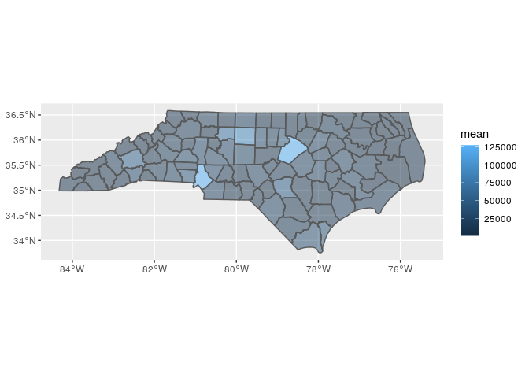
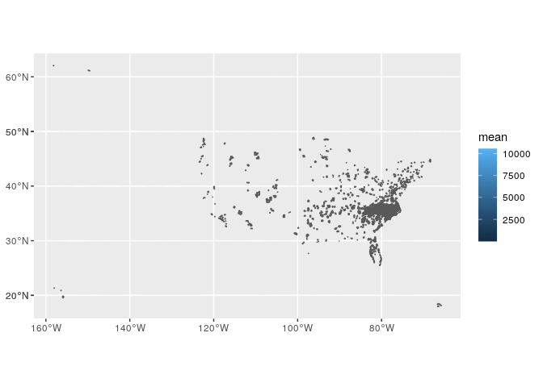
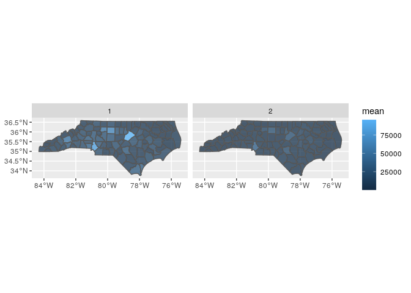

# Explore num enrollees

For a subset of 6 years.


```r
## The interactive Rstudio session was started with 38 GB and 8 cores
## The  default working directory of an Rmd in Rstudio is the Rmd location

## load packages ----
library(tidyverse)
library(magrittr)
library(sf)
```

### Read shp files

* read county shp files


```r
county_sf <- read_sf("../data/input/scratch/tl_2022_us_county/tl_2022_us_county.shp")

dim(county_sf)
```

```
## [1] 3235   18
```

```r
names(county_sf)
```

```
##  [1] "STATEFP"  "COUNTYFP" "COUNTYNS" "GEOID"    "NAME"     "NAMELSAD" "LSAD"     "CLASSFP" 
##  [9] "MTFCC"    "CSAFP"    "CBSAFP"   "METDIVFP" "FUNCSTAT" "ALAND"    "AWATER"   "INTPTLAT"
## [17] "INTPTLON" "geometry"
```


* read zcta shp files


```r
zcta_sf <- read_sf("../data/input/scratch/tl_2022_us_zcta520/tl_2022_us_zcta520.shp")

dim(zcta_sf)
```

```
## [1] 33791    10
```

```r
names(zcta_sf)
```

```
##  [1] "ZCTA5CE20"  "GEOID20"    "CLASSFP20"  "MTFCC20"    "FUNCSTAT20" "ALAND20"    "AWATER20"  
##  [8] "INTPTLAT20" "INTPTLON20" "geometry"
```

### Read zip to zcta crosswalk file


```r
zctazipcrosswalk <- read_csv("../data/input/zip_to_zcta/Zip_to_ZCTA_crosswalk_2015_JSI.csv")
```

```
## Parsed with column specification:
## cols(
##   ZIP = col_character(),
##   PO_NAME = col_character(),
##   STATE = col_character(),
##   ZIP_TYPE = col_character(),
##   ZCTA = col_character()
## )
```


```r
dim(zctazipcrosswalk)
```

```
## [1] 41270     5
```

```r
length(unique(zctazipcrosswalk$ZIP))
```

```
## [1] 41270
```

```r
length(unique(zctazipcrosswalk$ZCTA))
```

```
## [1] 33144
```

* Obtain crosswalk weights


```r
zctazipcrosswalk %<>% 
  left_join(
    zctazipcrosswalk %>% 
      select(ZIP, ZCTA) %>% 
      group_by(ZCTA) %>% 
      summarise(n = n()) %>% 
      mutate(w = 1/n)
  )
```

```
## Joining, by = "ZCTA"
```

```r
head(zctazipcrosswalk)
```

```
## # A tibble: 6 x 7
##   ZIP   PO_NAME    STATE ZIP_TYPE                             ZCTA      n     w
##   <chr> <chr>      <chr> <chr>                                <chr> <int> <dbl>
## 1 96916 Merizo     GU    Post Office or large volume customer 96916     1 1    
## 2 96917 Inarajan   GU    Post Office or large volume customer 96917     1 1    
## 3 96928 Agat       GU    Post Office or large volume customer 96928     1 1    
## 4 96915 Santa Rita GU    ZIP Code area                        96915     1 1    
## 5 96923 Mangilao   GU    Post Office or large volume customer 96913     3 0.333
## 6 96910 Hagatna    GU    ZIP Code area                        96910     2 0.5
```

### Read num enrollees


```r
fips_num_enroll <- read_csv("../data/input/fips_num_enroll.csv")
```

```
## Parsed with column specification:
## cols(
##   year = col_double(),
##   fips5 = col_double(),
##   race = col_character(),
##   count = col_double()
## )
```

```r
zips_num_enroll <- read_csv("../data/input/zips_num_enroll.csv")
```

```
## Parsed with column specification:
## cols(
##   year = col_double(),
##   zip = col_double(),
##   race = col_character(),
##   count = col_double()
## )
```


```r
dim(fips_num_enroll)
```

```
## [1] 8368    4
```

```r
dim(zips_num_enroll)
```

```
## [1] 48931     4
```

### Prepare datasets

* corroborate both zips and zip counts consider the same number of enrollees


```r
sum(fips_num_enroll$count)
```

```
## [1] 10746233
```

```r
sum(zips_num_enroll$count)
```

```
## [1] 10746233
```

* mapping fips in the shp files

Some fips not found in shp files.


```r
length(unique(fips_num_enroll$fips5))
```

```
## [1] 102
```

```r
sum(!unique(fips_num_enroll$fips5) %in% county_sf$GEOID)
```

```
## [1] 2
```

* mapping zips into zctas into shp files

Some zip codes not found in crosswalk file.


```r
length(unique(as.numeric(zips_num_enroll$zip)))
```

```
## [1] 2270
```

```r
sum(!unique(as.numeric(zips_num_enroll$zip)) %in% zctazipcrosswalk$ZIP)
```

```
## [1] 157
```

There are zctas not found in shp files


```r
zips_num_enroll %<>% 
  left_join(
    zctazipcrosswalk %>% 
      mutate(ZIP = as.numeric(ZIP)), 
    by = c("zip" = "ZIP")
  )

length(unique(zips_num_enroll$ZCTA))
```

```
## [1] 1950
```

```r
sum(!unique(zips_num_enroll$ZCTA) %in% zcta_sf$ZCTA5CE20)
```

```
## [1] 4
```

### Explore race

* corroborate both fips and zip race counts give the same numbers


```r
tapply(fips_num_enroll$count, fips_num_enroll$race, sum)
```

```
##       0     0,1     0,2     0,3     0,4     0,5     0,6       1     1,2     1,3   1,3,4   1,3,6 
##   91047    2343     730       6      67      37      12 8283747    9127    5711       4       6 
##     1,4     1,5     1,6       2     2,3     2,4     2,5     2,6       3     3,4     3,5     3,6 
##     508     532    1034 2083859    1599      24      73      90   91000    5991    6350    2304 
##       4       5       6 
##   63148   48772   48112
```


```r
tapply(zips_num_enroll$count, zips_num_enroll$race, sum)
```

```
##       0     0,1     0,2     0,3     0,4     0,5     0,6       1     1,2     1,3   1,3,4   1,3,6 
##   91047    2343     730       6      67      37      12 8283747    9127    5711       4       6 
##     1,4     1,5     1,6       2     2,3     2,4     2,5     2,6       3     3,4     3,5     3,6 
##     508     532    1034 2083859    1599      24      73      90   91000    5991    6350    2304 
##       4       5       6 
##   63148   48772   48112
```

* look at proportions by race

77% white and 19% black


```r
prettyNum(prop.table(tapply(fips_num_enroll$count, fips_num_enroll$race, sum)))
```

```
##              0            0,1            0,2            0,3            0,4            0,5 
##  "0.008472457" "0.0002180299" "6.793078e-05" "5.583352e-07" "6.234743e-06" "3.443067e-06" 
##            0,6              1            1,2            1,3          1,3,4          1,3,6 
##  "1.11667e-06"    "0.7708512" "0.0008493209"  "0.000531442" "3.722235e-07" "5.583352e-07" 
##            1,4            1,5            1,6              2            2,3            2,4 
## "4.727238e-05" "4.950572e-05" "9.621976e-05"    "0.1939153" "0.0001487963" "2.233341e-06" 
##            2,5            2,6              3            3,4            3,5            3,6 
## "6.793078e-06" "8.375028e-06"  "0.008468084" "0.0005574977" "0.0005909047" "0.0002144007" 
##              4              5              6 
##  "0.005876292"  "0.004538521"  "0.004477104"
```

### Explore num enrollees

* All counties have enrollee counts in all years


```r
xx <- fips_num_enroll %>% 
  group_by(year, fips5) %>% 
  summarise(count = sum(count)) %>% 
  group_by(fips5) %>% 
  summarise(
    n = n(),
    max = max(count, na.rm = T), 
    min = min(count, na.rm = T), 
    mean = mean(count, na.rm = T), 
    pct_diff = max / min - 1 
  )

summary(xx$n)
```

```
##    Min. 1st Qu.  Median    Mean 3rd Qu.    Max. 
##       6       6       6       6       6       6
```

* Pct change through years by county


```r
xx %>% 
  arrange(desc(pct_diff))
```

```
## # A tibble: 102 x 6
##    fips5     n    max    min     mean pct_diff
##    <dbl> <int>  <dbl>  <dbl>    <dbl>    <dbl>
##  1 37990     6     27     15     21.2    0.8  
##  2 37019     6  43210  28224  34986      0.531
##  3 37183     6 148457 107618 127348.     0.379
##  4 37055     6   8574   6357   7399.     0.349
##  5 37133     6  23829  17680  20266.     0.348
##  6 37135     6  24479  18223  21017.     0.343
##  7 37063     6  46321  35520  40647      0.304
##  8 37179     6  27194  20921  23924      0.300
##  9 37119     6 143176 110441 126840.     0.296
## 10 37053     6   4967   3841   4336.     0.293
## # … with 92 more rows
```

* Summary of mean enrollees per county


```r
summary(xx$mean) 
```

```
##      Min.   1st Qu.    Median      Mean   3rd Qu.      Max. 
##     21.17   5220.75  10740.50  17559.20  23350.42 127347.83
```

* Map num enrollees per county


```r
county_sf %>% 
  filter(STATEFP == "37") %>% 
  select(GEOID) %>% 
  left_join(
    xx %>%  
      mutate(fips5 = as.character(fips5)), 
    by = c("GEOID" = "fips5")
  ) %>% 
  ggplot() + 
  geom_sf(aes(fill = mean), alpha = 0.5)
```

<!-- -->

* Zip's have varying number of years with enrollees

Zip with zero enrollees are not included.


```r
xx <- zips_num_enroll %>% 
  group_by(year, zip) %>% 
  summarise(count = sum(count)) %>% 
  group_by(zip) %>% 
  summarise(
    n = n(),
    max = max(count, na.rm = T), 
    min = min(count, na.rm = T), 
    mean = mean(count, na.rm = T), 
    pct_diff = max / min - 1 
  ) 

summary(xx$n) 
```

```
##    Min. 1st Qu.  Median    Mean 3rd Qu.    Max. 
##    1.00    2.00    6.00    4.15    6.00    6.00
```

* Pct change through years by zip


```r
xx %>% 
  arrange(desc(pct_diff))
```

```
## # A tibble: 2,270 x 6
##      zip     n   max   min  mean pct_diff
##    <dbl> <int> <dbl> <dbl> <dbl>    <dbl>
##  1 29707     6    11     1  4.67     10  
##  2 27031     4     7     1  3.25      6  
##  3 28542     6     7     1  2.83      6  
##  4 20155     6     6     1  3.17      5  
##  5 22601     6     6     1  2.5       5  
##  6 22901     6     6     1  3.5       5  
##  7 29715     3     6     1  3         5  
##  8 27150     6    11     2  4.67      4.5
##  9 29582     6     5     1  2.5       4  
## 10 23462     2     4     1  2.5       3  
## # … with 2,260 more rows
```

* Summary of mean enrollees per zip

To obtain the mean through year, zip-year having enrollee counts of zero have to be included.


```r
summary(xx$mean) 
```

```
##    Min. 1st Qu.  Median    Mean 3rd Qu.    Max. 
##     1.0     1.0     1.5   789.3   555.6 11122.2
```

* Map num enrollees per zip

Zips to Zcta crosswalk or shapefiles seem to be outdated.


```r
xx <- zips_num_enroll %>% 
  group_by(year, ZCTA) %>% 
  summarise(count = sum(count * w)) %>% 
  group_by(ZCTA) %>% 
  summarise(
    n = n(),
    max = max(count, na.rm = T), 
    min = min(count, na.rm = T), 
    mean = mean(count, na.rm = T), 
    pct_diff = max / min - 1 
  ) 
```

```
## Warning in max(count, na.rm = T): no non-missing arguments to max; returning -Inf
```

```
## Warning in min(count, na.rm = T): no non-missing arguments to min; returning Inf
```

```r
zcta_sf %>% 
  select(ZCTA5CE20) %>% 
  right_join(
    xx, 
    by = c("ZCTA5CE20" = "ZCTA")
  ) %>% 
  ggplot() + 
  geom_sf(aes(fill = mean), alpha = 0.5)
```

<!-- -->

### Enrollee pop per county per race

* County-race (white & black) have varying number of years with enrollees. County-race-year with zero counts are excluded


```r
xx <- fips_num_enroll %>% 
  filter(race %in% c(1,2)) %>% 
  group_by(year, fips5, race) %>% 
  summarise(count = sum(count)) %>% 
  ungroup() %>% 
  group_by(fips5, race) %>% 
  summarise(
    n = n(),
    max = max(count, na.rm = T), 
    min = min(count, na.rm = T), 
    mean = mean(count, na.rm = T), 
    pct_diff = max / min - 1 
  ) %>% 
  ungroup()

tapply(xx$n, xx$race, summary)
```

```
## $`1`
##    Min. 1st Qu.  Median    Mean 3rd Qu.    Max. 
##       6       6       6       6       6       6 
## 
## $`2`
##    Min. 1st Qu.  Median    Mean 3rd Qu.    Max. 
##    4.00    6.00    6.00    5.98    6.00    6.00
```

* Pct change through years by county


```r
xx %>% 
  arrange(desc(pct_diff))
```

```
## # A tibble: 204 x 7
##    fips5 race      n   max   min     mean pct_diff
##    <dbl> <chr> <int> <dbl> <dbl>    <dbl>    <dbl>
##  1 37075 2         4     3     1     1.75    2    
##  2 37990 1         6    17     9    13.7     0.889
##  3 37173 2         6    23    13    16.3     0.769
##  4 37115 2         6    26    16    20.2     0.625
##  5    NA 2         6    14     9    11.3     0.556
##  6 37005 2         6    40    26    31.7     0.538
##  7 37019 1         6 38965 25610 31629.      0.521
##  8 37199 2         6    41    27    34.3     0.519
##  9 37990 2         6     3     2     2.17    0.5  
## 10 37025 2         6  4932  3375  4100.      0.461
## # … with 194 more rows
```

* Summary of mean enrollees per county-race


```r
tapply(xx$mean, xx$race, summary)
```

```
## $`1`
##     Min.  1st Qu.   Median     Mean  3rd Qu.     Max. 
##    13.67  4164.83  8375.08 13535.53 17176.79 95639.67 
## 
## $`2`
##     Min.  1st Qu.   Median     Mean  3rd Qu.     Max. 
##     1.75   395.25  2215.08  3405.00  3463.17 36395.67
```

* Map num enrollees per county


```r
county_sf %>% 
  filter(STATEFP == "37") %>% 
  select(GEOID) %>% 
  left_join(
    xx %>%  
      mutate(fips5 = as.character(fips5)), 
    by = c("GEOID" = "fips5")
  ) %>% 
  ggplot() + 
  geom_sf(aes(fill = mean), alpha = 0.75) +
  facet_wrap(~race)
```

<!-- -->
