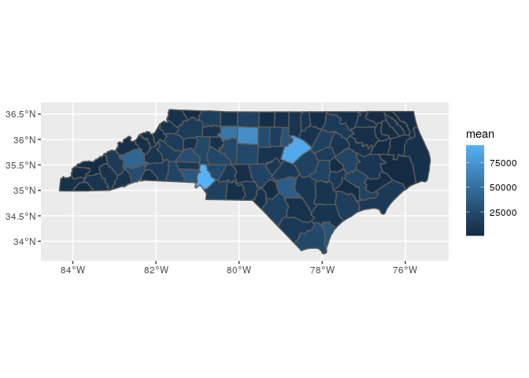
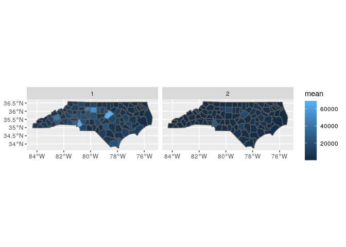

# Explore num enrollees

For a subset of 16 years.


```r
## The interactive Rstudio session was started with 38 GB and 8 cores
## The  default working directory of an Rmd in Rstudio is the Rmd location

## load packages ----
library(tidyverse)
library(magrittr)
library(sf)
```

### Read shp files

* read county shp files


```r
county_sf <- read_sf("../data/input/scratch/tl_2022_us_county/tl_2022_us_county.shp")

dim(county_sf)
```

```
## [1] 3235   18
```

```r
names(county_sf)
```

```
##  [1] "STATEFP"  "COUNTYFP" "COUNTYNS" "GEOID"    "NAME"     "NAMELSAD" "LSAD"     "CLASSFP" 
##  [9] "MTFCC"    "CSAFP"    "CBSAFP"   "METDIVFP" "FUNCSTAT" "ALAND"    "AWATER"   "INTPTLAT"
## [17] "INTPTLON" "geometry"
```


* read zcta shp files


```r
zcta_sf <- read_sf("../data/input/scratch/tl_2022_us_zcta520/tl_2022_us_zcta520.shp")

dim(zcta_sf)
```

```
## [1] 33791    10
```

```r
names(zcta_sf)
```

```
##  [1] "ZCTA5CE20"  "GEOID20"    "CLASSFP20"  "MTFCC20"    "FUNCSTAT20" "ALAND20"    "AWATER20"  
##  [8] "INTPTLAT20" "INTPTLON20" "geometry"
```

### Read zip to zcta crosswalk file


```r
zctazipcrosswalk <- read_csv("../data/input/zip_to_zcta/Zip_to_ZCTA_crosswalk_2015_JSI.csv")
```

```
## Parsed with column specification:
## cols(
##   ZIP = col_character(),
##   PO_NAME = col_character(),
##   STATE = col_character(),
##   ZIP_TYPE = col_character(),
##   ZCTA = col_character()
## )
```


```r
dim(zctazipcrosswalk)
```

```
## [1] 41270     5
```

```r
length(unique(zctazipcrosswalk$ZIP))
```

```
## [1] 41270
```

```r
length(unique(zctazipcrosswalk$ZCTA))
```

```
## [1] 33144
```

* Obtain crosswalk weights


```r
zctazipcrosswalk %<>% 
  left_join(
    zctazipcrosswalk %>% 
      select(ZIP, ZCTA) %>% 
      group_by(ZCTA) %>% 
      summarise(n = n()) %>% 
      mutate(w = 1/n)
  )
```

```
## Joining, by = "ZCTA"
```

```r
head(zctazipcrosswalk)
```

```
## # A tibble: 6 x 7
##   ZIP   PO_NAME    STATE ZIP_TYPE                             ZCTA      n     w
##   <chr> <chr>      <chr> <chr>                                <chr> <int> <dbl>
## 1 96916 Merizo     GU    Post Office or large volume customer 96916     1 1    
## 2 96917 Inarajan   GU    Post Office or large volume customer 96917     1 1    
## 3 96928 Agat       GU    Post Office or large volume customer 96928     1 1    
## 4 96915 Santa Rita GU    ZIP Code area                        96915     1 1    
## 5 96923 Mangilao   GU    Post Office or large volume customer 96913     3 0.333
## 6 96910 Hagatna    GU    ZIP Code area                        96910     2 0.5
```

## All years

### Read num enrollees


```r
fips_num_enroll_ <- read_csv("../data/input/fips_num_enroll_.csv")
```

```
## Parsed with column specification:
## cols(
##   year = col_double(),
##   fips5 = col_double(),
##   race = col_double(),
##   count = col_double()
## )
```


```r
dim(fips_num_enroll_)
```

```
## [1] 3313    4
```

### Prepare datasets

* mapping fips in the shp files

Some fips not found in shp files.


```r
length(unique(fips_num_enroll_$fips5))
```

```
## [1] 125
```

```r
sum(!unique(fips_num_enroll_$fips5) %in% county_sf$GEOID)
```

```
## [1] 25
```

### Explore race

* fips race counts


```r
tapply(fips_num_enroll_$count, fips_num_enroll_$race, sum)
```

```
##        1        2 
## 18520280  4501229
```

* look at proportions by race

80% white and 20% black


```r
prettyNum(prop.table(tapply(fips_num_enroll_$count, fips_num_enroll_$race, sum)))
```

```
##           1           2 
## "0.8044772" "0.1955228"
```

### Explore num enrollees

* There are counties that do not have enrollees in all years. 


```r
xx <- fips_num_enroll_ %>% 
  group_by(year, fips5) %>% 
  summarise(count = sum(count)) %>% 
  group_by(fips5) %>% 
  summarise(
    n = n(),
    max = max(count, na.rm = T), 
    min = min(count, na.rm = T), 
    mean = mean(count, na.rm = T), 
    pct_diff = max / min - 1 
  )

summary(xx$n)
```

```
##    Min. 1st Qu.  Median    Mean 3rd Qu.    Max. 
##    1.00   16.00   16.00   13.46   16.00   16.00
```

* Pct change through years by county


```r
xx %>% 
  arrange(desc(pct_diff))
```

```
## # A tibble: 125 x 6
##    fips5     n    max   min   mean pct_diff
##    <dbl> <int>  <dbl> <dbl>  <dbl>    <dbl>
##  1    NA    16 143547    53 25563.  2707.  
##  2 37990    13   1496    12   245.   124.  
##  3 37143    16   3679   808  2748.     3.55
##  4 37139    16   8603  2263  6149.     2.80
##  5 37093    16   4484  1220  3083.     2.68
##  6 37029    16   1728   536  1271.     2.22
##  7 37027    16  18238  5955 13833.     2.06
##  8 37710     3      3     1     2      2   
##  9 37069    16  10601  3576  7359.     1.96
## 10 37059    16   9359  3206  6836.     1.92
## # … with 115 more rows
```

* Summary of mean enrollees per county


```r
summary(xx$mean) 
```

```
##    Min. 1st Qu.  Median    Mean 3rd Qu.    Max. 
##       1    2516    6669   11511   15308   92745
```

* Map num enrollees per county


```r
county_sf %>% 
  filter(STATEFP == "37") %>% 
  select(GEOID) %>% 
  left_join(
    xx %>%  
      mutate(fips5 = as.character(fips5)), 
    by = c("GEOID" = "fips5")
  ) %>% 
  ggplot() + 
  geom_sf(aes(fill = mean), aes = 0.5)
```

```
## Warning: Ignoring unknown parameters: aes
```

<!-- -->

### Enrollee pop per county per race

* County-race (white & black) have varying number of years with enrollees. County-race-year with zero counts are excluded


```r
xx <- fips_num_enroll_ %>% 
  filter(race %in% c(1,2)) %>% 
  group_by(year, fips5, race) %>% 
  summarise(count = sum(count)) %>% 
  ungroup() %>% 
  group_by(fips5, race) %>% 
  summarise(
    n = n(),
    max = max(count, na.rm = T), 
    min = min(count, na.rm = T), 
    mean = mean(count, na.rm = T), 
    pct_diff = max / min - 1 
  ) %>% 
  ungroup()

tapply(xx$n, xx$race, summary)
```

```
## $`1`
##    Min. 1st Qu.  Median    Mean 3rd Qu.    Max. 
##    1.00   16.00   16.00   13.63   16.00   16.00 
## 
## $`2`
##    Min. 1st Qu.  Median    Mean 3rd Qu.    Max. 
##     1.0    16.0    16.0    15.3    16.0    16.0
```

* Pct change through years by county


```r
xx %>% 
  arrange(desc(pct_diff))
```

```
## # A tibble: 230 x 7
##    fips5  race     n    max   min    mean pct_diff
##    <dbl> <dbl> <int>  <dbl> <dbl>   <dbl>    <dbl>
##  1    NA     1    16 121856    40 21714.   3045.  
##  2    NA     2    16  21691     9  3849.   2409.  
##  3 37990     1    13   1272     9   207.    140.  
##  4 37990     2    13    224     2    37.3   111   
##  5 37075     2    14     55     1    12.4    54   
##  6 37011     2    16    230     9    54.4    24.6 
##  7 37009     2    16    317    39    91.8     7.13
##  8 37143     1    16   2962   526  2142.      4.63
##  9 37139     2    16   2899   635  2041.      3.57
## 10 37115     2    16     58    13    24.8     3.46
## # … with 220 more rows
```

* Summary of mean enrollees per county-race


```r
tapply(xx$mean, xx$race, summary)
```

```
## $`1`
##    Min. 1st Qu.  Median    Mean 3rd Qu.    Max. 
##       1    1787    5649    9411   12943   69316 
## 
## $`2`
##    Min. 1st Qu.  Median    Mean 3rd Qu.    Max. 
##     1.0   294.7  1731.2  2629.4  2897.2 25646.1
```

* Map num enrollees per county


```r
county_sf %>% 
  filter(STATEFP == "37") %>% 
  select(GEOID) %>% 
  left_join(
    xx %>%  
      mutate(fips5 = as.character(fips5)), 
    by = c("GEOID" = "fips5")
  ) %>% 
  ggplot() + 
  geom_sf(aes(fill = mean), aes = 0.5) +
  facet_wrap(~race)
```

```
## Warning: Ignoring unknown parameters: aes
```

<!-- -->
