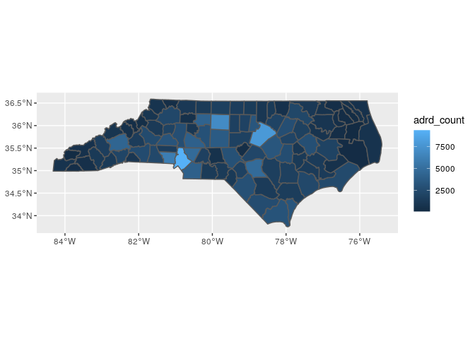
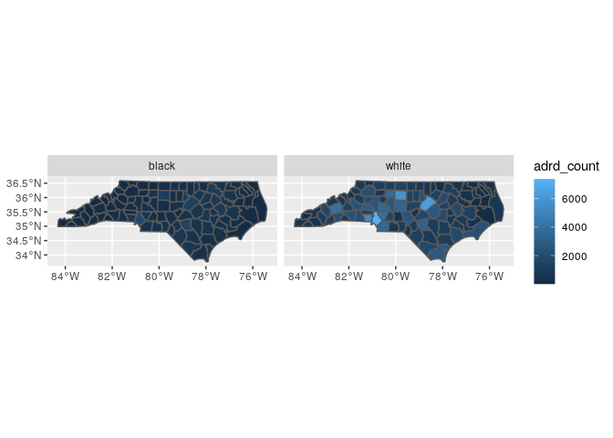

# ADRD hospitalization rates per county

## Limited to NC


```r
## The interactive Rstudio session was started with 36 GB and 8 cores
## The  default working directory of an Rmd in Rstudio is the Rmd location
## The details of the symbolic links to the input data are provided in the README of the  /data/input folder

## load packages ----
library(tidyverse)
library(magrittr)
library(fst)
library(data.table)
library(sf)
library(tictoc)
```

### Read shp files

* read county shp files


```r
county_sf <- read_sf("../data/input/scratch/tl_2022_us_county/tl_2022_us_county.shp")

dim(county_sf)
```

```
## [1] 3235   18
```

```r
names(county_sf)
```

```
##  [1] "STATEFP"  "COUNTYFP" "COUNTYNS" "GEOID"    "NAME"     "NAMELSAD" "LSAD"     "CLASSFP" 
##  [9] "MTFCC"    "CSAFP"    "CBSAFP"   "METDIVFP" "FUNCSTAT" "ALAND"    "AWATER"   "INTPTLAT"
## [17] "INTPTLON" "geometry"
```

### Read zcta to fips files


```r
countyzctacrosswalk <- read_tsv("../data/input/countyzctacrosswalk.tab")
```

```
## Parsed with column specification:
## cols(
##   FIPS = col_double(),
##   state = col_character(),
##   county = col_character(),
##   ZCTA5 = col_double()
## )
```

* Obtain weights


```r
xx <- countyzctacrosswalk %>%
  select(county, ZCTA5) %>%
  group_by(ZCTA5) %>%
  summarise(n = n()) %>%
  mutate(w = 1/n)

countyzctacrosswalk %<>%
  left_join(xx)
```

```
## Joining, by = "ZCTA5"
```

```r
head(countyzctacrosswalk)
```

```
## # A tibble: 6 x 6
##    FIPS state county ZCTA5     n     w
##   <dbl> <chr> <chr>  <dbl> <int> <dbl>
## 1 10001 DE    kent   19977     2   0.5
## 2 10001 DE    kent   19938     2   0.5
## 3 10001 DE    kent   19901     1   1  
## 4 10001 DE    kent   19904     1   1  
## 5 10001 DE    kent   19952     2   0.5
## 6 10001 DE    kent   19946     1   1
```

### Read zip to zcta


```r
zipzctacrosswalk <- read_csv("../data/input/zip_to_zcta/Zip_to_ZCTA_crosswalk_2015_JSI.csv") %>% 
  rename(
    zcta = ZCTA,
    zip = ZIP
  )
```

```
## Parsed with column specification:
## cols(
##   ZIP = col_character(),
##   PO_NAME = col_character(),
##   STATE = col_character(),
##   ZIP_TYPE = col_character(),
##   ZCTA = col_character()
## )
```

* check mapping properties


```r
dim(zipzctacrosswalk)
```

```
## [1] 41270     5
```

```r
length(unique(zipzctacrosswalk$zip))
```

```
## [1] 41270
```

```r
length(unique(zipzctacrosswalk$zcta))
```

```
## [1] 33144
```


```r
xx <- zipzctacrosswalk %>%
  select(zip, zcta) %>%
  group_by(zcta) %>%
  summarise(n = n()) %>%
  mutate(w = 1/n)

zipzctacrosswalk %<>%
  left_join(xx)
```

```
## Joining, by = "zcta"
```

```r
head(zipzctacrosswalk)
```

```
## # A tibble: 6 x 7
##   zip   PO_NAME    STATE ZIP_TYPE                             zcta      n     w
##   <chr> <chr>      <chr> <chr>                                <chr> <int> <dbl>
## 1 96916 Merizo     GU    Post Office or large volume customer 96916     1 1    
## 2 96917 Inarajan   GU    Post Office or large volume customer 96917     1 1    
## 3 96928 Agat       GU    Post Office or large volume customer 96928     1 1    
## 4 96915 Santa Rita GU    ZIP Code area                        96915     1 1    
## 5 96923 Mangilao   GU    Post Office or large volume customer 96913     3 0.333
## 6 96910 Hagatna    GU    ZIP Code area                        96910     2 0.5
```

### Read ADRD events


```r
tic("Read denom files")
ffs_entry_exit_adrd <- read_fst("../data/input/denom/ffs_entry_exit_adrd.fst" 
                                #, as.data.table = TRUE
)
toc()
```

```
## Read denom files: 92.804 sec elapsed
```


```r
class(ffs_entry_exit_adrd)
```

```
## [1] "data.frame"
```

```r
dim(ffs_entry_exit_adrd)
```

```
## [1] 64404527       23
```

```r
lapply(ffs_entry_exit_adrd, class)
```

```
## $qid
## [1] "character"
## 
## $entry_age
## [1] "integer"
## 
## $entry_zip
## [1] "integer"
## 
## $race
## [1] "integer"
## 
## $sex
## [1] "integer"
## 
## $any_dual
## [1] "logical"
## 
## $ffs_entry_year
## [1] "integer"
## 
## $ffs_exit_year
## [1] "integer"
## 
## $exit_zip
## [1] "integer"
## 
## $entry_fips
## [1] "integer"
## 
## $exit_fips
## [1] "integer"
## 
## $AD_year
## [1] "integer"
## 
## $ADRD_year
## [1] "integer"
## 
## $ADRD_date
## [1] "Date"
## 
## $ADRD_hosp
## [1] "logical"
## 
## $AD_date
## [1] "Date"
## 
## $AD_hosp
## [1] "logical"
## 
## $ADRD_zip
## [1] "integer"
## 
## $AD_zip
## [1] "integer"
## 
## $AD_age
## [1] "integer"
## 
## $ADRD_age
## [1] "integer"
## 
## $sexM
## [1] "logical"
## 
## $race_cat
## [1] "character"
```

* determine unique ID's.

A single row per ID


```r
tic("sum duplicates")
sum(duplicated(ffs_entry_exit_adrd$qid))
```

```
## [1] 0
```

```r
toc()
```

```
## sum duplicates: 14.552 sec elapsed
```

* Filter beneficiaries with ADRD


```r
adrd_df <- ffs_entry_exit_adrd %>% 
  filter(ADRD_hosp) %>% 
  select(qid, race_cat, sex, ADRD_year, ADRD_zip, ADRD_age)

dim(adrd_df)
```

```
## [1] 7562282       6
```

* explore race

80% white, 18% black


```r
prop.table(table(adrd_df$race_cat))
```

```
## 
##         asian         black          hisp n_amer_native         other         white 
##   0.008844930   0.100584158   0.015920238   0.001779569   0.007725654   0.865145451
```

### Prepare data

* Mapping of ADRD_zip with zcta and state and county

Some zips not found in crosswalk to zcta (all US)


```r
length(unique(adrd_df$ADRD_zip))
```

```
## [1] 39265
```

```r
sum(!unique(as.character(adrd_df$ADRD_zip)) %in% zipzctacrosswalk$zip)
```

```
## [1] 4291
```

Some zctas codes not found in crosswalk to county (all US)


```r
length(unique(zipzctacrosswalk$zcta))
```

```
## [1] 33144
```

```r
sum(!unique(zipzctacrosswalk$zcta) %in% countyzctacrosswalk$ZCTA5)
```

```
## [1] 6736
```

Some zero zip codes


```r
sum(as.numeric(adrd_df$ADRD_zip) == 0, na.rm = T)
```

```
## [1] 135
```

The left join produces duplicated q_id entries

Beneficiaries that live in zips that intersect more than one county contribute more than once. The weights distribute them.


```r
tic("map ADRD_zip")
adrd_df %<>%
  mutate(ADRD_zip = as.character(ADRD_zip)) %>%
  left_join(
    zipzctacrosswalk,
    by = c("ADRD_zip" = "zip")
  )
toc()
```

```
## map ADRD_zip: 3.442 sec elapsed
```


```r
tic("map ADRD_zip")
adrd_df %<>%
  left_join(
    countyzctacrosswalk %>% 
      mutate(ZCTA5 = as.character(ZCTA5)),
    by = c("zcta" = "ZCTA5")
  )
toc()
```

```
## map ADRD_zip: 1.899 sec elapsed
```

* Limit to NC


```r
adrd_df %<>% 
  filter(state == "NC")

dim(adrd_df)
```

```
## [1] 412240     17
```

* harmonize weights


```r
adrd_df %<>% 
  mutate(w = w.x * w.y)
```


### ADRD historic first hospitalizations in NC

* Summarize number of historic first ADRD hospitalizations per county


```r
yy <- adrd_df %>% 
  group_by(FIPS) %>% 
  summarize(adrd_count = sum(w))

summary(yy$adrd_count)
```

```
##    Min. 1st Qu.  Median    Mean 3rd Qu.    Max. 
##   114.0   782.1  1483.4  1909.0  2521.0  9341.4
```

* Map adrd counts


```r
county_sf %>% 
  filter(STATEFP == "37") %>% 
  select(GEOID) %>% 
  left_join(
    yy %>%  
      mutate(FIPS = as.character(FIPS)), 
    by = c("GEOID" = "FIPS")
  ) %>% 
  ggplot() + 
  geom_sf(aes(fill = adrd_count), aes = 0.5)
```

```
## Warning: Ignoring unknown parameters: aes
```

<!-- -->

### ADRD historic first hospitalizations per race

* Summarize number of historic first ADRD hospitalizations per county-race


```r
yy <- adrd_df %>% 
  group_by(FIPS, race_cat) %>% 
  summarize(adrd_count = sum(w)) %>% 
  ungroup()

tapply(yy$adrd_count, yy$race_cat, summary)
```

```
## $asian
##    Min. 1st Qu.  Median    Mean 3rd Qu.    Max. 
##   0.125   1.000   2.458   5.033   5.250  50.155 
## 
## $black
##     Min.  1st Qu.   Median     Mean  3rd Qu.     Max. 
##    1.375   76.583  299.833  346.797  523.312 1790.168 
## 
## $hisp
##    Min. 1st Qu.  Median    Mean 3rd Qu.    Max. 
##  0.1111  1.0000  2.0000  4.0767  4.0000 38.3214 
## 
## $n_amer_native
##     Min.  1st Qu.   Median     Mean  3rd Qu.     Max. 
##   0.0833   0.3542   1.2500  12.7632   2.5833 544.9167 
## 
## $other
##    Min. 1st Qu.  Median    Mean 3rd Qu.    Max. 
##   0.125   1.958   4.125  11.241   7.833 341.583 
## 
## $white
##    Min. 1st Qu.  Median    Mean 3rd Qu.    Max. 
##    70.5   561.0  1164.4  1534.6  2015.2  7381.2
```

* Map adrd counts


```r
county_sf %>% 
  filter(STATEFP == "37") %>% 
  select(GEOID) %>% 
  left_join(
    yy %>%  
      filter(race_cat %in% c("white", "black")) %>% 
      mutate(FIPS = as.character(FIPS)), 
    by = c("GEOID" = "FIPS")
  ) %>% 
  ggplot() + 
  geom_sf(aes(fill = adrd_count)) +
  facet_grid(~ race_cat)
```

<!-- -->


```r
write_rds(adrd_df, "../data/intermediate/adrd_df.rds")
```

