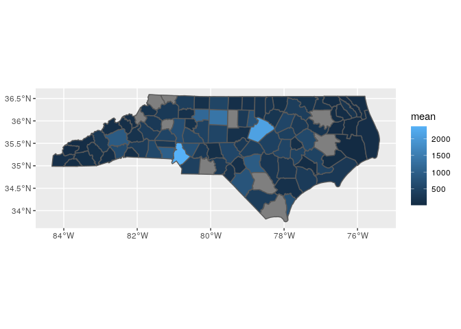
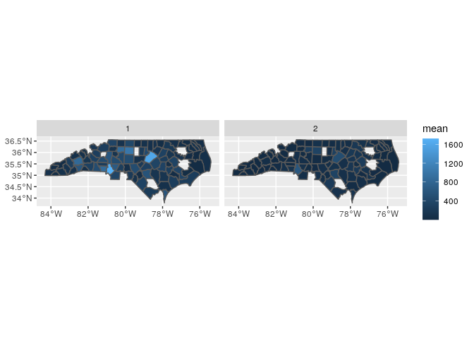

# ADRD hospitalization per county

## Limited to NC


```r
## The interactive Rstudio session was started with 36 GB and 8 cores
## The  default working directory of an Rmd in Rstudio is the Rmd location
## The details of the symbolic links to the input data are provided in the README of the  /data/input folder

## load packages ----
library(tidyverse)
library(magrittr)
library(fst)
library(data.table)
library(sf)
library(tictoc)
```

### Read num enrollees


```r
fips_num_enroll_ <- read_csv("../data/input/fips_num_enroll_.csv")
```

```
## Parsed with column specification:
## cols(
##   year = col_double(),
##   fips5 = col_double(),
##   race = col_double(),
##   count = col_double()
## )
```

### Read shp files

* read county shp files


```r
county_sf <- read_sf("../data/input/scratch/tl_2022_us_county/tl_2022_us_county.shp")

dim(county_sf)
```

```
## [1] 3235   18
```

```r
names(county_sf)
```

```
##  [1] "STATEFP"  "COUNTYFP" "COUNTYNS" "GEOID"    "NAME"     "NAMELSAD" "LSAD"     "CLASSFP" 
##  [9] "MTFCC"    "CSAFP"    "CBSAFP"   "METDIVFP" "FUNCSTAT" "ALAND"    "AWATER"   "INTPTLAT"
## [17] "INTPTLON" "geometry"
```

### Read SSA5 to FIPS


```r
ssa_fips <- read_csv("../data/input/ssa_fips_state_county2016.csv")
```

```
## Parsed with column specification:
## cols(
##   county = col_character(),
##   state = col_character(),
##   ssacounty = col_character(),
##   fipscounty = col_character(),
##   cbsa = col_double(),
##   cbsaname = col_character(),
##   ssastate = col_character(),
##   fipsstate = col_character()
## )
```


```r
dim(ssa_fips)
```

```
## [1] 3273    8
```

```r
length(unique(ssa_fips$ssacounty))
```

```
## [1] 3273
```

```r
length(unique(ssa_fips$fipscounty))
```

```
## [1] 3272
```

### Read ADRD admissions


```r
tic("Read ADRD admissions")
admissions <- read_csv("../data/intermediate/admissions.csv")
```

```
## Parsed with column specification:
## cols(
##   RACE = col_double(),
##   SSA5 = col_double(),
##   counts = col_double(),
##   year = col_double()
## )
```

```r
toc()
```

```
## Read ADRD admissions: 0.006 sec elapsed
```


```r
class(admissions)
```

```
## [1] "spec_tbl_df" "tbl_df"      "tbl"         "data.frame"
```

```r
dim(admissions)
```

```
## [1] 5878    4
```

```r
lapply(admissions, class)
```

```
## $RACE
## [1] "numeric"
## 
## $SSA5
## [1] "numeric"
## 
## $counts
## [1] "numeric"
## 
## $year
## [1] "numeric"
```

* crosswalk ssa5 and fips

some counties not in crosswalk file


```r
sum(!unique(as.numeric(admissions$SSA5)) %in% ssa_fips$ssacounty)
```

```
## [1] 35
```


```r
admissions %<>% 
  mutate(SSA5 = as.character(SSA5)) %>% 
  left_join(
    select(ssa_fips, ssacounty, fipscounty), 
    by = c("SSA5" = "ssacounty"))
```

### Prepare data

* Mapping of enrollment fips with admissions fips

All admission fips in enrollments fips


```r
sum(!unique(as.numeric(admissions$fipscounty)) %in% fips_num_enroll_$fips5)
```

```
## [1] 0
```

### Explore race

* fips race counts


```r
tapply(admissions$counts, admissions$RACE, sum)
```

```
##      0      1      2      3      4      5      6 
##   1188 437934 124635   3541   1266   1238   3725
```

* look at proportions by race

76% white and 21% black


```r
prettyNum(prop.table(tapply(admissions$counts, admissions$RACE, sum)))
```

```
##             0             1             2             3             4             5 
## "0.002071393"   "0.7635804"   "0.2173132" "0.006174077" "0.002207394" "0.002158573" 
##             6 
## "0.006494899"
```

### Explore num hospitalizations

* All counties have adrd counts in all years. 

Crosswalk may be required by year


```r
xx <- admissions %>% 
  group_by(year, SSA5) %>% 
  summarise(count = sum(counts)) %>% 
  group_by(SSA5) %>% 
  summarise(
    n = n(),
    max = max(count, na.rm = T), 
    min = min(count, na.rm = T), 
    mean = mean(count, na.rm = T), 
    pct_diff = max / min - 1 
  )

summary(xx$n)
```

```
##    Min. 1st Qu.  Median    Mean 3rd Qu.    Max. 
##    1.00   17.00   17.00   13.89   17.00   17.00
```


```r
xx <- admissions %>% 
  group_by(year, fipscounty) %>% 
  summarise(count = sum(counts)) %>% 
  group_by(fipscounty) %>% 
  summarise(
    n = n(),
    max = max(count, na.rm = T), 
    min = min(count, na.rm = T), 
    mean = mean(count, na.rm = T), 
    pct_diff = max / min - 1 
  )

summary(xx$n)
```

```
##    Min. 1st Qu.  Median    Mean 3rd Qu.    Max. 
##      17      17      17      17      17      17
```

* Pct change through years by county


```r
xx %>% 
  arrange(desc(pct_diff))
```

```
## # A tibble: 92 x 6
##    fipscounty     n   max   min  mean pct_diff
##    <chr>      <int> <dbl> <dbl> <dbl>    <dbl>
##  1 37990         17    69     1 15.7     68   
##  2 37177         17    21     1  7.76    20   
##  3 37095         17    58     5 13.7     10.6 
##  4 37041         17    89    19 43.9      3.68
##  5 37149         17   162    42 80.5      2.86
##  6 37121         17   100    26 71.9      2.85
##  7 37199         17   119    32 85.1      2.72
##  8 37055         17   120    35 76.2      2.43
##  9 37173         17    89    26 47.3      2.42
## 10 37187         17    59    19 35.2      2.11
## # … with 82 more rows
```

* Summary of mean hospitalizations per county


```r
summary(xx$mean) 
```

```
##     Min.  1st Qu.   Median     Mean  3rd Qu.     Max. 
##    7.765   99.177  250.088  366.705  481.588 2373.118
```

* Map num hospitalizations per county


```r
county_sf %>% 
  filter(STATEFP == "37") %>% 
  select(GEOID) %>% 
  left_join(
    xx, 
    by = c("GEOID" = "fipscounty")
  ) %>% 
  ggplot() + 
  geom_sf(aes(fill = mean), aes = 0.5)
```

```
## Warning: Ignoring unknown parameters: aes
```

<!-- -->

### Hospitalizations per county per race

* County-race (white & black) have varying number of years with hospitalizations. County-race-year with zero counts are excluded


```r
xx <- admissions %>% 
  filter(RACE %in% c(1,2)) %>% 
  group_by(year, fipscounty, RACE) %>% 
  summarise(count = sum(counts)) %>% 
  ungroup() %>% 
  group_by(fipscounty, RACE) %>% 
  summarise(
    n = n(),
    max = max(count, na.rm = T), 
    min = min(count, na.rm = T), 
    mean = mean(count, na.rm = T), 
    pct_diff = max / min - 1 
  ) %>% 
  ungroup()

tapply(xx$n, xx$RACE, summary)
```

```
## $`1`
##    Min. 1st Qu.  Median    Mean 3rd Qu.    Max. 
##   15.00   17.00   17.00   16.98   17.00   17.00 
## 
## $`2`
##    Min. 1st Qu.  Median    Mean 3rd Qu.    Max. 
##     1.0    17.0    17.0    15.6    17.0    17.0
```

* Pct change through years by county


```r
xx %>% 
  arrange(desc(pct_diff))
```

```
## # A tibble: 184 x 7
##    fipscounty  RACE     n   max   min  mean pct_diff
##    <chr>      <dbl> <int> <dbl> <dbl> <dbl>    <dbl>
##  1 37990          1    17    56     1 12.5      55  
##  2 37095          1    17    35     2  8.82     16.5
##  3 37177          1    15    14     1  5.4      13  
##  4 37111          2    17    12     1  5.71     11  
##  5 37095          2    13    23     2  6.23     10.5
##  6 37055          2    15     9     1  3.47      8  
##  7 37087          2    15     9     1  4.2       8  
##  8 37059          2    17    24     3  8.59      7  
##  9 37177          2    16     8     1  2.88      7  
## 10 37041          2    17    38     5 15.1       6.6
## # … with 174 more rows
```

* Summary of hospitalizations per county-race


```r
tapply(xx$mean, xx$RACE, summary)
```

```
## $`1`
##    Min. 1st Qu.  Median    Mean 3rd Qu.    Max. 
##    5.40   79.09  156.59  280.02  354.71 1719.59 
## 
## $`2`
##    Min. 1st Qu.  Median    Mean 3rd Qu.    Max. 
##    1.00   11.63   38.41   79.85   95.31  608.41
```

* Map num enrollees per county


```r
county_sf %>% 
  filter(STATEFP == "37") %>% 
  select(GEOID) %>% 
  right_join(
    xx %>%  
      mutate(fips5 = as.character(fipscounty)), 
    by = c("GEOID" = "fipscounty")
  ) %>% 
  ggplot() + 
  geom_sf(aes(fill = mean), aes = 0.5) +
  facet_wrap(~RACE)
```

```
## Warning: Ignoring unknown parameters: aes
```

<!-- -->
