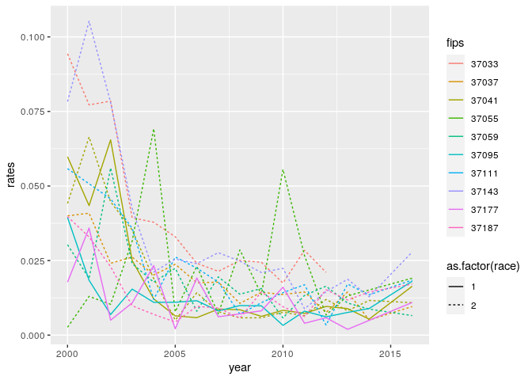

# ADRD hospitalization rates per county

## Limited to NC


```r
## The interactive Rstudio session was started with 36 GB and 8 cores
## The  default working directory of an Rmd in Rstudio is the Rmd location
## The details of the symbolic links to the input data are provided in the README of the  /data/input folder

## load packages ----
library(tidyverse)
library(magrittr)
library(fst)
library(data.table)
library(sf)
library(tictoc)
```

### Read num enrollees


```r
fips_num_enroll_ <- read_csv("../data/input/fips_num_enroll_.csv") %>% 
  rename(fips = fips5, 
         num_enroll = count) %>% 
  mutate(fips = as.character(fips))
```

```
## Parsed with column specification:
## cols(
##   year = col_double(),
##   fips5 = col_double(),
##   race = col_double(),
##   count = col_double()
## )
```

### Read shp files

* read county shp files


```r
county_sf <- read_sf("../data/input/scratch/tl_2022_us_county/tl_2022_us_county.shp") %>% 
  rename(fips = GEOID) %>% 
  mutate(fips = as.character(as.numeric(fips)))

dim(county_sf)
```

```
## [1] 3235   18
```

```r
names(county_sf)
```

```
##  [1] "STATEFP"  "COUNTYFP" "COUNTYNS" "fips"     "NAME"     "NAMELSAD" "LSAD"     "CLASSFP"  "MTFCC"   
## [10] "CSAFP"    "CBSAFP"   "METDIVFP" "FUNCSTAT" "ALAND"    "AWATER"   "INTPTLAT" "INTPTLON" "geometry"
```

### Read SSA5 to FIPS


```r
ssa_fips <- read_csv("../data/input/ssa_fips_state_county2016.csv") %>% 
  rename(ssa = ssacounty, 
         fips = fipscounty)
```

```
## Parsed with column specification:
## cols(
##   county = col_character(),
##   state = col_character(),
##   ssacounty = col_character(),
##   fipscounty = col_character(),
##   cbsa = col_double(),
##   cbsaname = col_character(),
##   ssastate = col_character(),
##   fipsstate = col_character()
## )
```


```r
dim(ssa_fips)
```

```
## [1] 3273    8
```

```r
length(unique(ssa_fips$ssa))
```

```
## [1] 3273
```

```r
length(unique(ssa_fips$fips))
```

```
## [1] 3272
```

### Read ADRD admissions


```r
admissions <- read_csv("../data/intermediate/admissions.csv") %>% 
  rename(ssa = SSA5, 
         race = RACE, 
         adrd_hosp = counts) %>% 
  mutate(ssa = as.character(ssa))
```

```
## Parsed with column specification:
## cols(
##   RACE = col_double(),
##   SSA5 = col_double(),
##   counts = col_double(),
##   year = col_double()
## )
```


```r
class(admissions)
```

```
## [1] "spec_tbl_df" "tbl_df"      "tbl"         "data.frame"
```

```r
dim(admissions)
```

```
## [1] 5878    4
```

* crosswalk ssa5 and fips

some counties not in crosswalk file


```r
sum(!unique(as.numeric(admissions$ssa)) %in% ssa_fips$ssa)
```

```
## [1] 35
```


```r
admissions %<>% 
  left_join(
    select(ssa_fips, ssa, fips))
```

```
## Joining, by = "ssa"
```

### Prepare data

* Mapping of enrollment fips with admissions fips


```r
sum(!unique(admissions$fips) %in% fips_num_enroll_$fips)
```

```
## [1] 0
```

```r
sum(!unique(fips_num_enroll_$fips) %in% admissions$fips )
```

```
## [1] 33
```


```r
fips_rates <- fips_num_enroll_ %>% 
  left_join(admissions) %>% 
  mutate(rates = adrd_hosp / num_enroll)
```

```
## Joining, by = c("year", "fips", "race")
```

* there are counties with quite a large enrollee populations that are not mapped to hospitalizations using (but maybe they do with correct ssa?).


```r
fips_rates %>% 
  filter(is.na(rates)) %>% 
  select(fips, race, year, num_enroll) %>% 
  pivot_wider(
    id_cols = c('fips', 'race'), 
    values_from = 'num_enroll', 
    names_from = 'year') %>% 
  head(15)
```

```
## # A tibble: 15 x 18
##    fips   race `2000` `2001` `2002` `2003` `2004` `2005` `2006` `2007` `2008` `2009` `2010` `2011` `2012`
##    <chr> <dbl>  <dbl>  <dbl>  <dbl>  <dbl>  <dbl>  <dbl>  <dbl>  <dbl>  <dbl>  <dbl>  <dbl>  <dbl>  <dbl>
##  1 37001     1  15613  15758  15922  19243  19475  19918  20429  21171  21630  21949  22400  23105  23761
##  2 37001     2   2967   3008   3119   4157   4242   4405   4524   4743   4903   5047   5241   5434   5592
##  3 37003     1   3682   3775   3816   4841   5037   5151   5394   5612   5824   5979   6161   6382   6600
##  4 37003     2    756    760    762    297    306    320    333    343    336    346    359    379    393
##  5 37005     1   1707   1703   1725   2584   2622   2669   2744   2808   2841   2894   2914   2972   3069
##  6 37005     2     13     15     14     32     27     26     25     26     23     24     28     26     29
##  7 37007     1   2662   2711   2748   2648   2687   2711   2751   2767   2827   2852   2880   2884   2915
##  8 37007     2   1139   1146   1196   1784   1801   1821   1838   1916   1938   1963   1991   2003   2044
##  9 37009     1   6391   6523   6728   5460   5544   5632   5722   5901   6078   6193   6295   6398   6561
## 10 37009     2    312    305    317     40     43     41     39     40     39     39     40     41     43
## 11 37011     1   8402   8551   8744   3686   3744   3800   3835   3897   4019   4092   4133   4266   4350
## 12 37011     2    223    230    230     16     16     10      9     11     12     19     13     16     15
## 13 37013     1   4249   4241   4313   6749   7006   7194   7422   7806   8082   8389   8604   8853   9142
## 14 37013     2   2460   2403   2402   2646   2659   2666   2674   2714   2768   2821   2856   2934   2996
## 15 37015     1   2588   2644   2699   1898   1919   1904   1899   1927   1970   1976   1999   2041   2081
## # … with 3 more variables: `2013` <dbl>, `2014` <dbl>, `2016` <dbl>
```

### Explore rates per race

* summary all years


```r
tapply(fips_rates$rates, fips_rates$race, summary)
```

```
## $`1`
##     Min.  1st Qu.   Median     Mean  3rd Qu.     Max.     NA's 
##  0.00001  0.01774  0.02336  0.19771  0.03046 11.25000      209 
## 
## $`2`
##    Min. 1st Qu.  Median    Mean 3rd Qu.    Max.    NA's 
## 0.00005 0.01909 0.02712 0.26491 0.03832 8.20000     286
```

* some fips do not have rates for all years


```r
xx <- fips_rates %>%  
  filter(
    !is.na(rates), 
    !is.na(fips)
  ) %>% 
  group_by(fips, race) %>% 
  summarise(
    n = n(),
    max = max(rates, na.rm = T), 
    min = min(rates, na.rm = T), 
    mean = mean(rates, na.rm = T), 
    pct_diff = max / min - 1 
  )

summary(xx$n)
```

```
##    Min. 1st Qu.  Median    Mean 3rd Qu.    Max. 
##    1.00   16.00   16.00   15.31   16.00   16.00
```

* Pct change through years by county


```r
summary(xx$pct_diff)
```

```
##    Min. 1st Qu.  Median    Mean 3rd Qu.    Max. 
##   0.000   1.118   2.024   3.568   3.377  74.487
```

* mean rate distribuition per race


```r
tapply(xx$mean, xx$race, summary)
```

```
## $`1`
##    Min. 1st Qu.  Median    Mean 3rd Qu.    Max. 
## 0.01161 0.01975 0.02355 0.02768 0.02740 0.40352 
## 
## $`2`
##    Min. 1st Qu.  Median    Mean 3rd Qu.    Max. 
## 0.00881 0.02301 0.02878 0.03364 0.03348 0.34753
```


* County 37990 is suspicious.


```r
fips_rates %>% 
  filter(
    !is.na(rates), 
    !is.na(fips)
  ) %>% 
  left_join(xx) %>% 
  arrange(desc(pct_diff, year))
```

```
## Joining, by = c("fips", "race")
```

```
## # A tibble: 2,786 x 12
##     year fips   race num_enroll ssa   adrd_hosp  rates     n   max    min  mean pct_diff
##    <dbl> <chr> <dbl>      <dbl> <chr>     <dbl>  <dbl> <int> <dbl>  <dbl> <dbl>    <dbl>
##  1  2003 37990     1        195 34999         4 0.0205    13  1.23 0.0163 0.404     74.5
##  2  2004 37990     1        609 34999        25 0.0411    13  1.23 0.0163 0.404     74.5
##  3  2005 37990     1       1272 34999        56 0.0440    13  1.23 0.0163 0.404     74.5
##  4  2006 37990     1        149 34999        25 0.168     13  1.23 0.0163 0.404     74.5
##  5  2007 37990     1        189 34999        14 0.0741    13  1.23 0.0163 0.404     74.5
##  6  2008 37990     1        184 34999         3 0.0163    13  1.23 0.0163 0.404     74.5
##  7  2009 37990     1         13 34999        16 1.23      13  1.23 0.0163 0.404     74.5
##  8  2010 37990     1         14 34999         8 0.571     13  1.23 0.0163 0.404     74.5
##  9  2011 37990     1         14 34999        16 1.14      13  1.23 0.0163 0.404     74.5
## 10  2012 37990     1         14 34999         9 0.643     13  1.23 0.0163 0.404     74.5
## # … with 2,776 more rows
```

* time series of a sample of hospitalizations per county


```r
yy <- fips_rates %>% 
  filter(
    !fips == '37990', 
    !is.na(rates), 
    !is.na(fips)
  ) %>% 
  left_join(xx) %>% 
  arrange(desc(pct_diff, year)) 
```

```
## Joining, by = c("fips", "race")
```

```r
yy[1:170,] %>% 
  ggplot() + 
  geom_line(aes(x = year, y = rates, color = fips, linetype = as.factor(race)))
```

<!-- -->

* Map mean rates per county


```r
county_sf %>% 
  filter(STATEFP == "37") %>% 
  select(fips) %>% 
  left_join(xx) %>% 
  filter(!is.na(race)) %>% 
  ggplot() + 
  geom_sf(aes(fill = mean)) + 
  facet_grid(~race)
```

```
## Joining, by = "fips"
```

<!-- -->
