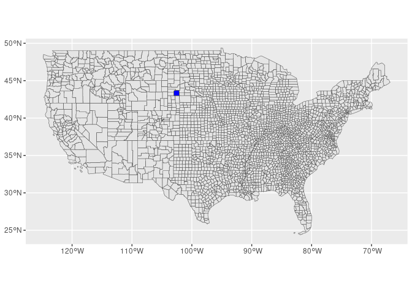

```r
## load packages ----
library(tidyverse)
library(magrittr)
library(sf)
```

In this notebook we make sure that the counties match in all objects: the adjacency matrix, geometry, hosp rates, sociodemographic and pollution data.

## Adjacency matrix


```r
####
# Download adjacency
####

## Import data ----
county_adj_df <- readr::read_delim(
    '../data/county/county_adjacency.txt',
    delim = "\t",
    escape_double = FALSE,
    col_names = c("name_i", "fips_i",
                  "name_j", "fips_j"),
    trim_ws = TRUE
)
```

```
## Rows: 22200 Columns: 4
## ── Column specification ─────────────────────────────────────────────────────────────────────────────────────────────────────
## Delimiter: "\t"
## chr (4): name_i, fips_i, name_j, fips_j
## 
## ℹ Use `spec()` to retrieve the full column specification for this data.
## ℹ Specify the column types or set `show_col_types = FALSE` to quiet this message.
```

```r
county_adj_df
```

```
## # A tibble: 22,200 × 4
##    name_i             fips_i name_j                fips_j
##    <chr>              <chr>  <chr>                 <chr> 
##  1 Autauga County, AL 01001  Autauga County, AL    01001 
##  2 <NA>               <NA>   Chilton County, AL    01021 
##  3 <NA>               <NA>   Dallas County, AL     01047 
##  4 <NA>               <NA>   Elmore County, AL     01051 
##  5 <NA>               <NA>   Lowndes County, AL    01085 
##  6 <NA>               <NA>   Montgomery County, AL 01101 
##  7 Baldwin County, AL 01003  Baldwin County, AL    01003 
##  8 <NA>               <NA>   Clarke County, AL     01025 
##  9 <NA>               <NA>   Escambia County, AL   01053 
## 10 <NA>               <NA>   Mobile County, AL     01097 
## # ℹ 22,190 more rows
```


```r
## Forward fill ----
county_adj_df <- zoo::na.locf(county_adj_df)

## Remove self loops and add state fips ----
county_adj_df <- county_adj_df %>%
    dplyr::filter(fips_i != fips_j) %>%
    dplyr::mutate(state_i = substr(fips_i, 1, 2),
                  state_j = substr(fips_j, 1, 2))

## Fix FIPS ----
## Bedford City got lumped together with Bedford county in CMF data
county_adj_df <- county_adj_df %>%
    dplyr::filter(fips_i != "51515",
                  fips_j != "51515")

## Now remove states/territories we won't use ----
county_adj_df <- dplyr::filter(county_adj_df,
                                  !state_i %in% c("02","15", "66", "72", "60", "69", "78"),
                                  !state_j %in% c("02","15", "66", "72", "60", "69", "78"))

county_adj_df %<>% 
  mutate(county = as.numeric(fips_i))

county_adj_df
```

```
## # A tibble: 18,472 × 7
##    name_i             fips_i name_j                fips_j state_i state_j county
##    <chr>              <chr>  <chr>                 <chr>  <chr>   <chr>    <dbl>
##  1 Autauga County, AL 01001  Chilton County, AL    01021  01      01        1001
##  2 Autauga County, AL 01001  Dallas County, AL     01047  01      01        1001
##  3 Autauga County, AL 01001  Elmore County, AL     01051  01      01        1001
##  4 Autauga County, AL 01001  Lowndes County, AL    01085  01      01        1001
##  5 Autauga County, AL 01001  Montgomery County, AL 01101  01      01        1001
##  6 Baldwin County, AL 01003  Clarke County, AL     01025  01      01        1003
##  7 Baldwin County, AL 01003  Escambia County, AL   01053  01      01        1003
##  8 Baldwin County, AL 01003  Mobile County, AL     01097  01      01        1003
##  9 Baldwin County, AL 01003  Monroe County, AL     01099  01      01        1003
## 10 Baldwin County, AL 01003  Washington County, AL 01129  01      01        1003
## # ℹ 18,462 more rows
```

## Shapefiles


```r
## read county shp files
county_sf <- read_sf("../data/county/tl_2015_us_county/tl_2015_us_county.shp") %>%
  filter(!STATEFP %in% c("02","15", "66", "72", "60", "69", "78")) %>% 
  mutate(county = as.numeric(GEOID))

dim(county_sf)
```

```
## [1] 3108   19
```

```r
length(unique(county_adj_df$fips_i))
```

```
## [1] 3108
```

```r
length(unique(county_adj_df$fips_j))
```

```
## [1] 3108
```

```r
length(unique(county_adj_df$county))
```

```
## [1] 3108
```

```r
counties_adj_ = unique(county_adj_df$county)
counties_shp_ = unique(county_sf$county)

setdiff(counties_shp_, counties_adj_) #46102
```

```
## [1] 46102
```

```r
setdiff(counties_adj_, counties_shp_) #46113
```

```
## [1] 46113
```


```r
county_sf %>%
  st_simplify() %>%
  ggplot() +
  geom_sf() + 
  geom_sf(data = county_sf[!county_sf$county %in% counties_adj_, ], fill="blue")
```

<!-- -->


```r
county_sf$county[county_sf$county == 46102] <- 46113 #Oglala Lakota County, SD. Shannon County, SD (FIPS code = 46113) was renamed Oglala Lakota County and assigned anew FIPS code (46102) effective in 2014

counties_adj_ = unique(county_adj_df$county)
counties_shp_ = unique(county_sf$county)

setdiff(counties_shp_, counties_adj_)
```

```
## numeric(0)
```

```r
setdiff(counties_adj_, counties_shp_)
```

```
## numeric(0)
```

```r
#write_rds(county_sf, "../data/symlinks/temp/county_sf.rds")
```

## All-cause data


```r
hosp_county_df <- read_csv("../data/symlinks/temp/hosp_rates.csv") %>% 
  filter(!state %in% c(2, 15, 66, 72, 60, 69, 78))
```

```
## Rows: 696384 Columns: 8
## ── Column specification ─────────────────────────────────────────────────────────────────────────────────────────────────────
## Delimiter: ","
## chr (1): age_grp
## dbl (7): county, year, race, sex, state, n_enrollees, n_admissions
## 
## ℹ Use `spec()` to retrieve the full column specification for this data.
## ℹ Specify the column types or set `show_col_types = FALSE` to quiet this message.
```

```r
counties_hosp_ = unique(hosp_county_df$county)

length(counties_hosp_) #3109
```

```
## [1] 3109
```

```r
setdiff(counties_hosp_, counties_adj_) 
```

```
## [1] 46102
```

```r
#when using 2010 crosswalk 51515 51560
#when using 2015 crosswalk 46102
setdiff(counties_adj_, counties_hosp_) 
```

```
## numeric(0)
```

```r
#when using 2010 crosswalk 8014
#when using 2015 crosswalk none
```


```r
#Shannon County, SD (FIPS code = 46113) was renamed Oglala Lakota County and assigned anew FIPS code (46102) effective in 2014
zip_county <- read.csv("../data/county/zip_county_2015.csv")

zip_county %>% 
  filter(county %in% c(46113, 46102))
```

```
##     zip county
## 1 57716  46113
## 2 57716  46102
## 3 57752  46113
## 4 57756  46113
## 5 57764  46113
## 6 57764  46102
## 7 57770  46113
## 8 57772  46113
## 9 57794  46113
```


```r
hosp_county_df$county[hosp_county_df$county == 46102] <- 46113

hosp_county_df %<>% 
  group_by(county, year, race, sex, age_grp, state) %>% 
  summarise(n_enrollees = sum(n_enrollees), 
            n_admissions = sum(n_admissions)) %>% 
  ungroup()
```

```
## `summarise()` has grouped output by 'county', 'year', 'race', 'sex', 'age_grp'. You can override using the `.groups`
## argument.
```


```r
counties_hosp_ = unique(hosp_county_df$county)

length(counties_hosp_)
```

```
## [1] 3108
```

```r
setdiff(counties_hosp_, counties_adj_)
```

```
## numeric(0)
```

```r
setdiff(counties_adj_, counties_hosp_)
```

```
## numeric(0)
```

## Sociodemographic

* year 2000


```r
census_county_df <- read_csv("../data/symlinks/prepped_census/census_county_interpolated.csv") %>% 
  rename(county = fips) %>% 
  mutate(county = as.numeric(county), 
         state = round(county / 1000)) %>% 
  filter(!state %in% c(2, 15, 66, 72, 60, 69, 78))
```

```
## Rows: 64660 Columns: 23
## ── Column specification ─────────────────────────────────────────────────────────────────────────────────────────────────────
## Delimiter: ","
## chr  (1): NAME
## dbl (22): fips, land_area, year, hispanic_pct, poverty, poverty_mcare, population, median_house_value, blk_pct, white_pct...
## 
## ℹ Use `spec()` to retrieve the full column specification for this data.
## ℹ Specify the column types or set `show_col_types = FALSE` to quiet this message.
```

```r
census_county_2000_df <- census_county_df %>% 
  filter(year == 2000, 
         !is.na(median_household_income)) 

counties_census_ = unique(census_county_2000_df$county)

length(counties_census_)
```

```
## [1] 3108
```

```r
setdiff(counties_census_, counties_adj_) #46102
```

```
## [1] 46102
```

```r
setdiff(counties_adj_, counties_census_) #46113
```

```
## [1] 46113
```


```r
census_county_2000_df$county[census_county_2000_df$county == 46102] <- 46113
sum(is.na(census_county_2000_df$median_household_income))
```

```
## [1] 0
```

* year 2010


```r
census_county_2010_df <- census_county_df %>% 
  filter(year == 2010, 
         !is.na(median_household_income)) 

counties_census_ = unique(census_county_2010_df$county)

length(counties_census_)
```

```
## [1] 3108
```

```r
setdiff(counties_census_, counties_adj_) #46102
```

```
## [1] 46102
```

```r
setdiff(counties_adj_, counties_census_) #46113
```

```
## [1] 46113
```


```r
census_county_2010_df$county[census_county_2010_df$county == 46102] <- 46113
sum(is.na(census_county_2010_df$median_household_income))
```

```
## [1] 0
```


```r
median_household_df <- census_county_2000_df %>% 
  rename(med_house_income_2000 = median_household_income) %>% 
  select(county, med_house_income_2000) %>% 
  left_join(
    census_county_2010_df %>% 
    rename(med_house_income_2010 = median_household_income) %>% 
    select(county, med_house_income_2010)
  ) 
```

```
## Joining with `by = join_by(county)`
```

```r
median_household_df$med_house_income <- rowMeans(median_household_df[,-1])
```

## Pollution


```r
pollution_county_df %<>% 
  rename(county = fips) %>% 
  mutate(county = as.numeric(county), 
         state = round(county / 1000)) %>% 
  filter(!state %in% c(2, 15, 66, 72, 60, 69, 78))

counties_pollution_ = unique(pollution_county_df$county)

length(counties_pollution_)
```

```
## [1] 3108
```

```r
setdiff(counties_pollution_, counties_adj_) #46102
```

```
## [1] 46102
```

```r
setdiff(counties_adj_, counties_pollution_) #46113
```

```
## [1] 46113
```


```r
pollution_county_df$county[pollution_county_df$county == 46102] <- 46113
```

* merge datasets


```r
hosp_county_df %<>%
  left_join(
    median_household_df %>% select(county, med_house_income)
  ) %>% 
  left_join(
    pollution_county_df %>% select(county, pm25)
  )
```

```
## Joining with `by = join_by(county)`
## Joining with `by = join_by(county)`
```

```r
write_rds(hosp_county_df, "../data/symlinks/temp/hosp_county_df.rds")
```


```r
lapply(hosp_county_df, summary)
```

```
## $county
##    Min. 1st Qu.  Median    Mean 3rd Qu.    Max. 
##    1001   19044   29212   30672   46008   56045 
## 
## $year
##    Min. 1st Qu.  Median    Mean 3rd Qu.    Max. 
##    2000    2004    2008    2009    2013    2018 
## 
## $race
##    Min. 1st Qu.  Median    Mean 3rd Qu.    Max. 
##     1.0     1.0     1.5     1.5     2.0     2.0 
## 
## $sex
##    Min. 1st Qu.  Median    Mean 3rd Qu.    Max. 
##     1.0     1.0     1.5     1.5     2.0     2.0 
## 
## $age_grp
##    Length     Class      Mode 
##    671328 character character 
## 
## $state
##    Min. 1st Qu.  Median    Mean 3rd Qu.    Max. 
##    1.00   19.00   29.00   30.57   46.00   56.00 
## 
## $n_enrollees
##      Min.   1st Qu.    Median      Mean   3rd Qu.      Max.      NA's 
##      0.17     24.00    177.50    848.69    653.00 113127.00     73096 
## 
## $n_admissions
##     Min.  1st Qu.   Median     Mean  3rd Qu.     Max.     NA's 
##     0.17    22.00    96.17   326.43   276.50 48706.67   121783 
## 
## $med_house_income
##    Min. 1st Qu.  Median    Mean 3rd Qu.    Max. 
##   17578   33270   38046   39697   43808   98111 
## 
## $pm25
##    Min. 1st Qu.  Median    Mean 3rd Qu.    Max. 
##   1.959   6.151   8.363   7.856   9.549  12.729
```
