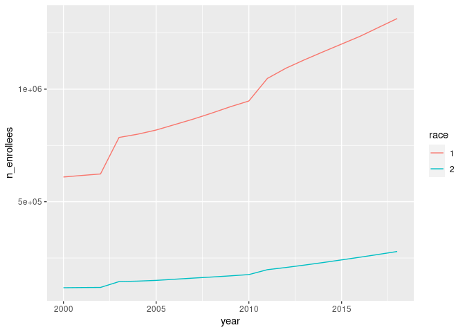
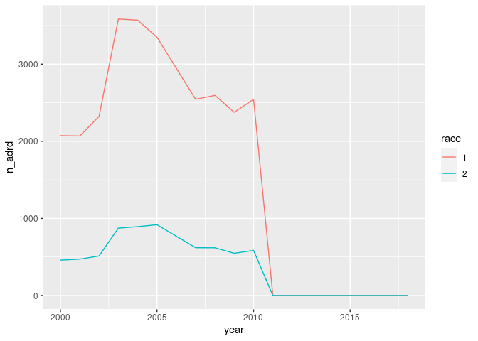
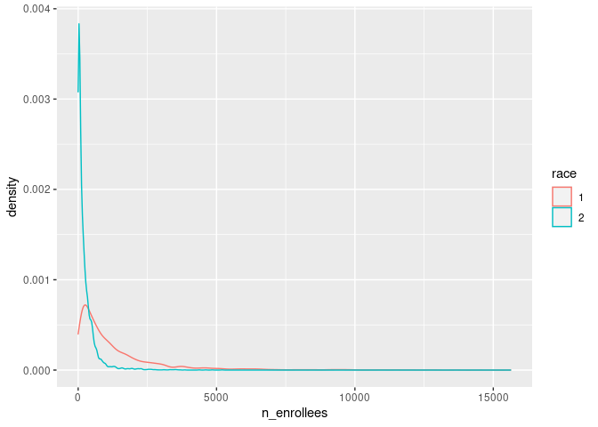
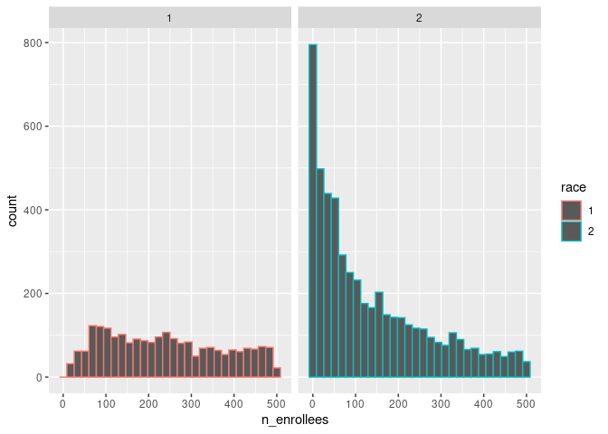
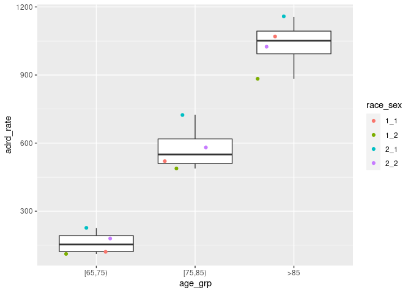
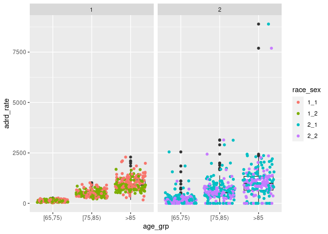
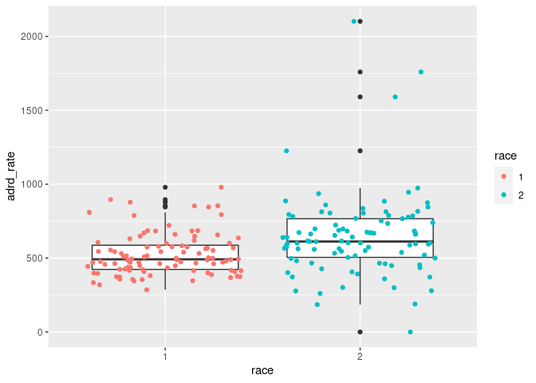
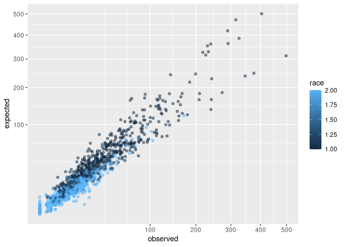
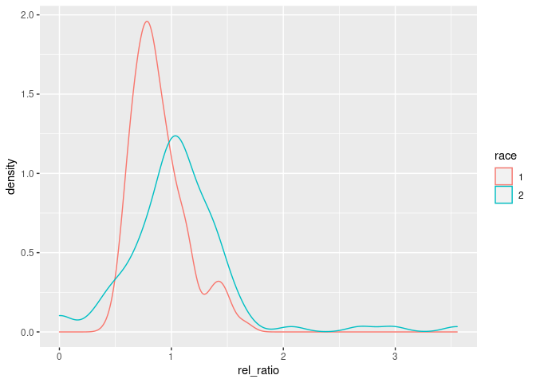
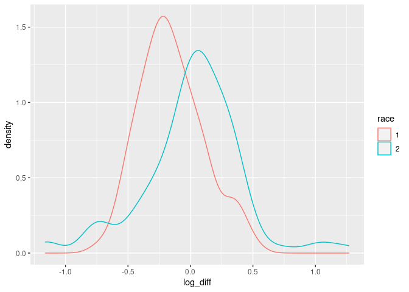

```r
## Load libraries ----
library(tidyverse)
library(magrittr)
library(ggplot2)
```


```r
## Read data ----
adrd_county_df <- read_csv("../data/input/local/adrd_county_df.csv")
```

```
## Rows: 27200 Columns: 8
## ── Column specification ───────────────────────────────────────────────────────────────────────────
## Delimiter: ","
## chr (1): age_grp
## dbl (7): county, year, race, sex, state, n_enrollees, n_adrd
## 
## ℹ Use `spec()` to retrieve the full column specification for this data.
## ℹ Specify the column types or set `show_col_types = FALSE` to quiet this message.
```

```r
county_fips_df <- read_rds("../data/intermediate/county_fips_df.rds")
county_adj_df <- read_rds("../data/intermediate/county_adj_df.rds")
```


```r
## Subset ----
##  Just get FIPS we want and subset to population of interest --
adrd_county_df %<>%
    filter(county %in% as.integer(county_fips_df$fipschar), 
           age_grp %in% c("[65,75)", "[75,85)", ">85"))

##  Replace NA with 0 --
adrd_county_df$n_enrollees[is.na(adrd_county_df$n_enrollees)] <- 0 
adrd_county_df$n_adrd[is.na(adrd_county_df$n_adrd)] <- 0 

sum(adrd_county_df$n_enrollees)
```

```
## [1] 19269529
```

```r
sum(adrd_county_df$n_adrd)
```

```
## [1] 33528
```


```r
## Plot number of enrollees across years ----
adrd_county_df %>% 
  mutate(race = as.character(race)) %>% 
  group_by(year, race) %>% 
  summarise(n_enrollees = sum(n_enrollees)) %>% 
  ggplot() + 
  geom_line(aes(x = year, y = n_enrollees, color = race))
```

```
## `summarise()` has grouped output by 'year'. You can override using the `.groups` argument.
```

<!-- -->


```r
## Plot number of adrd admissions across years ----
adrd_county_df %>% 
  mutate(race = as.character(race)) %>% 
  group_by(year, race) %>% 
  summarise(n_adrd = sum(n_adrd)) %>% 
  ggplot() + 
  geom_line(aes(x = year, y = n_adrd, color = race))
```

```
## `summarise()` has grouped output by 'year'. You can override using the `.groups` argument.
```

<!-- -->


```r
#! ----> temporarily remove 2011 onwards
adrd_county_df %<>% 
  filter(year <= 2010)

sum(adrd_county_df$n_enrollees)
```

```
## [1] 9356368
```

```r
sum(adrd_county_df$n_adrd)
```

```
## [1] 33528
```


```r
## Number of enrollees by county-sex-age_grp split by race group ----
adrd_county_df %>% 
  mutate(race = as.character(race)) %>% 
  ggplot() + 
  geom_density(aes(x = n_enrollees, color = race))
```

<!-- -->


```r
## Number of enrollees by county-sex-age_grp split by race group ----
adrd_county_df %>% 
  filter(n_enrollees < 500) %>% 
  mutate(race = as.character(race)) %>% 
  ggplot() + 
  geom_histogram(aes(x = n_enrollees, color = race)) +
  facet_grid(~race)
```

```
## `stat_bin()` using `bins = 30`. Pick better value with `binwidth`.
```

<!-- -->


```r
## Adrd blind-to-counties rates for each race-sex-age_grp----
adrd_county_df %>% 
  group_by(race, sex, age_grp) %>% 
  summarise(n_enrollees = sum(n_enrollees), 
            n_adrd = sum(n_adrd),
            adrd_rate = n_adrd / n_enrollees * 1e5) %>% 
  mutate(race_sex = paste(race, sex, sep = "_")) %>% 
  ggplot() +
  geom_boxplot(aes(x = age_grp, y = adrd_rate)) + 
  geom_jitter(aes(x = age_grp, y = adrd_rate, col = race_sex))
```

```
## `summarise()` has grouped output by 'race', 'sex'. You can override using the `.groups` argument.
```

<!-- -->


```r
## Adrd county rates for each race-sex-age_grp ----
adrd_county_df %>% 
  group_by(county, race, sex, age_grp) %>% 
  summarise(n_enrollees = sum(n_enrollees), 
            n_adrd = sum(n_adrd),
            adrd_rate = n_adrd / n_enrollees * 1e5) %>% 
  mutate(race_sex = paste(race, sex, sep = "_")) %>% 
  ggplot() +
  geom_boxplot(aes(x = age_grp, y = adrd_rate)) + 
  geom_jitter(aes(x = age_grp, y = adrd_rate, col = race_sex)) + 
  facet_wrap(~race)
```

```
## `summarise()` has grouped output by 'county', 'race', 'sex'. You can override using the `.groups`
## argument.
```

```
## Warning: Removed 3 rows containing non-finite values (stat_boxplot).
```

```
## Warning: Removed 3 rows containing missing values (geom_point).
```

<!-- -->


```r
## Adrd equally-weighted (sex/age_gtp) rates for each county/race ----
adrd_county_df %>% 
  mutate(race = as.character(race)) %>% 
  group_by(county, race, sex, age_grp) %>% 
  summarise(n_enrollees = sum(n_enrollees), 
            n_adrd = sum(n_adrd),
            adrd_rate = n_adrd / n_enrollees * 1e5) %>% 
  group_by(county, race) %>% 
  summarise(adrd_rate = mean(adrd_rate)) %>% 
  ggplot() +
  geom_boxplot(aes(x = race, y = adrd_rate)) + 
  geom_jitter(aes(x = race, y = adrd_rate, color = race))
```

```
## `summarise()` has grouped output by 'county', 'race', 'sex'. You can override using the `.groups`
## argument.
## `summarise()` has grouped output by 'county'. You can override using the `.groups` argument.
```

```
## Warning: Removed 3 rows containing non-finite values (stat_boxplot).
```

```
## Warning: Removed 3 rows containing missing values (geom_point).
```

<!-- -->

* adrd hospitalizations entangle prevalence and severity, specially in "small" counties 
* biased measurement error? noise systematically affects certain groups
* even if not affecting certain groups, measurement error decreases the power of the model
* variance of the inference, will not detect statistical differences in the output

## Observed vs expected rates


```r
## Get the standard rates ----
## We just get the standard rate for each sex/age group combination
## combining all observations over the time period (over fips).
exp_df <- adrd_county_df %>%
    dplyr::group_by(race, sex, age_grp) %>% # race, sex, age_grp
    dplyr::summarize(
        n_adrd = sum(n_adrd),
        n_enrollees = sum(n_enrollees),
        exp_rate = n_adrd / n_enrollees
    ) %>% 
  group_by(sex, age_grp) %>% 
  summarise(exp_rate = mean(exp_rate)) # equal weight to race
```

```
## `summarise()` has grouped output by 'race', 'sex'. You can override using the `.groups` argument.
## `summarise()` has grouped output by 'sex'. You can override using the `.groups` argument.
```

```r
exp_df
```

```
## # A tibble: 6 × 3
## # Groups:   sex [2]
##     sex age_grp exp_rate
##   <dbl> <chr>      <dbl>
## 1     1 [65,75)  0.00176
## 2     1 [75,85)  0.00621
## 3     1 >85      0.0111 
## 4     2 [65,75)  0.00146
## 5     2 [75,85)  0.00535
## 6     2 >85      0.00957
```


```r
## Aggregate over years ----
## Just tally up the number of person years and deaths over all years
obs_df <- adrd_county_df %>%
    dplyr::group_by(county, race, sex, age_grp) %>% #county, race, sex, age_grp
    dplyr::summarize(n_enrollees = sum(n_enrollees),
                     n_adrd = sum(n_adrd), 
                     obs_rate = n_adrd / n_enrollees)
```

```
## `summarise()` has grouped output by 'county', 'race', 'sex'. You can override using the `.groups`
## argument.
```

```r
## fill NAs
obs_df %>% 
  filter(n_enrollees == 0) 
```

```
## # A tibble: 3 × 7
## # Groups:   county, race, sex [3]
##   county  race   sex age_grp n_enrollees n_adrd obs_rate
##    <dbl> <dbl> <dbl> <chr>         <dbl>  <dbl>    <dbl>
## 1  37043     2     1 >85               0      0      NaN
## 2  37099     2     1 >85               0      0      NaN
## 3  37173     2     1 >85               0      0      NaN
```

```r
obs_df$obs_rate[is.na(obs_df$obs_rate)] <- 0
```


```r
## Merge with exp_df ----
adrd_ratios_df <- obs_df %>%
    dplyr::left_join(exp_df %>%
                         dplyr::select(sex, age_grp, exp_rate),
                     by = c("sex", "age_grp"))

adrd_ratios_df %>% 
  mutate(
    person_years = n_enrollees,
    expected = person_years * exp_rate, 
    observed = person_years * obs_rate
  ) %>% 
  ggplot() + 
  geom_point(aes(x = observed, y = expected, color = race), alpha = 0.5) + 
  scale_x_sqrt() + 
  scale_y_sqrt()
```

<!-- -->


```r
## Now aggregate age ----
adrd_ratios_df %<>%
    dplyr::group_by(county, race) %>%
    dplyr::summarize(
      person_years = sum(n_enrollees),
      exp_rate = mean(exp_rate), 
      obs_rate = mean(obs_rate), 
      expected = person_years * exp_rate, 
      observed = person_years * obs_rate) %>%
    dplyr::ungroup()
```

```
## `summarise()` has grouped output by 'county'. You can override using the `.groups` argument.
```

```r
adrd_ratios_df %>% 
  mutate(
    rel_ratio = obs_rate / exp_rate,
    race = as.character(race)
    ) %>% 
  ggplot() + 
  geom_density(aes(x = rel_ratio, color = race))
```

<!-- -->


```r
adrd_ratios_df %>% 
  mutate(
    log_diff = log(obs_rate) - log(exp_rate),
    race = as.character(race)
    ) %>% 
  ggplot() + 
  geom_density(aes(x = log_diff, color = race))
```

```
## Warning: Removed 3 rows containing non-finite values (stat_density).
```

<!-- -->


```r
## Save ----
write_rds(adrd_ratios_df, "../data/intermediate/adrd_ratios_df.rds")
```
