```r
## Load libraries ----
library(tidyverse)
library(magrittr)
library(ggplot2)
library(sf)
#library(feather)
#library(cowplot)
library(RColorBrewer)
library(viridis)
```


```r
## Read data ----
adrd_county_df <- read_rds("../data/intermediate/adrd_county_df.rds")
county_sf <- read_rds("../data/intermediate/county_sf.rds")
county_fips_df <- read_rds("../data/intermediate/county_fips_df.rds")

length(unique(adrd_county_df$county))
```

```
## [1] 3108
```

```r
length(unique(county_sf$county))
```

```
## [1] 3108
```

```r
length(unique(county_fips_df$county))
```

```
## [1] 3108
```

```r
counties_shp_ = unique(county_sf$county)
counties_adrd_ = unique(adrd_county_df$county)
counties_ = unique(county_fips_df$county)

setdiff(counties_shp_, counties_adrd_)
```

```
## numeric(0)
```

```r
setdiff(counties_adrd_, counties_shp_)
```

```
## numeric(0)
```

```r
setdiff(counties_, counties_shp_)
```

```
## numeric(0)
```

```r
setdiff(counties_shp_, counties_)
```

```
## numeric(0)
```


```r
## Subset ----
##  Subset to population of interest --
adrd_county_df %<>%
    filter(age_grp %in% c("[65,75)", "[75,85)", ">85"))

##  Replace NA with 0 --
adrd_county_df$n_enrollees[is.na(adrd_county_df$n_enrollees)] <- 0 
adrd_county_df$n_adrd[is.na(adrd_county_df$n_adrd)] <- 0 

sum(adrd_county_df$n_enrollees)
```

```
## [1] 643798583
```

```r
sum(adrd_county_df$n_adrd)
```

```
## [1] 2129768
```

```r
counties_shp_ = unique(county_sf$county)
counties_adrd_ = unique(adrd_county_df$county)

setdiff(counties_shp_, counties_adrd_)
```

```
## numeric(0)
```

```r
setdiff(counties_adrd_, counties_shp_)
```

```
## numeric(0)
```


```r
## Plot number of enrollees across years ----
adrd_county_df %>% 
  mutate(race = as.character(race)) %>% 
  group_by(year, race) %>% 
  summarise(n_enrollees = sum(n_enrollees)) %>% 
  ggplot() + 
  geom_line(aes(x = year, y = n_enrollees, color = race))
```

```
## `summarise()` has grouped output by 'year'. You can override using the `.groups` argument.
```

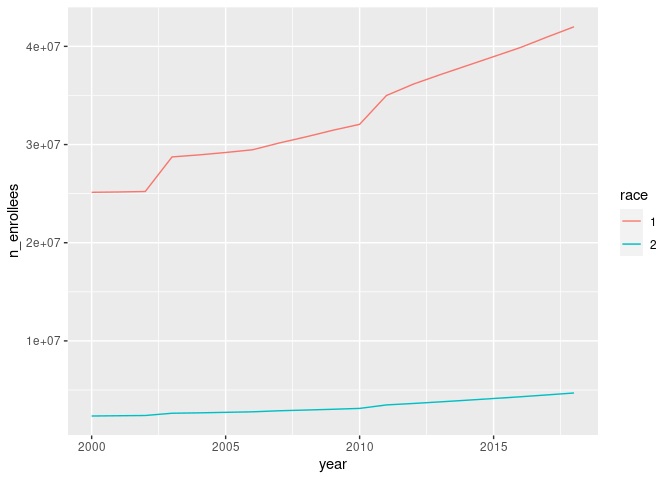<!-- -->


```r
## Plot number of adrd admissions across years ----
adrd_county_df %>% 
  mutate(race = as.character(race)) %>% 
  group_by(year, race) %>% 
  summarise(n_adrd = sum(n_adrd)) %>% 
  ggplot() + 
  geom_line(aes(x = year, y = n_adrd, color = race))
```

```
## `summarise()` has grouped output by 'year'. You can override using the `.groups` argument.
```

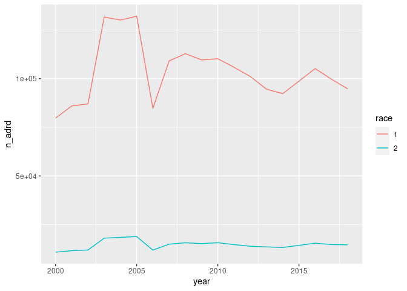<!-- -->


```r
## Number of enrollees by county-sex-age_grp split by race group ----
adrd_county_df %>% 
  mutate(race = as.character(race)) %>% 
  ggplot() + 
  geom_density(aes(x = n_enrollees, color = race))
```

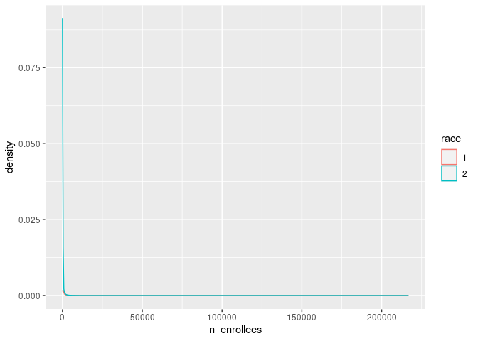<!-- -->


```r
## Number of enrollees by county-sex-age_grp split by race group ----
adrd_county_df %>% 
  filter(n_enrollees < 500) %>% 
  mutate(race = as.character(race)) %>% 
  ggplot() + 
  geom_histogram(aes(x = n_enrollees, color = race)) +
  facet_grid(~race)
```

```
## `stat_bin()` using `bins = 30`. Pick better value with `binwidth`.
```

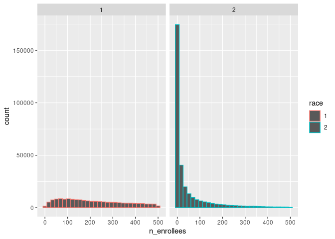<!-- -->


```r
## Adrd blind-to-counties rates for each race-sex-age_grp----
adrd_county_df %>% 
  group_by(race, sex, age_grp) %>% 
  summarise(n_enrollees = sum(n_enrollees), 
            n_adrd = sum(n_adrd),
            adrd_rate = n_adrd / n_enrollees * 1e5) %>% 
  mutate(race_sex = paste(race, sex, sep = "_")) %>% 
  ggplot() +
  geom_boxplot(aes(x = age_grp, y = adrd_rate)) + 
  geom_jitter(aes(x = age_grp, y = adrd_rate, col = race_sex))
```

```
## `summarise()` has grouped output by 'race', 'sex'. You can override using the `.groups` argument.
```

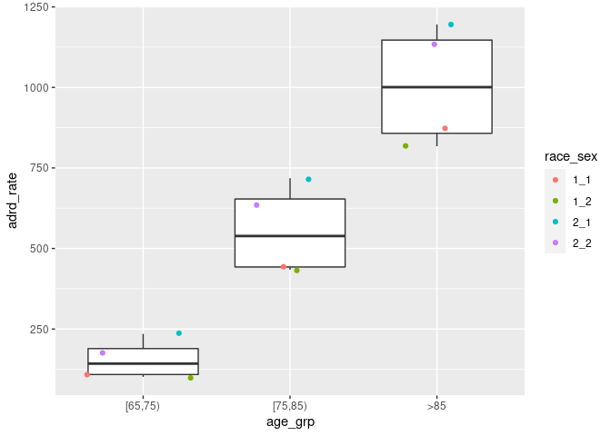<!-- -->


```r
## Adrd county rates for each race-sex-age_grp ----
adrd_county_df %>% 
  group_by(county, race, sex, age_grp) %>% 
  summarise(n_enrollees = sum(n_enrollees), 
            n_adrd = sum(n_adrd),
            adrd_rate = n_adrd / n_enrollees * 1e5) %>% 
  mutate(race_sex = paste(race, sex, sep = "_")) %>% 
  ggplot() +
  geom_boxplot(aes(x = age_grp, y = adrd_rate)) + 
  geom_jitter(aes(x = age_grp, y = adrd_rate, col = race_sex)) + 
  facet_wrap(~race)
```

```
## `summarise()` has grouped output by 'county', 'race', 'sex'. You can override using the `.groups` argument.
```

```
## Warning: Removed 1818 rows containing non-finite values (stat_boxplot).
```

```
## Warning: Removed 1818 rows containing missing values (geom_point).
```

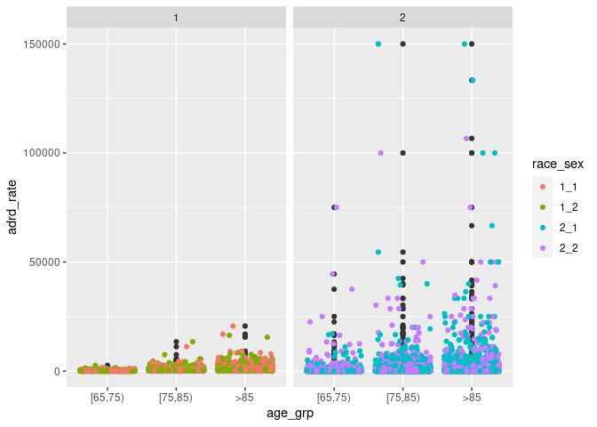<!-- -->


```r
adrd_county_df %>% 
  group_by(race, sex, age_grp) %>% 
  summarise(n_enrollees = sum(n_enrollees), 
            n_adrd = sum(n_adrd),
            adrd_rate = n_adrd / n_enrollees * 1e5) %>% 
  group_by(sex, age_grp) %>% 
  summarise(adrd_rate = mean(adrd_rate))
```

```
## `summarise()` has grouped output by 'race', 'sex'. You can override using the `.groups` argument.
## `summarise()` has grouped output by 'sex'. You can override using the `.groups` argument.
```

```
## # A tibble: 6 × 3
## # Groups:   sex [2]
##     sex age_grp adrd_rate
##   <dbl> <chr>       <dbl>
## 1     1 [65,75)      173.
## 2     1 [75,85)      582.
## 3     1 >85         1033.
## 4     2 [65,75)      138.
## 5     2 [75,85)      533.
## 6     2 >85          974.
```


```r
xx <- adrd_county_df

xx$sex[adrd_county_df$sex == 1] = "male"
xx$sex[adrd_county_df$sex == 2] = "female"

## Reference adrd rates for each sex/age_grp blind to race ----
xx %>% 
  mutate(race = as.character(race)) %>% 
  group_by(race, sex, age_grp) %>% 
  summarise(n_enrollees = sum(n_enrollees), 
            n_adrd = sum(n_adrd),
            adrd_rate = n_adrd / n_enrollees * 1e5) %>% 
  group_by(sex, age_grp) %>% 
  summarise(adrd_rate = mean(adrd_rate)) %>%  
  ggplot() + 
  geom_point(aes(x = age_grp, y = adrd_rate, color = sex)) + 
  labs(title = "ADRD reference rates", x = "Age group", y = "ADRD rate") + 
  theme_bw()
```

```
## `summarise()` has grouped output by 'race', 'sex'. You can override using the `.groups` argument.
## `summarise()` has grouped output by 'sex'. You can override using the `.groups` argument.
```

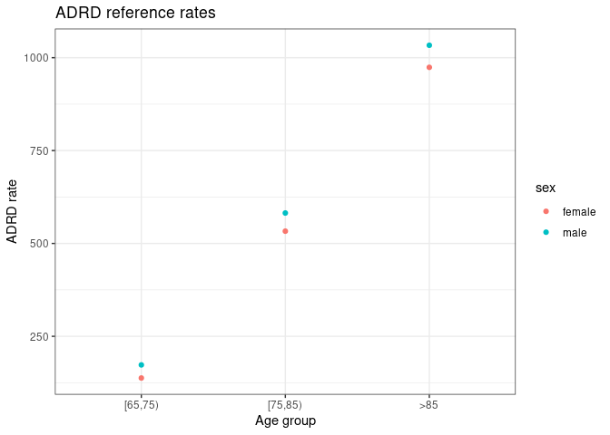<!-- -->

```r
ggsave("../results/figures/adrd_reference_rates.png")
```

```
## Saving 7 x 5 in image
```


```r
## look at proportions by race
prettyNum(prop.table(tapply(adrd_county_df$n_enrollees, adrd_county_df$race, sum)))
```

```
##            1            2 
##  "0.9094204" "0.09057961"
```


```r
xx <- adrd_county_df

## Observed county-level ADRD counts
xx$race[xx$race == 1] = "white"
xx$race[xx$race == 2] = "black"

xx %<>% 
  group_by(county, race) %>% 
  summarise(n_adrd = sum(n_adrd))
```

```
## `summarise()` has grouped output by 'county'. You can override using the `.groups` argument.
```

```r
counties_shp_ = unique(county_sf$county)
counties_xx_w_ = unique(xx$county[xx$race == "white"])
counties_xx_b_ = unique(xx$county[xx$race == "black"])

setdiff(counties_shp_, counties_xx_w_)
```

```
## numeric(0)
```

```r
setdiff(counties_xx_w_, counties_shp_)
```

```
## numeric(0)
```

```r
setdiff(counties_shp_, counties_xx_b_)
```

```
## numeric(0)
```

```r
setdiff(counties_xx_b_, counties_shp_)
```

```
## numeric(0)
```


```r
length(unique(xx$county))
```

```
## [1] 3108
```

```r
sum(is.na(xx$race))
```

```
## [1] 0
```


```r
yy <- county_sf %>% 
  select(county) %>% 
  left_join(xx) 
```

```
## Joining, by = "county"
```

```r
length(unique(yy$county))
```

```
## [1] 3108
```

```r
sum(is.na(yy$race))
```

```
## [1] 0
```

```r
sum(is.na(yy$n_adrd))
```

```
## [1] 0
```


```r
yy %>%
  filter(race == "white") %>% 
  st_simplify() %>%
  ggplot() +
  geom_sf(aes(fill = n_adrd), alpha = 1, lwd = 0.0)
```

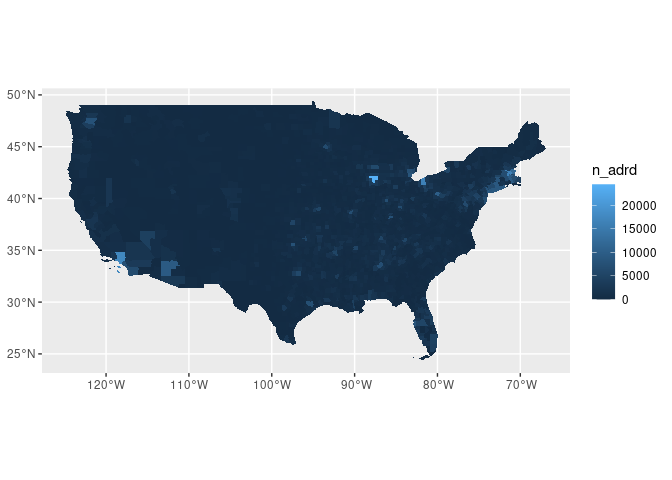<!-- -->

```r
yy %>%
  filter(race == "black") %>% 
  st_simplify() %>%
  ggplot() +
  geom_sf(aes(fill = n_adrd), alpha = 1, lwd = 0.0)
```

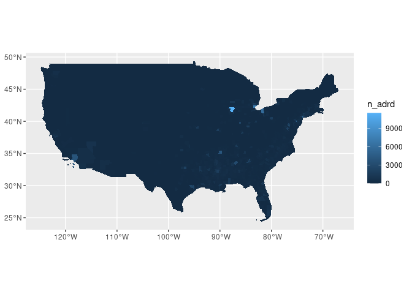<!-- -->


```r
n_adrd_ <- yy$n_adrd
myPalette <- colorRampPalette(rev(RColorBrewer::brewer.pal(11, "Spectral")))
sc <- scale_fill_gradientn(colors = myPalette(10), 
                           limits = c(min(n_adrd_, na.rm = TRUE), max(n_adrd_, na.rm = TRUE)))

yy  %>% 
  ggplot() + 
  geom_sf(aes(fill = n_adrd), alpha = 1, lwd = 0.0) +
  facet_wrap(~race, ncol = 2) + 
  labs(title = "Observed") + 
  guides(fill = guide_legend(title = "ADRD counts")) + 
  theme_classic() + 
  theme(legend.position = "bottom") + 
  sc
```

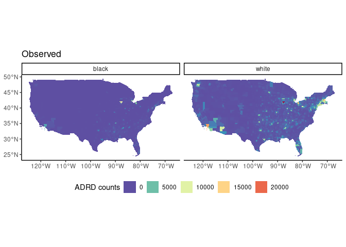<!-- -->

```r
#the yellow looks like white, try another visualization package
```


```r
yy %>% 
  ggplot() + 
  geom_sf(aes(fill = n_adrd), alpha = 1, lwd = 0.0) +
  facet_wrap(~race, ncol = 2) + 
  labs(title = "Observed") + 
  guides(fill = guide_legend(title = "ADRD counts")) + 
  theme_classic() + 
  scale_fill_viridis(name = "n_adrd", option = "D")
```

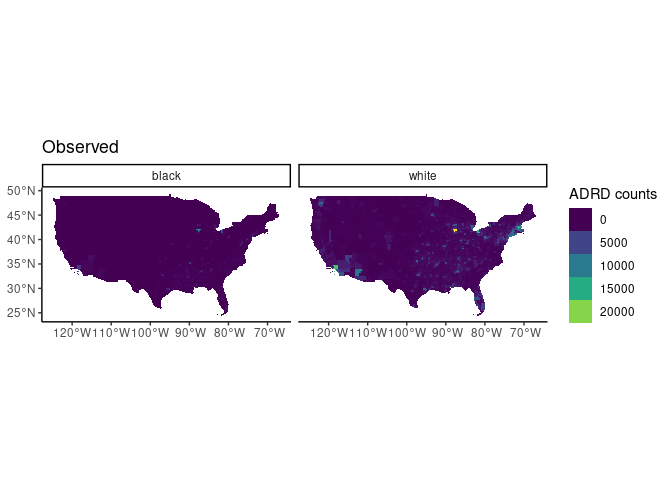<!-- -->

* adrd hospitalizations entangle prevalence and severity, specially in "small" counties 
* biased measurement error? noise systematically affects certain groups
* even if not affecting certain groups, measurement error decreases the power of the model
* variance of the inference, will not detect statistical differences in the output

## Observed vs expected


```r
## Get the standard rates ----
## We just get the standard rate for each sex/age group combination
## combining all observations over the time period (over fips).
exp_df <- adrd_county_df %>%
    dplyr::group_by(race, sex, age_grp) %>% # race, sex, age_grp
    dplyr::summarize(
        n_adrd = sum(n_adrd),
        n_enrollees = sum(n_enrollees),
        exp_rate = n_adrd / n_enrollees
    ) %>% 
  group_by(sex, age_grp) %>% 
  summarise(exp_rate = mean(exp_rate)) # equal weight to race
```

```
## `summarise()` has grouped output by 'race', 'sex'. You can override using the `.groups` argument.
## `summarise()` has grouped output by 'sex'. You can override using the `.groups` argument.
```

```r
exp_df
```

```
## # A tibble: 6 × 3
## # Groups:   sex [2]
##     sex age_grp exp_rate
##   <dbl> <chr>      <dbl>
## 1     1 [65,75)  0.00173
## 2     1 [75,85)  0.00582
## 3     1 >85      0.0103 
## 4     2 [65,75)  0.00138
## 5     2 [75,85)  0.00533
## 6     2 >85      0.00974
```


```r
## Aggregate over years ----
## Just tally up the number of person years and deaths over all years
obs_df <- adrd_county_df %>%
    dplyr::group_by(county, race, sex, age_grp) %>% #county, race, sex, age_grp
    dplyr::summarize(n_enrollees = sum(n_enrollees),
                     n_adrd = sum(n_adrd), 
                     obs_rate = n_adrd / n_enrollees)
```

```
## `summarise()` has grouped output by 'county', 'race', 'sex'. You can override using the `.groups` argument.
```

```r
## fill NAs
obs_df %>% 
  filter(n_enrollees == 0) 
```

```
## # A tibble: 1,818 × 7
## # Groups:   county, race, sex [1,001]
##    county  race   sex age_grp n_enrollees n_adrd obs_rate
##     <dbl> <dbl> <dbl> <chr>         <dbl>  <dbl>    <dbl>
##  1   4011     2     1 >85               0      0      NaN
##  2   4011     2     2 >85               0      0      NaN
##  3   5009     2     1 >85               0      0      NaN
##  4   5049     2     1 >85               0      0      NaN
##  5   5065     2     1 >85               0      0      NaN
##  6   5065     2     2 >85               0      0      NaN
##  7   5101     2     1 >85               0      0      NaN
##  8   5113     2     1 [75,85)           0      0      NaN
##  9   5113     2     1 >85               0      0      NaN
## 10   5113     2     2 >85               0      0      NaN
## # … with 1,808 more rows
```

```r
obs_df$obs_rate[is.na(obs_df$obs_rate)] <- 0
```


```r
## Merge with exp_df ----
adrd_ratios_df <- obs_df %>%
    dplyr::left_join(exp_df %>%
                         dplyr::select(sex, age_grp, exp_rate),
                     by = c("sex", "age_grp"))

## Now aggregate age ----
adrd_ratios_df %<>% 
  mutate(
    expected = n_enrollees * exp_rate, 
    observed = n_adrd
  ) %>% 
  dplyr::group_by(county, race) %>%
  dplyr::summarize(
    person_years = sum(n_enrollees),
    expected = sum(expected), 
    observed = sum(observed)) %>%
  dplyr::ungroup()
```

```
## `summarise()` has grouped output by 'county'. You can override using the `.groups` argument.
```

```r
adrd_ratios_df %>% 
  mutate(
    rel_ratio = observed / expected,
    race = as.character(race)
  ) %>% 
  ggplot() + 
  geom_density(aes(x = rel_ratio, color = race))
```

```
## Warning: Removed 83 rows containing non-finite values (stat_density).
```

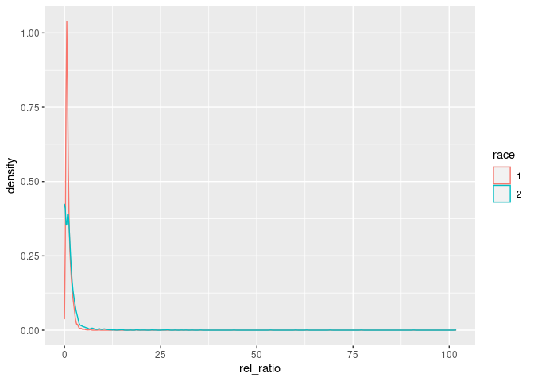<!-- -->


```r
adrd_ratios_df %>% 
  ggplot() + 
  geom_point(aes(x = observed, y = expected, color = as.factor(race)), alpha = 0.5) + 
  scale_x_sqrt() + 
  scale_y_sqrt()
```

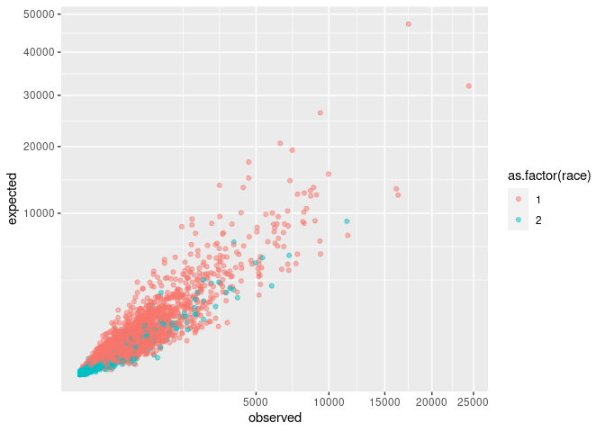<!-- -->


```r
adrd_ratios_df %>% 
  mutate(
    log_diff = log(observed) - log(expected),
    race = as.character(race)
    ) %>% 
  ggplot() + 
  geom_density(aes(x = log_diff, color = race))
```

```
## Warning: Removed 863 rows containing non-finite values (stat_density).
```

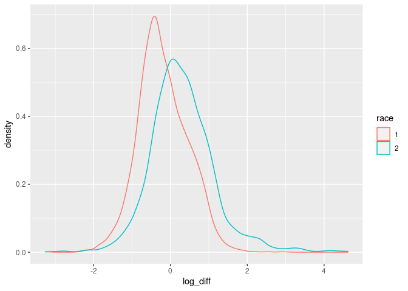<!-- -->


```r
xx <- adrd_ratios_df
xx$race[xx$race == 1] = "white"
xx$race[xx$race == 2] = "black"

xx %<>% 
  mutate(
    log_diff = log(observed/expected),
    log_diff = if_else(observed == 0, as.numeric(NA), log_diff)
    )

counties_shp_ = unique(county_sf$county)
counties_xx_w_ = unique(xx$county[xx$race == "white"])
counties_xx_b_ = unique(xx$county[xx$race == "black"])

setdiff(counties_shp_, counties_xx_w_)
```

```
## numeric(0)
```

```r
setdiff(counties_xx_w_, counties_shp_)
```

```
## numeric(0)
```

```r
setdiff(counties_shp_, counties_xx_b_)
```

```
## numeric(0)
```

```r
setdiff(counties_xx_b_, counties_shp_)
```

```
## numeric(0)
```


```r
length(unique(xx$county))
```

```
## [1] 3108
```

```r
sum(is.na(xx$race))
```

```
## [1] 0
```


```r
yy <- county_sf %>% 
  select(county) %>% 
  left_join(xx) 
```

```
## Joining, by = "county"
```

```r
length(unique(yy$county))
```

```
## [1] 3108
```

```r
sum(is.na(yy$race))
```

```
## [1] 0
```

```r
sum(is.na(yy$log_diff))
```

```
## [1] 861
```

```r
sum(yy$person_years == 0)
```

```
## [1] 83
```

```r
sum(yy$observed == 0)
```

```
## [1] 861
```


```r
yy %>% 
  mutate(person_years = log(person_years)) %>% 
  ggplot() + 
  geom_sf(aes(fill = person_years), alpha = 1, lwd = 0.0) +
  scale_fill_viridis(name = "person_years", option = "D") +
  facet_wrap(~race, ncol = 2) + 
  labs(title = "log person years") + 
  theme(legend.position = "bottom")
```

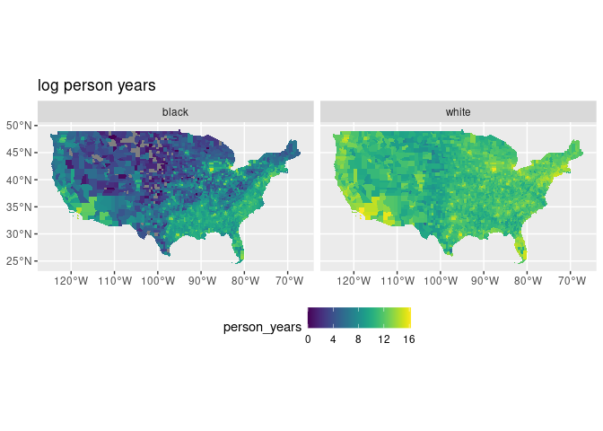<!-- -->


```r
## person years is zero
yy %>%
  st_simplify() %>%
  mutate(zero_persons = (person_years == 0)) %>%
  ggplot() + 
  geom_sf(aes(fill = zero_persons), alpha = 1, lwd = 0.0) + 
  facet_grid(~race)
```

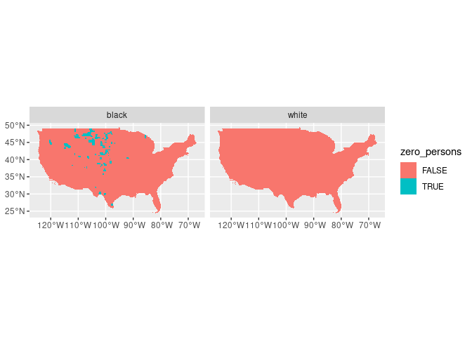<!-- -->


```r
## observed is zero
yy %>%
  st_simplify() %>%
  mutate(zero_observed = (observed == 0)) %>%
  ggplot() + 
  geom_sf(aes(fill = zero_observed), alpha = 1, lwd = 0.0) + 
  facet_grid(~race)
```

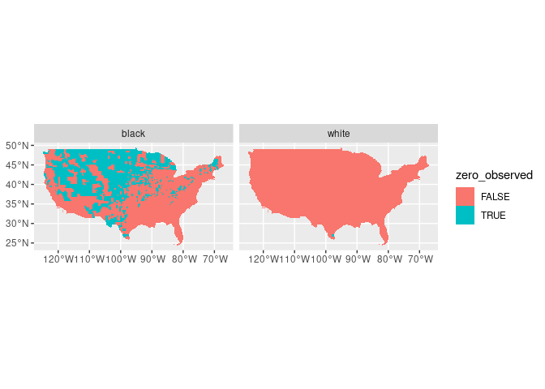<!-- -->


```r
yy %>%
  filter(race == "white") %>% 
  st_simplify() %>%
  ggplot() +
  geom_sf(aes(fill = log_diff), alpha = 1, lwd = 0.0)
```

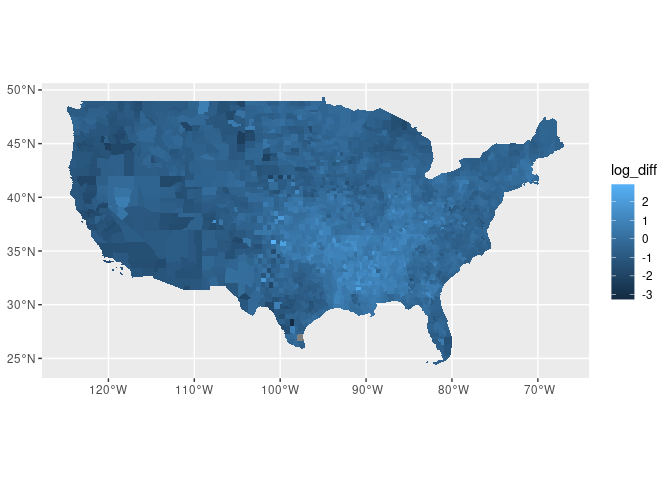<!-- -->

```r
yy %>%
  filter(race == "black") %>% 
  st_simplify() %>%
  ggplot() +
  geom_sf(aes(fill = log_diff), alpha = 1, lwd = 0.0)
```

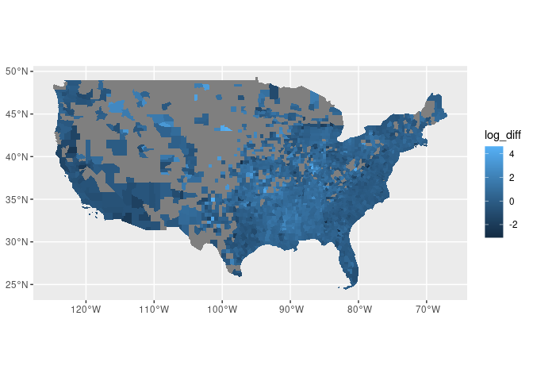<!-- -->


```r
yy %>% 
  ggplot() + 
  geom_sf(aes(fill = log_diff), alpha = 1, lwd = 0.0) +
  scale_fill_viridis(name = "log_diff", option = "D") +
  facet_wrap(~race, ncol = 2) + 
  labs(title = "log(observed) - log(expected)") + 
  theme(legend.position = "bottom")
```

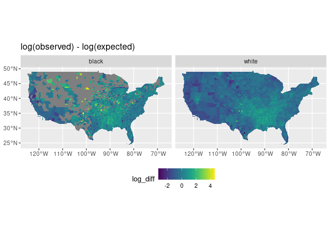<!-- -->


```r
## Prep data ----
adrd_ratios_df %<>% 
  mutate(
    black = as.integer(if_else(race == 2, 1, 0)),
    expected = as.integer(ceiling(expected)), 
    observed = as.integer(ceiling(observed))
  ) %>% 
  left_join(county_fips_df)
```

```
## Joining, by = "county"
```

```r
sum(is.na(adrd_ratios_df$c_idx))
```

```
## [1] 0
```

```r
sum(is.na(adrd_ratios_df$s_idx))
```

```
## [1] 0
```

```r
sum(is.na(adrd_ratios_df$observed))
```

```
## [1] 0
```

```r
sum(is.na(adrd_ratios_df$expected))
```

```
## [1] 0
```

```r
sum(is.na(adrd_ratios_df$person_years))
```

```
## [1] 0
```


```r
write_rds(adrd_ratios_df, "../data/intermediate/adrd_ratios_df.rds")
```
