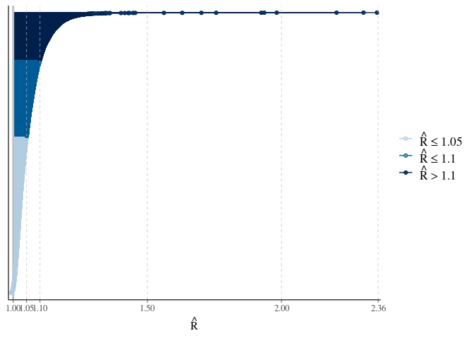
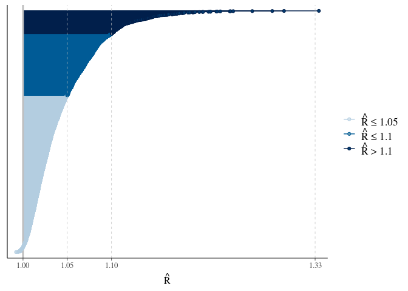
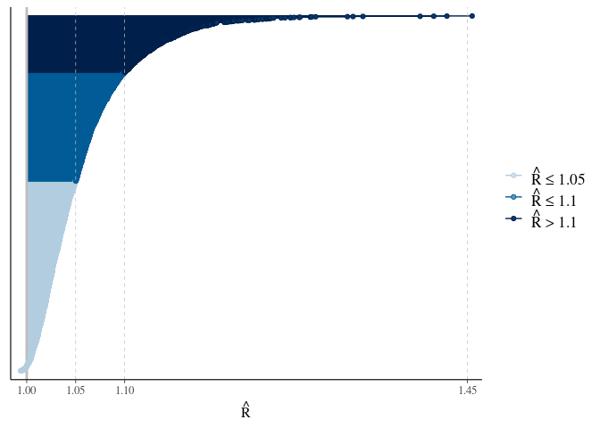
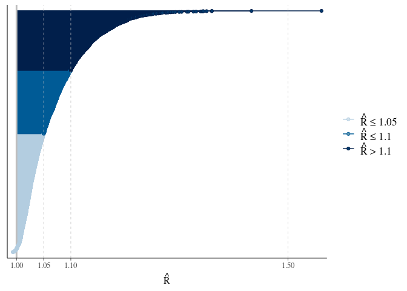

```r
## Load libraries ----
library(tidyverse)
library(magrittr)
library(bayesplot)
```


```r
## Read data ----
#slurm job number 1307317 for m0 is labeled model_run_20230311_185502
stanfit_object <- read_rds("../results/models/model_run_20230311_185502/stanfit_object.rds")

class(stanfit_object)
```

```
## [1] "stanfit"
## attr(,"package")
## [1] "rstan"
```


```r
list_of_draws <- rstan::extract(stanfit_object)
print(names(list_of_draws))
```

```
##  [1] "alpha"   "nu"      "sigma_u" "sigma_v" "sigma_s" "delta"   "psi"    
##  [8] "phi"     "tau_u"   "tau_v"   "lp__"
```


```r
rhat_of_draws <- rhat(stanfit_object)
mcmc_rhat(rhat_of_draws)
```

<!-- -->


```r
names(rhat_of_draws)[1:100]
```

```
##   [1] "alpha[1]"   "alpha[2]"   "nu[1]"      "nu[2]"      "nu[3]"     
##   [6] "nu[4]"      "nu[5]"      "nu[6]"      "nu[7]"      "nu[8]"     
##  [11] "nu[9]"      "nu[10]"     "nu[11]"     "nu[12]"     "nu[13]"    
##  [16] "nu[14]"     "nu[15]"     "nu[16]"     "nu[17]"     "nu[18]"    
##  [21] "nu[19]"     "nu[20]"     "nu[21]"     "nu[22]"     "nu[23]"    
##  [26] "nu[24]"     "nu[25]"     "nu[26]"     "nu[27]"     "nu[28]"    
##  [31] "nu[29]"     "nu[30]"     "nu[31]"     "nu[32]"     "nu[33]"    
##  [36] "nu[34]"     "nu[35]"     "nu[36]"     "nu[37]"     "nu[38]"    
##  [41] "nu[39]"     "nu[40]"     "nu[41]"     "nu[42]"     "nu[43]"    
##  [46] "nu[44]"     "nu[45]"     "nu[46]"     "nu[47]"     "nu[48]"    
##  [51] "nu[49]"     "sigma_u[1]" "sigma_u[2]" "sigma_u[3]" "sigma_v[1]"
##  [56] "sigma_v[2]" "sigma_v[3]" "sigma_s"    "delta"      "psi[1,1]"  
##  [61] "psi[1,2]"   "psi[1,3]"   "psi[1,4]"   "psi[1,5]"   "psi[1,6]"  
##  [66] "psi[1,7]"   "psi[1,8]"   "psi[1,9]"   "psi[1,10]"  "psi[1,11]" 
##  [71] "psi[1,12]"  "psi[1,13]"  "psi[1,14]"  "psi[1,15]"  "psi[1,16]" 
##  [76] "psi[1,17]"  "psi[1,18]"  "psi[1,19]"  "psi[1,20]"  "psi[1,21]" 
##  [81] "psi[1,22]"  "psi[1,23]"  "psi[1,24]"  "psi[1,25]"  "psi[1,26]" 
##  [86] "psi[1,27]"  "psi[1,28]"  "psi[1,29]"  "psi[1,30]"  "psi[1,31]" 
##  [91] "psi[1,32]"  "psi[1,33]"  "psi[1,34]"  "psi[1,35]"  "psi[1,36]" 
##  [96] "psi[1,37]"  "psi[1,38]"  "psi[1,39]"  "psi[1,40]"  "psi[1,41]"
```


```r
rhat_of_draws[c('alpha[1]', # white surface intercept
                'alpha[2]', # black surface intercept
                'delta', # shared surface scaling factor
                'nu[1]', # state random effect
                'lp__') # Stan's lp__ variable
              ] 
```

```
## alpha[1] alpha[2]    delta    nu[1]     lp__ 
## 1.002164 1.011118 1.935585 1.008044 2.305810
```


```r
rhat_of_draws[c('sigma_u[1]', # SD of CAR part
                'sigma_u[2]', # SD of CAR part
                'sigma_u[3]', # SD of CAR part
                'sigma_v[1]', # SD of iid spatial part
                'sigma_v[2]', # SD of iid spatial part
                'sigma_v[3]', # SD of iid spatial part
                'sigma_s', # SD of state random effect
                'tau_u[1]', # precision of CAR part
                'tau_u[2]', # precision of CAR part
                'tau_u[3]', # precision of CAR part
                'tau_v[1]', # precision of iid spatial part
                'tau_v[2]', # precision of iid spatial part
                'tau_v[3]' # precision of iid spatial part
                )
              ]
```

```
## sigma_u[1] sigma_u[2] sigma_u[3] sigma_v[1] sigma_v[2] sigma_v[3] 
##   1.924810   1.630155   1.038039   1.982226   2.205336   1.089852 
##    sigma_s   tau_u[1]   tau_u[2]   tau_u[3]   tau_v[1]   tau_v[2] 
##   1.003522   1.756572   1.446857   1.043754   1.701363   2.355906 
##   tau_v[3] 
##   1.086590
```


```r
# phi
mcmc_rhat(rhat_of_draws[grep('phi', names(rhat_of_draws))])
```

<!-- -->


```r
# psi
mcmc_rhat(rhat_of_draws[grep('psi\\[1', names(rhat_of_draws))])
```

<!-- -->


```r
# psi
mcmc_rhat(rhat_of_draws[grep('psi\\[2', names(rhat_of_draws))])
```

<!-- -->


