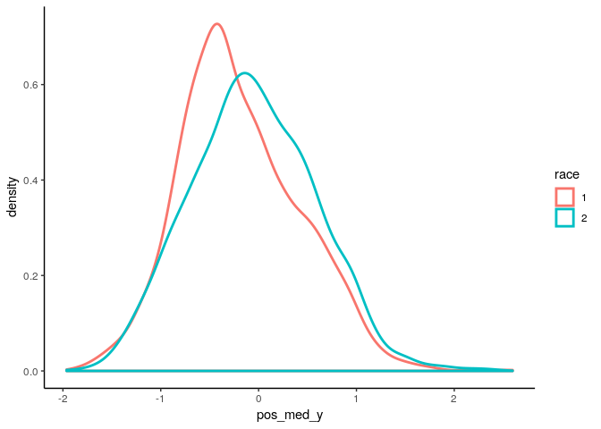
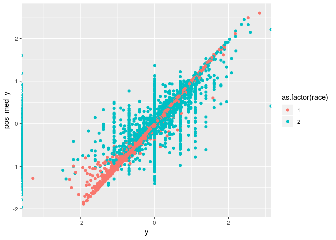
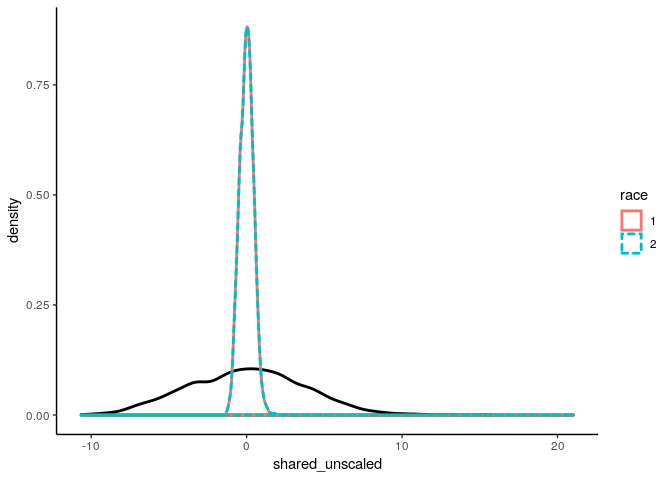
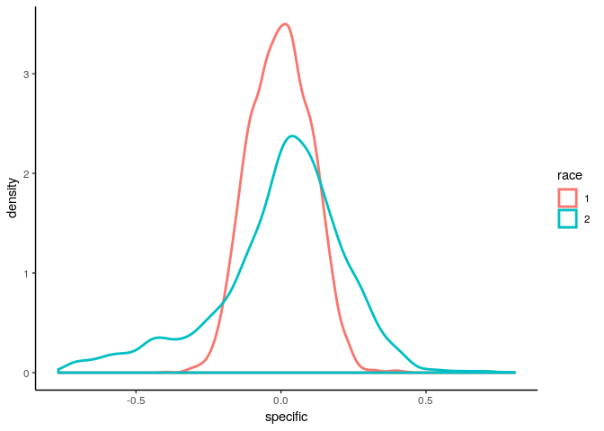

```r
## Load libraries ----
library(tidyverse)
library(magrittr)
library(rstan)
```


```r
## Read data ----
adrd_ratios_df <- read_rds('../data/intermediate/adrd_ratios_df.rds')
adrd_ratios_df
```

```
## # A tibble: 6,216 x 13
##    county  race person_years expected observed black log_expected
##     <dbl> <dbl>        <int>    <int>    <int> <int>        <dbl>
##  1   1001     1        85881      307      486     0         5.73
##  2   1001     2        22762       86      179     1         4.45
##  3   1003     1       475644     1762     1990     0         7.47
##  4   1003     2        28113      104      133     1         4.64
##  5   1005     1        31145      120      260     0         4.79
##  6   1005     2        16972       68      143     1         4.22
##  7   1007     1        56774      206      403     0         5.33
##  8   1007     2         7962       31       47     1         3.43
##  9   1009     1       161161      590      966     0         6.38
## 10   1009     2         3342       13       21     1         2.57
## # ... with 6,206 more rows, and 6 more variables: county_name <chr>,
## #   fipschar <chr>, fips_st <chr>, c_idx <int>, s_idx <int>, st_abbr <chr>
```


```r
county_fips_df <- read_rds("../data/intermediate/county_fips_df.rds")
county_fips_df
```

```
## # A tibble: 3,108 x 7
##    county_name         county fipschar fips_st c_idx s_idx st_abbr
##    <chr>                <dbl> <chr>    <chr>   <int> <int> <chr>  
##  1 Autauga County, AL    1001 01001    01          1     1 AL     
##  2 Baldwin County, AL    1003 01003    01          2     1 AL     
##  3 Barbour County, AL    1005 01005    01          3     1 AL     
##  4 Bibb County, AL       1007 01007    01          4     1 AL     
##  5 Blount County, AL     1009 01009    01          5     1 AL     
##  6 Bullock County, AL    1011 01011    01          6     1 AL     
##  7 Butler County, AL     1013 01013    01          7     1 AL     
##  8 Calhoun County, AL    1015 01015    01          8     1 AL     
##  9 Chambers County, AL   1017 01017    01          9     1 AL     
## 10 Cherokee County, AL   1019 01019    01         10     1 AL     
## # ... with 3,098 more rows
```


```r
#slurm job number 1307333 for m1 is labeled model_run_20230311_191123
# 1285340 model_run_20230311_190811
stanfit_object <- read_rds("../results/models/model_run_20230311_191123/stanfit_object.rds")

class(stanfit_object)
```

```
## [1] "stanfit"
## attr(,"package")
## [1] "rstan"
```


```r
stanfit_summary <- summary(stanfit_object)
## summary stats of fixed effects ----
stanfit_summary$summary[c('alpha[1]', 'alpha[2]', 'delta'), ]
```

```
##                 mean     se_mean         sd        2.5%         25%
## alpha[1] -0.19292809 0.002544514 0.03750659 -0.26815231 -0.21472990
## alpha[2] -0.05758916 0.003675690 0.04078447 -0.14563397 -0.08318440
## delta     0.11862847 0.017728001 0.03111448  0.06073501  0.09735114
##                  50%         75%       97.5%      n_eff     Rhat
## alpha[1] -0.19528274 -0.16609696 -0.12024544 217.272910 1.015935
## alpha[2] -0.05820323 -0.03201456  0.02159908 123.115283 1.030553
## delta     0.12339497  0.14192933  0.17129993   3.080389 2.791083
```


```r
## Define functions ----
extract_samples <- function(stanfit) {
    ## Extract samples from a stanfit object and return a list of variables
    ## NOTE: Random effects will be matrices of dimensions iterations x areas
    ##       while the fixed effects will just be columns of length iterations
    
    ## Extract the samples of fixed effects from stan_fit object
    fixed_pars <- stanfit@model_pars[grepl(stanfit@model_pars,
                                           pattern = "alpha|beta|delta|sigma")]
    x <- as.matrix(stanfit, pars = fixed_pars)
    
    ## Get a list of the names and make them prettier
    var_names <-
        gsub(x = colnames(x),
             pattern = "\\[|\\]",
             replacement = "")
    
    ## Turn the named matrix into a list of vectors
    x <- split(x, c(col(x)))
    
    ## Put back in the variable names
    names(x) <- var_names
    
    ## Now extract the random effects and attach the random effects
    random_pars <- stanfit@model_pars[grepl(stanfit@model_pars,
                                            pattern = "nu|psi|phi")]
    r_effs <- as.matrix(stanfit, pars = random_pars)
    x$psi1 <- r_effs[, grep(x = colnames(r_effs),
                            pattern = 'psi[1',
                            fixed = TRUE)]
    x$psi2 <- r_effs[, grep(x = colnames(r_effs),
                            pattern = 'psi[2',
                            fixed = TRUE)]
    x$phi  <- r_effs[, grep(x = colnames(r_effs),
                            pattern = 'phi',
                            fixed = TRUE)]
    x$nu   <- r_effs[, grep(x = colnames(r_effs),
                            pattern = 'nu',
                            fixed = TRUE)]
    
    return(x)
}
```


```r
## organize samples from stanfit_object ----
stanfit_samples <- extract_samples(stanfit_object)

names(stanfit_samples)
```

```
##  [1] "alpha1"   "alpha2"   "sigma_u1" "sigma_u2" "sigma_u3" "sigma_v1"
##  [7] "sigma_v2" "sigma_v3" "sigma_s"  "delta"    "psi1"     "psi2"    
## [13] "phi"      "nu"
```

```r
length(stanfit_samples$alpha1)
```

```
## [1] 400
```

```r
dim(stanfit_samples$phi)
```

```
## [1]  400 3108
```

```r
dim(stanfit_samples$nu)
```

```
## [1] 400  49
```

# log ratios


```r
## obtain posterior predictive values ----
## Make a version of nu that is expanded such that every state column
## repeats as many times as their are counties. Then we can just add
## the expanded matrix when calculating posterior quantities.
nu_counts <- county_fips_df %>%
    dplyr::group_by(s_idx) %>%
    dplyr::summarize(count = dplyr::n()) %>%
    dplyr::mutate(c_sum = cumsum(count))

## Initialize a holder
nu_expanded <- matrix(NA,
                      nrow = nrow(stanfit_samples$psi1),
                      ncol = max(nu_counts$c_sum))

for (s in 1:nrow(nu_counts)) {
    start_ix <- ifelse(length(nu_counts$c_sum[s - 1]) > 0,
                       nu_counts$c_sum[s - 1], 0) + 1
    end_ix <- nu_counts$c_sum[s]
    
    nu_expanded[, start_ix:end_ix] <- stanfit_samples$nu[, s]
}

# white log ratios
posterior_white <- stanfit_samples$alpha1 + stanfit_samples$psi1 + 
  (stanfit_samples$phi * stanfit_samples$delta) + 
  nu_expanded

# black log ratios
posterior_black <- stanfit_samples$alpha2 + stanfit_samples$psi2 +
            (stanfit_samples$phi * stanfit_samples$delta) +
            nu_expanded

dim(posterior_white)
```

```
## [1]  400 3108
```

```r
dim(posterior_white)
```

```
## [1]  400 3108
```


```r
# posterior median log ratios
pos_med <- rbind(
  tibble(
    pos_med_y = matrixStats::colMedians(posterior_white), 
    race = 1, 
    c_idx = 1:ncol(posterior_white)), 
  tibble(
    pos_med_y = matrixStats::colMedians(posterior_black), 
    race = 2, 
    c_idx = 1:ncol(posterior_black))
)

pos_med %>% 
  mutate(race = as.character(race)) %>% 
  ggplot() + 
  geom_density(aes(x = pos_med_y, color = race), size = 1) + 
  theme_classic()
```

<!-- -->


```r
## Add in correct fipschar ----
pos_med <- adrd_ratios_df %>%
  mutate(y = log(observed) - log(expected)) %>% 
  dplyr::left_join(pos_med, by = c("c_idx", "race"))

pos_med %>% 
  ggplot() +
  geom_point(aes(x = y, y = pos_med_y, col = as.factor(race)))
```

```
## Warning: Removed 81 rows containing missing values (geom_point).
```

<!-- -->

## Decompose log ratios


```r
summary(stanfit_samples$delta)
```

```
##    Min. 1st Qu.  Median    Mean 3rd Qu.    Max. 
## 0.05367 0.09735 0.12339 0.11863 0.14193 0.18861
```


```r
shared_w <- (stanfit_samples$phi * stanfit_samples$delta)
shared_b <- (stanfit_samples$phi * stanfit_samples$delta)

# posterior median
shared <- rbind(
  tibble(
    shared = matrixStats::colMedians(shared_w), 
    shared_unscaled = matrixStats::colMedians(stanfit_samples$phi), 
    race = 1, 
    c_idx = 1:ncol(shared_w)), 
  tibble(
    shared = matrixStats::colMedians(shared_b), 
    shared_unscaled = matrixStats::colMedians(stanfit_samples$phi), 
    race = 2, 
    c_idx = 1:ncol(shared_b))
)

## Add in correct fipschar ----
pos_med %<>% 
  dplyr::left_join(shared, by = c("c_idx", "race"))

shared %>% 
  mutate(race = as.character(race)) %>% 
  ggplot() + 
  geom_density(aes(x = shared_unscaled), size = 1) + 
  geom_density(aes(x = shared, color = race, lty = race), size = 1) + 
  theme_classic()
```

<!-- -->


```r
specific_w <- stanfit_samples$psi1
specific_b <- stanfit_samples$psi2

# posterior median
specific <- rbind(
  tibble(
    specific = matrixStats::colMedians(specific_w), 
    race = 1, 
    c_idx = 1:ncol(specific_w)), 
  tibble(
    specific = matrixStats::colMedians(specific_b), 
    race = 2, 
    c_idx = 1:ncol(specific_b))
)

## Add in correct fipschar ----
pos_med %<>% 
  dplyr::left_join(specific, by = c("c_idx", "race"))

specific %>% 
  mutate(race = as.character(race)) %>% 
  ggplot() + 
  geom_density(aes(x = specific, color = race), size = 1) + 
  theme_classic()
```

<!-- -->


```r
write_rds(pos_med, "../data/intermediate/m1-pos_med.rds")
```
