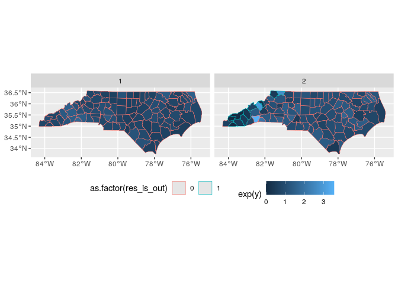
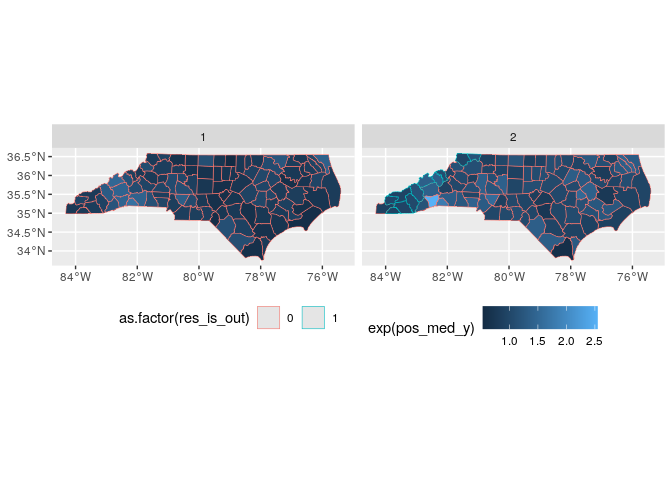
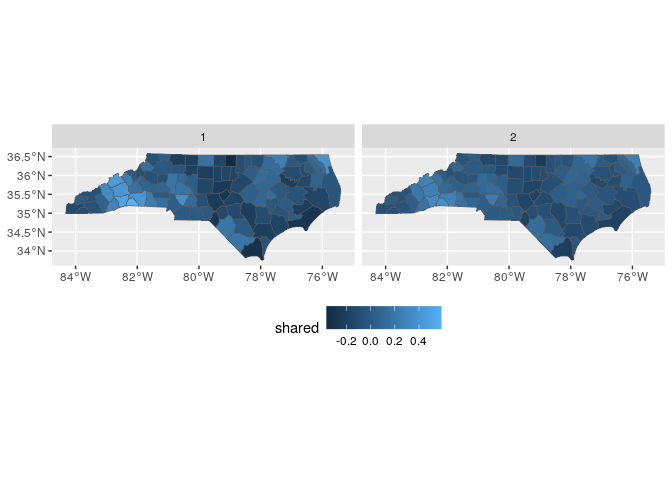
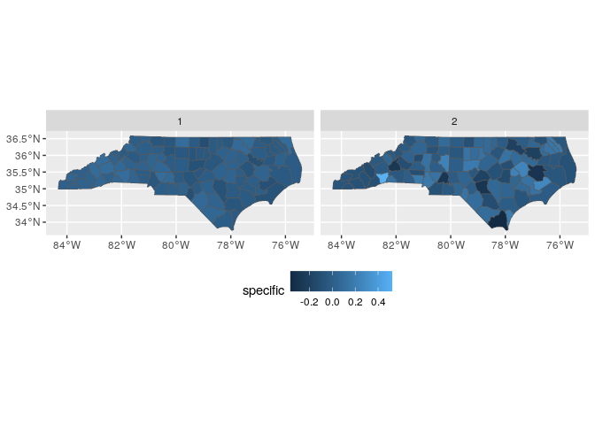

```r
## Load libraries ----
library(tidyverse)
library(magrittr)
library(sf)
```


```r
## Read data ----
pos_med <- read_rds('../data/intermediate/pos_med.rds')
county_sf <- read_sf("../data/input/local/tl_2022_us_county/tl_2022_us_county.shp")

dim(county_sf)
```

```
## [1] 3235   18
```

```r
names(county_sf)
```

```
##  [1] "STATEFP"  "COUNTYFP" "COUNTYNS" "GEOID"    "NAME"     "NAMELSAD" "LSAD"     "CLASSFP"  "MTFCC"    "CSAFP"   
## [11] "CBSAFP"   "METDIVFP" "FUNCSTAT" "ALAND"    "AWATER"   "INTPTLAT" "INTPTLON" "geometry"
```

## log ratios (y)


```r
pos_med_sf <- county_sf %>% 
  mutate(
    county = as.integer(GEOID)
  ) %>% 
  select(county) %>% 
  right_join(pos_med)
```

```
## Joining, by = "county"
```

```r
pos_med_sf %>% 
  mutate(
    res = y - pos_med_y,
    res_is_out = if_else(abs(res) > 2/3, 1, 0) 
  ) %>% 
  ggplot() +
  geom_sf(aes(fill = exp(y), col = as.factor(res_is_out)), lwd = 0.2) +
  facet_grid(~race) +
  theme(legend.position = "bottom")
```

<!-- -->

## posterior median log ratios (pos_med_y)


```r
pos_med_sf %>% 
  mutate(
    res = y - pos_med_y,
    res_is_out = if_else(abs(res) > 2/3, 1, 0) 
  ) %>% 
  ggplot() +
  geom_sf(aes(fill = exp(pos_med_y), col = as.factor(res_is_out)), lwd = 0.2) +
  facet_grid(~race) +
  theme(legend.position = "bottom")
```

<!-- -->

## shared


```r
pos_med_sf %>% 
  ggplot() +
  geom_sf(aes(fill = shared), lwd = 0.2) +
  facet_grid(~race) +
  theme(legend.position = "bottom")
```

<!-- -->

## specific


```r
pos_med_sf %>% 
  ggplot() +
  geom_sf(aes(fill = specific), lwd = 0.2) +
  facet_grid(~race) +
  theme(legend.position = "bottom")
```

<!-- -->
