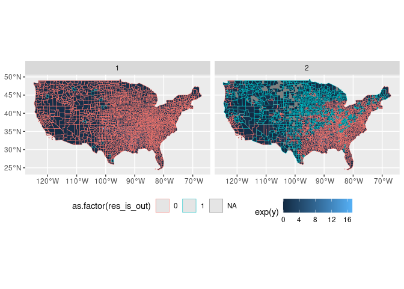
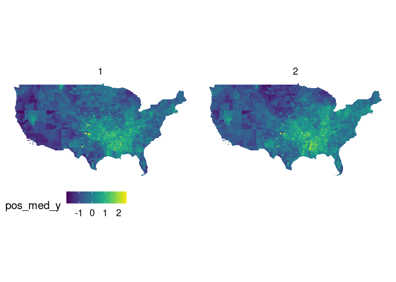
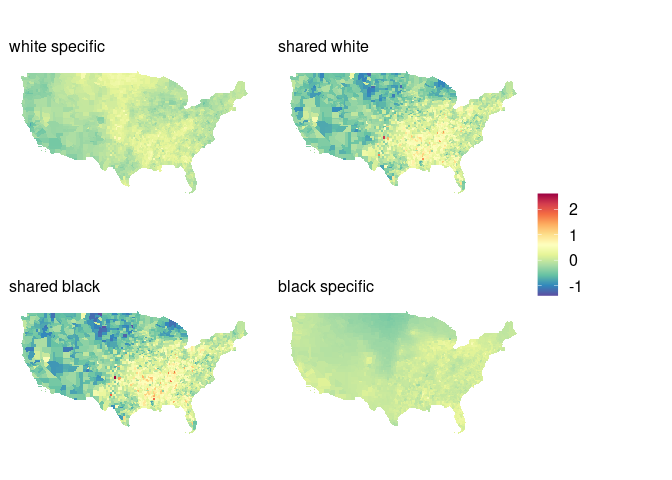

```r
## Load libraries ----
library(tidyverse)
library(magrittr)
library(sf)
library(cowplot)
library(viridis)
library(RColorBrewer)
```


```r
## Read data ----
stanfit_samples <- read_rds("../data/intermediate/m0-stanfit_samples.rds")
stanfit_summary <- read_rds("../data/intermediate/m0-stanfit_summary.rds")
pos_med <- read_rds("../data/intermediate/m0-pos_med.rds")

pos_med_sf <- county_sf %>% 
  select(county) %>% 
  right_join(pos_med)
```

```
## Joining, by = "county"
```

```r
dim(county_sf)
```

```
## [1] 3108   19
```

```r
dim(pos_med_sf)
```

```
## [1] 6216   19
```

```r
colnames(pos_med_sf)
```

```
##  [1] "county"          "geometry"        "race"            "person_years"    "expected"        "observed"       
##  [7] "black"           "log_expected"    "county_name"     "fipschar"        "fips_st"         "c_idx"          
## [13] "s_idx"           "st_abbr"         "y"               "pos_med_y"       "shared"          "shared_unscaled"
## [19] "specific"
```


```r
county_sf <- read_rds("../data/intermediate/county_sf.rds")
county_fips_df <- read_rds("../data/intermediate/county_fips_df.rds")
state_sf <- read_sf("../data/input/local/tl_2015_us_state/tl_2015_us_state.shp")
state_sf %<>% 
  left_join(
    county_sf %>% 
      left_join(county_fips_df) %>% 
      st_drop_geometry() %>% 
      distinct(STATEFP, s_idx, st_abbr)
  ) %>% 
  filter(!is.na(s_idx))
```

```
## Joining, by = "county"
## Joining, by = "STATEFP"
```


## Observed vs Predicted

### log ratios (y)


```r
pos_med_sf %>% 
  mutate(
    res = y - pos_med_y,
    res_is_out = if_else(abs(res) > 2/3, 1, 0) 
  ) %>% 
  ggplot() +
  geom_sf(aes(fill = exp(y), col = as.factor(res_is_out)), lwd = 0.2) +
  facet_grid(~race) +
  theme(legend.position = "bottom")
```

<!-- -->

### posterior median log ratios (pos_med_y)

In this model the "prediction" is a smoothed version of the observed.


```r
pos_med_sf %>% 
  ggplot() +
  geom_sf(aes(fill = pos_med_y), lwd = 0.00) +
  facet_grid(~race) +
  scale_fill_viridis(option = "D") + 
  theme_map() + 
  theme(legend.position = "bottom") 
```

<!-- -->

## Risk decomposition

## state effects


```r
param = rownames(stanfit_summary$summary)
nu = tibble(
  param = param[grep("nu", param)],
  med = stanfit_summary$summary[grep("nu", param),"50%"],
  s_idx = 1:length(grep("nu", param))
)

state_sf %>% 
  left_join(nu) %>% 
  ggplot() + 
  geom_sf(aes(fill = med))
```

```
## Joining, by = "s_idx"
```

<!-- -->

## shared unscaled


```r
shared_ <- c(pos_med$shared_unscaled, pos_med$specific)
myPalette <- colorRampPalette(rev(RColorBrewer::brewer.pal(11, "Spectral")))
sc <- scale_fill_gradientn(colors = myPalette(100), 
                           limits = c(min(shared_), max(shared_)))

p1 <- pos_med_sf %>% 
  filter(race == 1) %>% 
  ggplot() +
  geom_sf(aes(fill = specific), lwd = 0.0) + 
  theme_map() +
  labs(subtitle = "white specific") + 
  theme(legend.title = element_blank()) + 
  sc

p2 <- pos_med_sf %>% 
  filter(race == 1) %>% #shared_unscaled is non-race specific
  ggplot() +
  geom_sf(aes(fill = shared_unscaled), lwd = 0.0) + 
  theme_map() + 
  labs(subtitle = "shared unscaled") + 
  sc

p3 <- pos_med_sf %>% 
  filter(race == 2) %>% 
  ggplot() +
  geom_sf(aes(fill = specific), lwd = 0.0) + 
  theme_map() + 
  labs(subtitle = "black specific") +
  sc
  
p <- cowplot::plot_grid(
  p1 + theme(legend.position = "none"), 
  p2 + theme(legend.position = "none"), 
  p3  + theme(legend.position = "none"),
  nrow = 3)

cowplot::plot_grid(
  p, 
  cowplot::get_legend(p1), 
  ncol = 2
)
```

<!-- -->

## shared unscaled


```r
shared_ <- c(pos_med$shared, pos_med$specific)
myPalette <- colorRampPalette(rev(RColorBrewer::brewer.pal(11, "Spectral")))
sc <- scale_fill_gradientn(colors = myPalette(100), 
                           limits = c(min(shared_), max(shared_)))

p1 <- pos_med_sf %>% 
  filter(race == 1) %>% 
  ggplot() +
  geom_sf(aes(fill = specific), lwd = 0.00) + 
  theme_map() +
  labs(subtitle = "white specific") + 
  theme(legend.title = element_blank()) + 
  sc

p2 <- pos_med_sf %>% 
  filter(race == 1) %>% #shared_unscaled is non-race specific
  ggplot() +
  geom_sf(aes(fill = shared), lwd = 0.00) + 
  theme_map() + 
  labs(subtitle = "shared white") + 
  sc

p3 <- pos_med_sf %>% 
  filter(race == 2) %>% #shared_unscaled is non-race specific
  ggplot() +
  geom_sf(aes(fill = shared), lwd = 0.00) + 
  theme_map() + 
  labs(subtitle = "shared black") + 
  sc

p4 <- pos_med_sf %>% 
  filter(race == 2) %>% 
  ggplot() +
  geom_sf(aes(fill = specific), lwd = 0.00) + 
  theme_map() + 
  labs(subtitle = "black specific") +
  sc
  
p <- cowplot::plot_grid(
  p1 + theme(legend.position = "none"), 
  p2 + theme(legend.position = "none"), 
  p3  + theme(legend.position = "none"),
  p4  + theme(legend.position = "none"),
  nrow = 2, 
  ncol = 2)

cowplot::plot_grid(
  p, 
  cowplot::get_legend(p1), 
  ncol = 2, 
  rel_widths = c(0.8, 0.2)
)
```

<!-- -->
