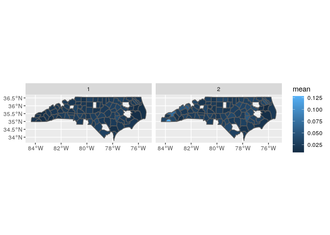

# ADRD hospitalization rates per county

## Limited to NC


```r
## The interactive Rstudio session was started with 36 GB and 8 cores
## The  default working directory of an Rmd in Rstudio is the Rmd location
## The details of the symbolic links to the input data are provided in the README of the  /data/input folder

## load packages ----
library(tidyverse)
library(magrittr)
library(fst)
library(data.table)
library(sf)
library(tictoc)
```

### Read num enrollees


```r
fips_num_enroll_ <- read_csv("../data/input/fips_num_enroll_.csv") %>% 
  rename(fips = fips5, 
         num_enroll = count) %>% 
  mutate(fips = as.character(fips))
```

```
## Parsed with column specification:
## cols(
##   year = col_double(),
##   fips5 = col_double(),
##   race = col_double(),
##   count = col_double()
## )
```

### Read shp files

* read county shp files


```r
county_sf <- read_sf("../data/input/scratch/tl_2022_us_county/tl_2022_us_county.shp") %>% 
  rename(fips = GEOID) %>% 
  mutate(fips = as.character(as.numeric(fips)))

dim(county_sf)
```

```
## [1] 3235   18
```

```r
names(county_sf)
```

```
##  [1] "STATEFP"  "COUNTYFP" "COUNTYNS" "fips"     "NAME"     "NAMELSAD" "LSAD"     "CLASSFP" 
##  [9] "MTFCC"    "CSAFP"    "CBSAFP"   "METDIVFP" "FUNCSTAT" "ALAND"    "AWATER"   "INTPTLAT"
## [17] "INTPTLON" "geometry"
```

### Read SSA5 to FIPS


```r
ssa_fips <- read_csv("../data/input/ssa_fips_state_county2016.csv") %>% 
  rename(ssa = ssacounty, 
         fips = fipscounty)
```

```
## Parsed with column specification:
## cols(
##   county = col_character(),
##   state = col_character(),
##   ssacounty = col_character(),
##   fipscounty = col_character(),
##   cbsa = col_double(),
##   cbsaname = col_character(),
##   ssastate = col_character(),
##   fipsstate = col_character()
## )
```


```r
dim(ssa_fips)
```

```
## [1] 3273    8
```

```r
length(unique(ssa_fips$ssa))
```

```
## [1] 3273
```

```r
length(unique(ssa_fips$fips))
```

```
## [1] 3272
```

### Read ADRD admissions


```r
admissions <- read_csv("../data/intermediate/admissions.csv") %>% 
  rename(ssa = SSA5, 
         race = RACE, 
         adrd_hosp = counts) %>% 
  mutate(ssa = as.character(ssa))
```

```
## Parsed with column specification:
## cols(
##   RACE = col_double(),
##   SSA5 = col_double(),
##   counts = col_double(),
##   year = col_double()
## )
```


```r
class(admissions)
```

```
## [1] "spec_tbl_df" "tbl_df"      "tbl"         "data.frame"
```

```r
dim(admissions)
```

```
## [1] 5878    4
```

* crosswalk ssa5 and fips

some counties not in crosswalk file


```r
sum(!unique(as.numeric(admissions$ssa)) %in% ssa_fips$ssa)
```

```
## [1] 35
```


```r
admissions %<>% 
  left_join(
    select(ssa_fips, ssa, fips))
```

```
## Joining, by = "ssa"
```

### Prepare data

* Mapping of enrollment fips with admissions fips


```r
sum(!unique(admissions$fips) %in% fips_num_enroll_$fips)
```

```
## [1] 0
```

```r
sum(!unique(fips_num_enroll_$fips) %in% admissions$fips )
```

```
## [1] 33
```


```r
fips_rates <- fips_num_enroll_ %>% 
  left_join(admissions) %>% 
  mutate(rates = adrd_hosp / num_enroll)
```

```
## Joining, by = c("year", "fips", "race")
```

* there are counties with quite a large enrollee populations that are not mapped to hospitalizations using (but maybe they do with correct ssa?).


```r
fips_rates %>% 
  filter(is.na(rates)) %>% 
  select(fips, race, year, num_enroll) %>% 
  pivot_wider(
    id_cols = c('fips', 'race'), 
    values_from = 'num_enroll', 
    names_from = 'year') %>% 
  DT::datatable()
```

<!--html_preserve--><div id="htmlwidget-2bf840eddf9ab5c8ec67" style="width:100%;height:auto;" class="datatables html-widget"></div>
<script type="application/json" data-for="htmlwidget-2bf840eddf9ab5c8ec67">{"x":{"filter":"none","data":[["1","2","3","4","5","6","7","8","9","10","11","12","13","14","15","16","17","18","19","20","21","22","23","24","25","26","27","28","29","30","31","32","33","34","35","36","37","38","39","40","41","42","43","44","45","46","47","48","49","50","51","52","53","54","55","56","57","58","59","60","61","62","63","64","65","66"],["37001","37001","37003","37003","37005","37005","37007","37007","37009","37009","37011","37011","37013","37013","37015","37015","37017","37017","37019","37019","37020","37039","37086","37086","37121","37189","37201","37215","37277","37281","37291","37309","37313","37337","37439","37439","37441","37510","37590","37650","37710","37740","37790","37810","37840","37075","37115","37173","37199","37550","37043","37219","37570","37710","37095","37113","37087","37099","37149","37175","37177","37990","37053","37169","37177","37055"],[1,2,1,2,1,2,1,2,1,2,1,2,1,2,1,2,1,2,1,2,1,2,1,2,2,2,1,1,1,1,1,1,1,1,1,2,1,2,1,2,1,1,1,1,1,2,2,2,2,1,2,1,1,2,2,2,2,2,2,2,1,2,2,2,2,2],[15613,2967,3682,756,1707,13,2662,1139,6391,312,8402,223,4249,2460,2588,1923,3196,1648,11396,2093,1,32,1,1,42,217,1,1,1,1,1,1,2,2,1,1,1,1,1,2,1,1,1,2,1,null,null,null,null,null,null,null,null,null,null,null,null,null,null,null,null,null,null,null,null,null],[15758,3008,3775,760,1703,15,2711,1146,6523,305,8551,230,4241,2403,2644,1965,3163,1664,11946,2128,1,null,1,1,null,213,1,1,null,1,1,1,2,2,null,null,1,2,null,2,2,2,null,1,null,53,54,24,53,1,null,null,null,null,null,null,null,null,null,null,null,null,null,null,null,null],[15922,3119,3816,762,1725,14,2748,1196,6728,317,8744,230,4313,2402,2699,2000,3170,1715,12616,2166,1,null,1,null,44,null,1,1,null,1,1,null,2,2,null,null,1,2,null,1,2,1,1,2,null,55,null,null,null,null,12,1,1,1,null,null,null,null,null,null,null,null,null,null,null,null],[19243,4157,4841,297,2584,32,2648,1784,5460,40,3686,16,6749,2646,1898,2607,3617,2105,15280,1722,null,62,null,null,15,null,null,null,null,null,null,null,null,null,null,null,null,null,null,null,null,null,null,null,null,2,13,null,null,null,null,null,null,null,352,51,null,null,null,null,null,null,null,null,null,null],[19475,4242,5037,306,2622,27,2687,1801,5544,43,3744,16,7006,2659,1919,2650,3608,2109,16252,1755,null,null,null,null,15,58,null,null,null,null,null,null,null,null,null,null,null,null,null,null,null,null,null,null,null,1,null,18,null,null,7,null,null,null,null,51,128,null,null,null,null,null,null,null,null,null],[19918,4405,5151,320,2669,26,2711,1821,5632,41,3800,10,7194,2666,1904,2679,3659,2127,17170,1798,null,61,null,null,16,null,null,null,null,null,null,null,null,null,null,null,null,null,null,null,null,null,null,null,null,1,null,20,25,null,6,null,null,null,null,null,null,63,null,null,null,null,null,null,null,null],[20429,4524,5394,333,2744,25,2751,1838,5722,39,3835,9,7422,2674,1899,2691,3721,2165,18490,1861,null,64,null,null,19,null,null,null,null,null,null,null,null,null,null,null,null,null,null,null,null,null,null,null,null,1,19,20,25,null,7,null,null,null,348,49,131,63,178,null,null,null,null,null,null,null],[21171,4743,5612,343,2808,26,2767,1916,5901,40,3897,11,7806,2714,1927,2774,3755,2242,19952,1951,null,null,null,null,20,null,null,null,null,null,null,null,null,null,null,null,null,null,null,null,null,null,null,null,null,1,20,null,28,null,7,null,null,null,351,null,null,null,null,197,null,null,null,null,null,null],[21630,4903,5824,336,2841,23,2827,1938,6078,39,4019,12,8082,2768,1970,2792,3879,2269,21516,2011,null,null,null,null,21,69,null,null,null,null,null,null,null,null,null,null,null,null,null,null,null,null,null,null,null,1,17,17,31,null,7,null,null,null,null,null,null,66,null,199,503,null,null,null,null,null],[21949,5047,5979,346,2894,24,2852,1963,6193,39,4092,19,8389,2821,1976,2814,3895,2273,22725,2074,null,72,null,null,21,null,null,null,null,null,null,null,null,null,null,null,null,null,null,null,null,null,null,null,null,1,18,14,null,null,9,null,null,null,null,63,null,null,null,null,null,2,null,null,null,null],[22400,5241,6161,359,2914,28,2880,1991,6295,40,4133,13,8604,2856,1999,2787,3965,2296,23937,2123,null,73,null,null,null,null,null,null,null,null,null,null,null,null,null,null,null,null,null,null,null,null,null,null,null,2,null,null,36,null,7,null,null,null,null,66,null,null,null,199,null,null,null,null,null,null],[23105,5434,6382,379,2972,26,2884,2003,6398,41,4266,16,8853,2934,2041,2812,4046,2322,25610,2233,null,70,null,null,null,null,null,null,null,null,null,null,null,null,null,null,null,null,null,null,null,null,null,null,null,null,16,13,41,null,11,null,null,null,null,null,null,null,null,null,null,2,null,null,null,null],[23761,5592,6600,393,3069,29,2915,2044,6561,43,4350,15,9142,2996,2081,2817,4198,2355,27678,2324,null,null,null,null,20,null,null,null,null,null,null,null,null,null,null,null,null,null,null,null,null,null,null,null,null,1,18,14,40,null,13,null,null,null,null,68,null,77,null,null,null,null,null,null,null,null],[24101,5751,6819,406,3140,30,2974,2105,6730,42,4484,16,9398,3062,2066,2878,4275,2398,29606,2418,null,76,null,null,null,null,null,null,null,null,null,null,null,null,null,null,null,null,null,null,null,null,null,null,null,null,20,13,35,null,15,null,null,null,326,null,null,null,null,null,null,2,279,386,245,null],[24555,5973,6963,408,3201,29,3026,2154,6893,42,4583,17,9577,3132,2128,2880,4345,2421,31684,2536,null,80,null,null,22,null,null,null,null,null,null,null,null,null,null,null,null,null,null,null,null,null,null,null,null,1,null,null,35,null,14,null,null,null,null,null,null,72,180,211,546,2,null,null,null,157],[25353,6397,7332,412,3320,36,3007,2279,7189,45,4820,17,9878,3236,2213,2949,4455,2470,36233,2774,null,79,null,null,20,84,null,null,null,null,null,null,null,null,null,null,null,null,null,null,null,null,null,null,null,2,null,19,28,null,15,null,null,null,null,80,null,null,189,null,null,null,null,null,null,null]],"container":"<table class=\"display\">\n  <thead>\n    <tr>\n      <th> <\/th>\n      <th>fips<\/th>\n      <th>race<\/th>\n      <th>2000<\/th>\n      <th>2001<\/th>\n      <th>2002<\/th>\n      <th>2003<\/th>\n      <th>2004<\/th>\n      <th>2005<\/th>\n      <th>2006<\/th>\n      <th>2007<\/th>\n      <th>2008<\/th>\n      <th>2009<\/th>\n      <th>2010<\/th>\n      <th>2011<\/th>\n      <th>2012<\/th>\n      <th>2013<\/th>\n      <th>2014<\/th>\n      <th>2016<\/th>\n    <\/tr>\n  <\/thead>\n<\/table>","options":{"columnDefs":[{"className":"dt-right","targets":[2,3,4,5,6,7,8,9,10,11,12,13,14,15,16,17,18]},{"orderable":false,"targets":0}],"order":[],"autoWidth":false,"orderClasses":false}},"evals":[],"jsHooks":[]}</script><!--/html_preserve-->

### Explore rates per race

* summary


```r
tapply(fips_rates$rates, fips_rates$race, summary)
```

```
## $`1`
##     Min.  1st Qu.   Median     Mean  3rd Qu.     Max.     NA's 
##  0.00001  0.01774  0.02336  0.19771  0.03046 11.25000      209 
## 
## $`2`
##    Min. 1st Qu.  Median    Mean 3rd Qu.    Max.    NA's 
## 0.00005 0.01909 0.02712 0.26491 0.03832 8.20000     286
```

* some fips do not have rates for all years


```r
xx <- fips_rates %>%  
  filter(
    !is.na(rates), 
    !is.na(fips)
  ) %>% 
  group_by(fips, race) %>% 
  summarise(
    n = n(),
    max = max(rates, na.rm = T), 
    min = min(rates, na.rm = T), 
    mean = mean(rates, na.rm = T), 
    pct_diff = max / min - 1 
  )

summary(xx$n)
```

```
##    Min. 1st Qu.  Median    Mean 3rd Qu.    Max. 
##    1.00   16.00   16.00   15.31   16.00   16.00
```

* Pct change through years by county


```r
summary(xx$pct_diff)
```

```
##    Min. 1st Qu.  Median    Mean 3rd Qu.    Max. 
##   0.000   1.118   2.024   3.568   3.377  74.487
```

* County 37990 is suspicious.


```r
fips_rates %>% 
  filter(
    !is.na(rates), 
    !is.na(fips)
  ) %>% 
  left_join(xx) %>% 
  arrange(desc(pct_diff, year))
```

```
## Joining, by = c("fips", "race")
```

```
## # A tibble: 2,786 x 12
##     year fips   race num_enroll ssa   adrd_hosp  rates     n   max    min  mean pct_diff
##    <dbl> <chr> <dbl>      <dbl> <chr>     <dbl>  <dbl> <int> <dbl>  <dbl> <dbl>    <dbl>
##  1  2003 37990     1        195 34999         4 0.0205    13  1.23 0.0163 0.404     74.5
##  2  2004 37990     1        609 34999        25 0.0411    13  1.23 0.0163 0.404     74.5
##  3  2005 37990     1       1272 34999        56 0.0440    13  1.23 0.0163 0.404     74.5
##  4  2006 37990     1        149 34999        25 0.168     13  1.23 0.0163 0.404     74.5
##  5  2007 37990     1        189 34999        14 0.0741    13  1.23 0.0163 0.404     74.5
##  6  2008 37990     1        184 34999         3 0.0163    13  1.23 0.0163 0.404     74.5
##  7  2009 37990     1         13 34999        16 1.23      13  1.23 0.0163 0.404     74.5
##  8  2010 37990     1         14 34999         8 0.571     13  1.23 0.0163 0.404     74.5
##  9  2011 37990     1         14 34999        16 1.14      13  1.23 0.0163 0.404     74.5
## 10  2012 37990     1         14 34999         9 0.643     13  1.23 0.0163 0.404     74.5
## # … with 2,776 more rows
```

* time series of a sample of hospitalizations per county


```r
yy <- fips_rates %>% 
  filter(
    !fips == '37990', 
    !is.na(rates), 
    !is.na(fips)
  ) %>% 
  left_join(xx) %>% 
  arrange(desc(pct_diff, year)) 
```

```
## Joining, by = c("fips", "race")
```

```r
yy[1:170,] %>% 
  ggplot() + 
  geom_line(aes(x = year, y = rates, color = fips, linetype = as.factor(race)))
```

<!-- -->

* Map mean rates per county


```r
county_sf %>% 
  filter(STATEFP == "37") %>% 
  select(fips) %>% 
  left_join(xx) %>% 
  filter(!is.na(race)) %>% 
  ggplot() + 
  geom_sf(aes(fill = mean), aes = 0.5) + 
  facet_grid(~race)
```

```
## Joining, by = "fips"
```

```
## Warning: Ignoring unknown parameters: aes
```

<!-- -->
