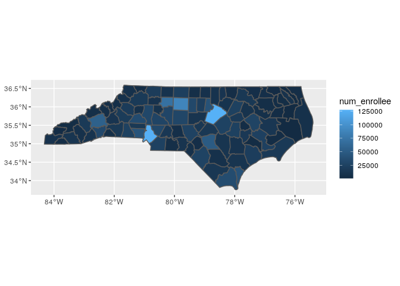

# Explore num enrollees


```r
## The interactive Rstudio session was started with 38 GB and 8 cores
## The  default working directory of an Rmd in Rstudio is the Rmd location

## load packages ----
library(tidyverse)
library(magrittr)
library(sf)
```

### Read shp files

* read county shp files


```r
county_sf <- read_sf("../data/input/scratch/tl_2022_us_county/tl_2022_us_county.shp")

dim(county_sf)
```

```
## [1] 3235   18
```

```r
names(county_sf)
```

```
##  [1] "STATEFP"  "COUNTYFP" "COUNTYNS" "GEOID"    "NAME"     "NAMELSAD"
##  [7] "LSAD"     "CLASSFP"  "MTFCC"    "CSAFP"    "CBSAFP"   "METDIVFP"
## [13] "FUNCSTAT" "ALAND"    "AWATER"   "INTPTLAT" "INTPTLON" "geometry"
```


* read zcta shp files


```r
zcta_sf <- read_sf("../data/input/scratch/tl_2022_us_zcta520/tl_2022_us_zcta520.shp")

dim(zcta_sf)
```

```
## [1] 33791    10
```

```r
names(zcta_sf)
```

```
##  [1] "ZCTA5CE20"  "GEOID20"    "CLASSFP20"  "MTFCC20"    "FUNCSTAT20"
##  [6] "ALAND20"    "AWATER20"   "INTPTLAT20" "INTPTLON20" "geometry"
```

### Read num enrollees


```r
fips_num_enroll <- read_csv("../data/input/fips_num_enroll.csv")
```

```
## Parsed with column specification:
## cols(
##   year = col_double(),
##   fips5 = col_double(),
##   race = col_character(),
##   count = col_double()
## )
```

```r
zcta_num_enroll <- read_csv("../data/input/zcta_num_enroll.csv")
```

```
## Parsed with column specification:
## cols(
##   year = col_double(),
##   zip = col_double(),
##   race = col_character(),
##   count = col_double()
## )
```


```r
dim(fips_num_enroll)
```

```
## [1] 8368    4
```

```r
dim(zcta_num_enroll)
```

```
## [1] 48931     4
```

* mapping fips in the shp files

There are fips not found in shp files


```r
length(unique(fips_num_enroll$fips5))
```

```
## [1] 102
```

```r
sum(!unique(fips_num_enroll$fips5) %in% county_sf$GEOID)
```

```
## [1] 2
```

* mapping zctas are in the shp files

There are zctas not found in shp files


```r
length(unique(zcta_num_enroll$zip))
```

```
## [1] 2270
```

```r
sum(unique(zcta_num_enroll$zip) %in% zcta_sf$ZCTA5CE20)
```

```
## [1] 1886
```

### Explore race


```r
table(fips_num_enroll$race)
```

```
## 
##     0   0,1   0,2   0,3   0,4   0,5   0,6     1   1,2   1,3 1,3,4 1,3,6   1,4 
##   605   474   249     6    32    24    12   612   530   530     4     6   176 
##   1,5   1,6     2   2,3   2,4   2,5   2,6     3   3,4   3,5   3,6     4     5 
##   217   315   610   367    20    52    73   606   395   456   249   596   598 
##     6 
##   554
```


```r
prop.table(table(fips_num_enroll$race))
```

```
## 
##            0          0,1          0,2          0,3          0,4          0,5 
## 0.0722992352 0.0566443595 0.0297562141 0.0007170172 0.0038240918 0.0028680688 
##          0,6            1          1,2          1,3        1,3,4        1,3,6 
## 0.0014340344 0.0731357553 0.0633365201 0.0633365201 0.0004780115 0.0007170172 
##          1,4          1,5          1,6            2          2,3          2,4 
## 0.0210325048 0.0259321224 0.0376434034 0.0728967495 0.0438575526 0.0023900574 
##          2,5          2,6            3          3,4          3,5          3,6 
## 0.0062141491 0.0087237094 0.0724187380 0.0472036329 0.0544933078 0.0297562141 
##            4            5            6 
## 0.0712237094 0.0714627151 0.0662045889
```

### Explore num enrollees

* All counties have enrollee counts in all years


```r
xx <- fips_num_enroll %>% 
  group_by(year, fips5) %>% 
  summarise(count = sum(count)) %>% 
  group_by(fips5) %>% 
  summarise(
    n = n(),
    max = max(count, na.rm = T), 
    min = min(count, na.rm = T), 
    pct_diff = max / min - 1 
  )

summary(xx$n)
```

```
##    Min. 1st Qu.  Median    Mean 3rd Qu.    Max. 
##       6       6       6       6       6       6
```

* Pct change through years by county


```r
xx %>% 
  arrange(desc(pct_diff))
```

```
## # A tibble: 102 x 5
##    fips5     n    max    min pct_diff
##    <dbl> <int>  <dbl>  <dbl>    <dbl>
##  1 37990     6     27     15    0.8  
##  2 37019     6  43210  28224    0.531
##  3 37183     6 148457 107618    0.379
##  4 37055     6   8574   6357    0.349
##  5 37133     6  23829  17680    0.348
##  6 37135     6  24479  18223    0.343
##  7 37063     6  46321  35520    0.304
##  8 37179     6  27194  20921    0.300
##  9 37119     6 143176 110441    0.296
## 10 37053     6   4967   3841    0.293
## # … with 92 more rows
```


* Zcta's have varying number of years with enrollees

To obtain the mean through year, zcta-year having enrollee counts of zero have to be included.


```r
xx <- zcta_num_enroll %>% 
  group_by(year, zip) %>% 
  summarise(count = sum(count)) %>% 
  group_by(zip) %>% 
  summarise(
    n = n(),
    max = max(count, na.rm = T), 
    min = min(count, na.rm = T), 
    pct_diff = max / min - 1 
  ) 

summary(xx$n) 
```

```
##    Min. 1st Qu.  Median    Mean 3rd Qu.    Max. 
##    1.00    2.00    6.00    4.15    6.00    6.00
```


```r
xx %>% 
  arrange(desc(pct_diff))
```

```
## # A tibble: 2,270 x 5
##      zip     n   max   min pct_diff
##    <dbl> <int> <dbl> <dbl>    <dbl>
##  1 29707     6    11     1     10  
##  2 27031     4     7     1      6  
##  3 28542     6     7     1      6  
##  4 20155     6     6     1      5  
##  5 22601     6     6     1      5  
##  6 22901     6     6     1      5  
##  7 29715     3     6     1      5  
##  8 27150     6    11     2      4.5
##  9 29582     6     5     1      4  
## 10 23462     2     4     1      3  
## # … with 2,260 more rows
```

### Enrollee pop per county


```r
xx <- fips_num_enroll %>% 
  group_by(year, fips5) %>% 
  summarise(count = sum(count)) %>% 
  group_by(fips5) %>% 
  summarise(
    num_enrollee = mean(count, na.rm = T) 
  ) 

summary(xx$num_enrollee)
```

```
##      Min.   1st Qu.    Median      Mean   3rd Qu.      Max. 
##     21.17   5220.75  10740.50  17559.20  23350.42 127347.83
```


```r
hist(xx$num_enrollee)
```

<!-- -->

* Map num enrollees


```r
county_sf %>% 
  filter(STATEFP == "37") %>% 
  select(GEOID) %>% 
  left_join(
    xx %>%  
      mutate(fips5 = as.character(fips5)), 
    by = c("GEOID" = "fips5")
  ) %>% 
  ggplot() + 
  geom_sf(aes(fill = num_enrollee))
```

<!-- -->

### Enrollee pop per county per race


```r
# xx <- fips_num_enroll %>% 
#   group_by(year, fips5, race) %>% 
#   summarise(count = sum(count)) %>% 
#   group_by(fips5, race) %>% 
#   summarise(
#     num_enrollee = mean(count, na.rm = T) 
#   ) %>%
#   group_by(race)
#   nest()
# 
# lapply(xx$num_enrollee, summary)
```


