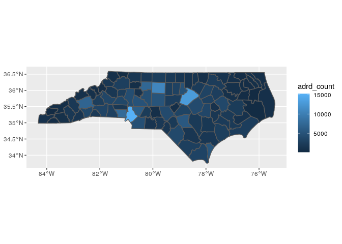
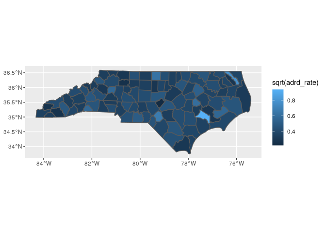

# ADRD hospitalization rates per county

## Limited to NC


```r
## The interactive Rstudio session was started with 36 GB and 8 cores
## The  default working directory of an Rmd in Rstudio is the Rmd location
## The details of the symbolic links to the input data are provided in the README of the  /data/input folder

## load packages ----
library(tidyverse)
library(magrittr)
library(fst, lib.loc = ".")
library(data.table)
library(sf)
library(tictoc, lib.loc = ".")
```

### Read num enrollees


```r
fips_num_enroll <- read_csv("../data/input/fips_num_enroll.csv")
```

```
## Parsed with column specification:
## cols(
##   year = col_double(),
##   fips5 = col_double(),
##   race = col_character(),
##   count = col_double()
## )
```

```r
zcta_num_enroll <- read_csv("../data/input/zcta_num_enroll.csv")
```

```
## Parsed with column specification:
## cols(
##   year = col_double(),
##   zip = col_double(),
##   race = col_character(),
##   count = col_double()
## )
```

### Read shp files

* read county shp files


```r
county_sf <- read_sf("../data/input/scratch/tl_2022_us_county/tl_2022_us_county.shp")

dim(county_sf)
```

```
## [1] 3235   18
```

```r
names(county_sf)
```

```
##  [1] "STATEFP"  "COUNTYFP" "COUNTYNS" "GEOID"    "NAME"     "NAMELSAD" "LSAD"     "CLASSFP" 
##  [9] "MTFCC"    "CSAFP"    "CBSAFP"   "METDIVFP" "FUNCSTAT" "ALAND"    "AWATER"   "INTPTLAT"
## [17] "INTPTLON" "geometry"
```

* read zcta shp files


```r
zcta_sf <- read_sf("../data/input/scratch/tl_2022_us_zcta520/tl_2022_us_zcta520.shp")

dim(zcta_sf)
```

```
## [1] 33791    10
```

```r
names(zcta_sf)
```

```
##  [1] "ZCTA5CE20"  "GEOID20"    "CLASSFP20"  "MTFCC20"    "FUNCSTAT20" "ALAND20"   
##  [7] "AWATER20"   "INTPTLAT20" "INTPTLON20" "geometry"
```

### Read zcta to fips crosswalk file


```r
countyzipcrosswalk <- read_tsv("../data/input/countyzipcrosswalk.tab")
```

```
## Parsed with column specification:
## cols(
##   FIPS = col_double(),
##   state = col_character(),
##   county = col_character(),
##   ZCTA5 = col_double()
## )
```

* Obtain weights


```r
xx <- countyzipcrosswalk %>% 
  select(county, ZCTA5) %>% 
  group_by(ZCTA5) %>% 
  summarise(n = n()) %>% 
  mutate(w = 1/n)

countyzipcrosswalk %<>% 
  left_join(xx)
```

```
## Joining, by = "ZCTA5"
```

```r
head(countyzipcrosswalk)
```

```
## # A tibble: 6 x 6
##    FIPS state county ZCTA5     n     w
##   <dbl> <chr> <chr>  <dbl> <int> <dbl>
## 1 10001 DE    kent   19977     2   0.5
## 2 10001 DE    kent   19938     2   0.5
## 3 10001 DE    kent   19901     1   1  
## 4 10001 DE    kent   19904     1   1  
## 5 10001 DE    kent   19952     2   0.5
## 6 10001 DE    kent   19946     1   1
```

### Read ADRD events


```r
tic("Read denom files")
ffs_entry_exit_adrd <- read_fst("../data/input/denom/ffs_entry_exit_adrd.fst" 
                                #, as.data.table = TRUE
)
toc()
```

```
## Read denom files: 84.213 sec elapsed
```


```r
class(ffs_entry_exit_adrd)
```

```
## [1] "data.frame"
```

```r
dim(ffs_entry_exit_adrd)
```

```
## [1] 64404527       23
```

```r
lapply(ffs_entry_exit_adrd, class)
```

```
## $qid
## [1] "character"
## 
## $entry_age
## [1] "integer"
## 
## $entry_zip
## [1] "integer"
## 
## $race
## [1] "integer"
## 
## $sex
## [1] "integer"
## 
## $any_dual
## [1] "logical"
## 
## $ffs_entry_year
## [1] "integer"
## 
## $ffs_exit_year
## [1] "integer"
## 
## $exit_zip
## [1] "integer"
## 
## $entry_fips
## [1] "integer"
## 
## $exit_fips
## [1] "integer"
## 
## $AD_year
## [1] "integer"
## 
## $ADRD_year
## [1] "integer"
## 
## $ADRD_date
## [1] "Date"
## 
## $ADRD_hosp
## [1] "logical"
## 
## $AD_date
## [1] "Date"
## 
## $AD_hosp
## [1] "logical"
## 
## $ADRD_zip
## [1] "integer"
## 
## $AD_zip
## [1] "integer"
## 
## $AD_age
## [1] "integer"
## 
## $ADRD_age
## [1] "integer"
## 
## $sexM
## [1] "logical"
## 
## $race_cat
## [1] "character"
```

* determine unique ID's.

A single row per ID


```r
tic("sum duplicates")
sum(duplicated(ffs_entry_exit_adrd$qid))
```

```
## [1] 0
```

```r
toc()
```

```
## sum duplicates: 13.545 sec elapsed
```

### Prepare data

* Filter beneficiaries with ADRD


```r
adrd_df <- ffs_entry_exit_adrd %>% 
  filter(ADRD_hosp) %>% 
  select(qid, race_cat, sex, ADRD_year, ADRD_zip, ADRD_age)

dim(adrd_df)
```

```
## [1] 7562282       6
```

* Mapping of ADRD_zip with state and county

Some zip codes not found in crosswalk file


```r
sum(!unique(as.numeric(adrd_df$ADRD_zip)) %in% countyzipcrosswalk$ZCTA5)
```

```
## [1] 11052
```

Some zero zip codes


```r
sum(as.numeric(adrd_df$ADRD_zip) == 0, na.rm = T)
```

```
## [1] 135
```

The left join produces duplicated q_id entries

Beneficiaries that live in zips that intersect more than one county contribute more than once. The weights distribure them.


```r
tic("map ADRD_zip")
adrd_df %<>%
  mutate(ADRD_zip = as.numeric(ADRD_zip)) %>%
  left_join(
    countyzipcrosswalk,
    by = c("ADRD_zip" = "ZCTA5")
  )
toc()
```

```
## map ADRD_zip: 3.157 sec elapsed
```

* Limit to NC


```r
adrd_df %<>% 
  filter(state == "NC")
```

### ADRD hospitalizations in NC

* Summarize number of ADRD cases per county


```r
yy <- adrd_df %>% 
  group_by(FIPS) %>% 
  summarize(adrd_count = sum(w))

summary(yy$adrd_count)
```

```
##    Min. 1st Qu.  Median    Mean 3rd Qu.    Max. 
##   114.0   918.1  1860.8  2538.8  3157.2 15223.8
```

* Map adrd counts


```r
county_sf %>% 
  filter(STATEFP == "37") %>% 
  select(GEOID) %>% 
  left_join(
    yy %>%  
      mutate(FIPS = as.character(FIPS)), 
    by = c("GEOID" = "FIPS")
  ) %>% 
  ggplot() + 
  geom_sf(aes(fill = adrd_count), aes = 0.5)
```

```
## Warning: Ignoring unknown parameters: aes
```

<!-- -->

### Compute ADRD rates per county


```r
xx <- fips_num_enroll %>% 
  group_by(year, fips5) %>% 
  summarise(count = sum(count)) %>% 
  group_by(fips5) %>% 
  summarise(
    num_enrollee = mean(count, na.rm = T) 
  ) 

zz <- left_join(xx, yy, by = c("fips5" = "FIPS")) %>% 
  mutate(adrd_rate = adrd_count / num_enrollee)

summary(zz$adrd_rate)
```

```
##    Min. 1st Qu.  Median    Mean 3rd Qu.    Max.    NA's 
## 0.04985 0.11617 0.14903 0.17323 0.18868 0.87489       2
```

* Map adrd rates


```r
county_sf %>% 
  filter(STATEFP == "37") %>% 
  select(GEOID) %>% 
  left_join(
    zz %>%  
      mutate(fips5 = as.character(fips5)), 
    by = c("GEOID" = "fips5")
  ) %>% 
  ggplot() + 
  geom_sf(aes(fill = sqrt(adrd_rate)))
```

<!-- -->
